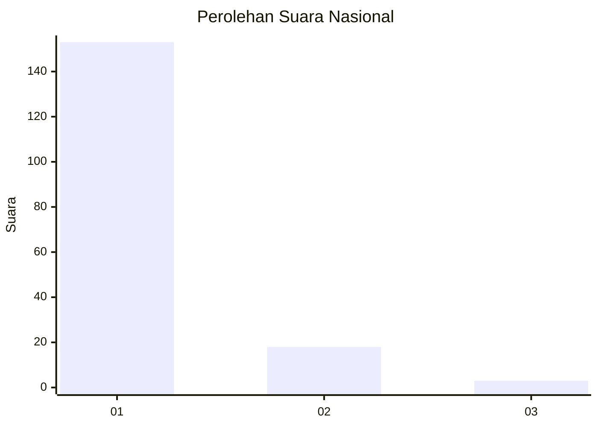
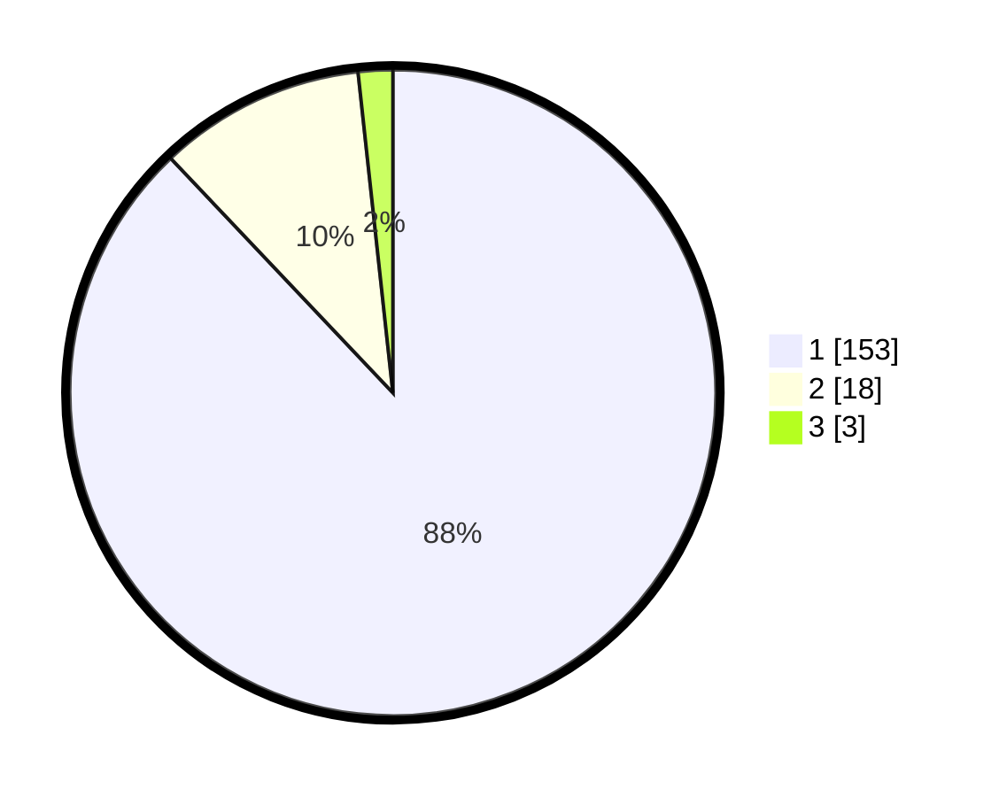

# Hasil

## Grafik

## Tabel

| No. | Nama Paslon    | Suara | Suara (raw) | Persentase |
|:--- |:-------------- | -----:| -----------:| ----------:|
| 1   | ANIES MUHAIMIN | 153   | [153][p-1]  | 87,93      |
| 2   | PRABOWO GIBRAN | 18    | [18][p-2]   | 10,34      |
| 3   | GANJAR MAHFUD  | 3     | [3][p-3]    | 1,72       |

[p-1]: https://github.com/gigit-pemilu/pemilu-2024/blob/main/pilpres/hitung-suara/sub/11-aceh/sub/05-aceh-barat/sub/05-samatiga/sub/2001-alue-raya/sub/001-tps/sub/paslon-1.txt
[p-2]: https://github.com/gigit-pemilu/pemilu-2024/blob/main/pilpres/hitung-suara/sub/11-aceh/sub/05-aceh-barat/sub/05-samatiga/sub/2001-alue-raya/sub/001-tps/sub/paslon-2.txt
[p-3]: https://github.com/gigit-pemilu/pemilu-2024/blob/main/pilpres/hitung-suara/sub/11-aceh/sub/05-aceh-barat/sub/05-samatiga/sub/2001-alue-raya/sub/001-tps/sub/paslon-3.txt

## Foto C Plano

https://sirekap-obj-formc.kpu.go.id/dfc3/pemilu/ppwp/11/05/05/20/01/1105052001001-20240215-150643--b373b8a2-335b-4174-bf2e-a62489fd8ccd.jpg

https://sirekap-obj-formc.kpu.go.id/dfc3/pemilu/ppwp/11/05/05/20/01/1105052001001-20240215-150704--6c63ee86-ed6f-456f-88c4-c84532172470.jpg

https://sirekap-obj-formc.kpu.go.id/dfc3/pemilu/ppwp/11/05/05/20/01/1105052001001-20240215-150653--33977516-2413-4a8b-b9a2-c8a658ad4cf5.jpg

## Metadata

| Key        | Value               |
| ---------- | ------------------- |
| Time Stamp | 2024-02-15 18:00:26 |

## DATA PEMILIH TETAP

Jumlah pemilih dalam DPT: **198**.
 * L: **104**.
 * P: **94**.

## DATA PENGGUNA HAK PILIH

Jumlah pengguna hak pilih dalam DPT: **183**.
 * L: **93**.
 * P: **90**.

Jumlah pengguna hak pilih dalam DPTb: **0**.
 * L: **0**.
 * P: **0**.

Jumlah pengguna hak pilih dalam DPK: **1**.
 * L: **1**.
 * P: **0**.

Jumlah pengguna hak pilih: **184**.
 * L: **94**.
 * P: **90**.

## JUMLAH SUARA SAH DAN TIDAK SAH

JUMLAH SELURUH SUARA SAH: **174**.

JUMLAH SUARA TIDAK SAH: **10**.

JUMLAH SELURUH SUARA SAH DAN SUARA TIDAK SAH: **184**.

