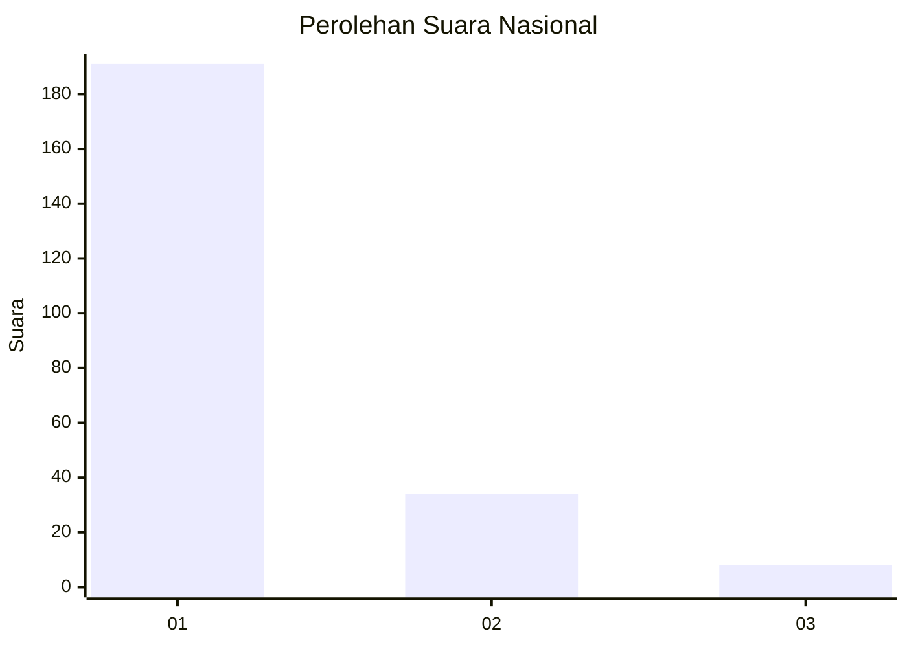
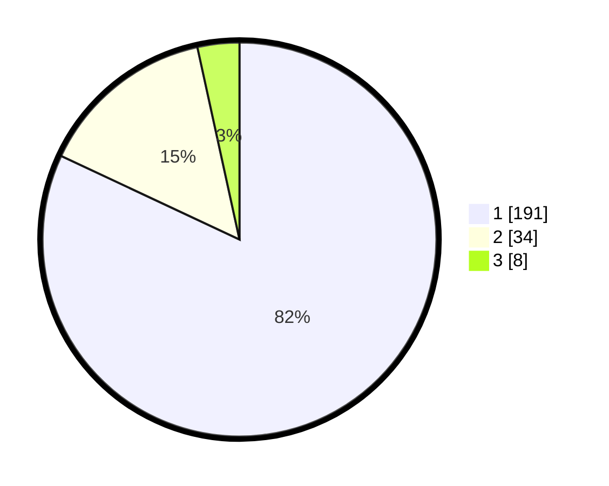

# Hasil

## Grafik

## Tabel

| No. | Nama Paslon    | Suara | Suara (raw) | Persentase |
|:--- |:-------------- | -----:| -----------:| ----------:|
| 1   | ANIES MUHAIMIN | 191   | [191][p-1]  | 81,97      |
| 2   | PRABOWO GIBRAN | 34    | [34][p-2]   | 14,59      |
| 3   | GANJAR MAHFUD  | 8     | [8][p-3]    | 3,43       |

[p-1]: https://github.com/gigit-pemilu/pemilu-2024/blob/main/pilpres/hitung-suara/sub/11-aceh/sub/05-aceh-barat/sub/05-samatiga/sub/2002-cot-darat/sub/002-tps/sub/paslon-1.txt
[p-2]: https://github.com/gigit-pemilu/pemilu-2024/blob/main/pilpres/hitung-suara/sub/11-aceh/sub/05-aceh-barat/sub/05-samatiga/sub/2002-cot-darat/sub/002-tps/sub/paslon-2.txt
[p-3]: https://github.com/gigit-pemilu/pemilu-2024/blob/main/pilpres/hitung-suara/sub/11-aceh/sub/05-aceh-barat/sub/05-samatiga/sub/2002-cot-darat/sub/002-tps/sub/paslon-3.txt

## Foto C Plano

https://sirekap-obj-formc.kpu.go.id/05f0/pemilu/ppwp/11/05/05/20/02/1105052002002-20240216-015231--11f72b48-11e8-4f84-8972-7f5f0dc0808a.jpg

https://sirekap-obj-formc.kpu.go.id/05f0/pemilu/ppwp/11/05/05/20/02/1105052002002-20240216-015232--2dfc99b1-671d-4378-a1ee-3a61a8c9786e.jpg

https://sirekap-obj-formc.kpu.go.id/05f0/pemilu/ppwp/11/05/05/20/02/1105052002002-20240216-015231--6d49f17a-0a12-4015-ba87-1c720938d8fc.jpg

## Metadata

| Key        | Value               |
| ---------- | ------------------- |
| Time Stamp | 2024-02-16 16:25:10 |

## DATA PEMILIH TETAP

Jumlah pemilih dalam DPT: **261**.
 * L: **128**.
 * P: **133**.

## DATA PENGGUNA HAK PILIH

Jumlah pengguna hak pilih dalam DPT: **231**.
 * L: **117**.
 * P: **114**.

Jumlah pengguna hak pilih dalam DPTb: **0**.
 * L: **0**.
 * P: **0**.

Jumlah pengguna hak pilih dalam DPK: **4**.
 * L: **4**.
 * P: **0**.

Jumlah pengguna hak pilih: **235**.
 * L: **121**.
 * P: **114**.

## JUMLAH SUARA SAH DAN TIDAK SAH

JUMLAH SELURUH SUARA SAH: **233**.

JUMLAH SUARA TIDAK SAH: **2**.

JUMLAH SELURUH SUARA SAH DAN SUARA TIDAK SAH: **235**.

