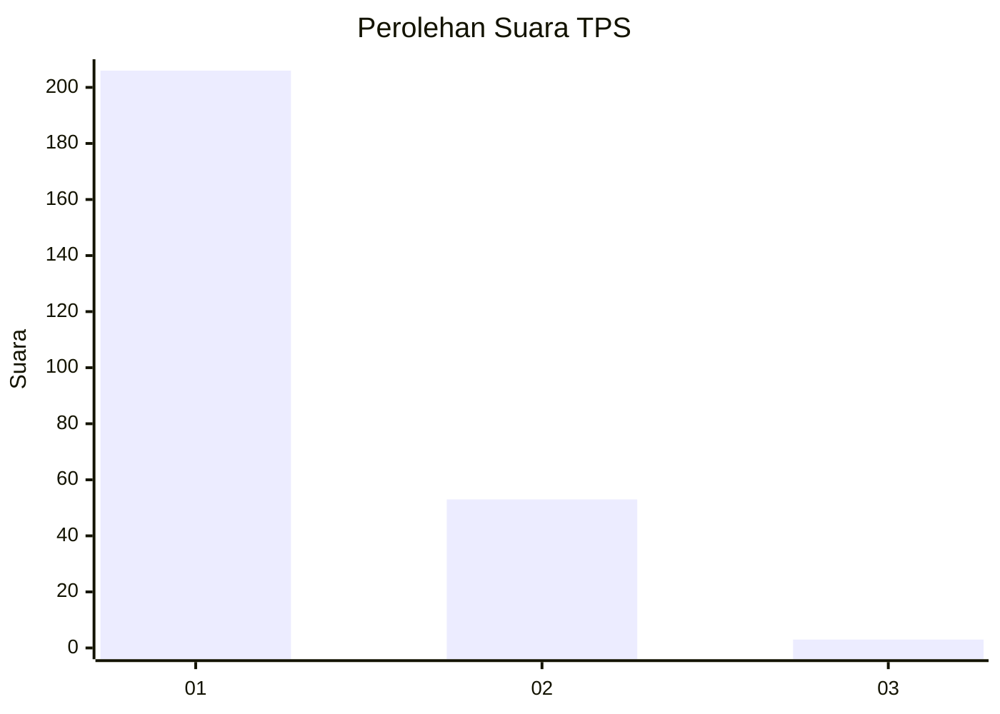
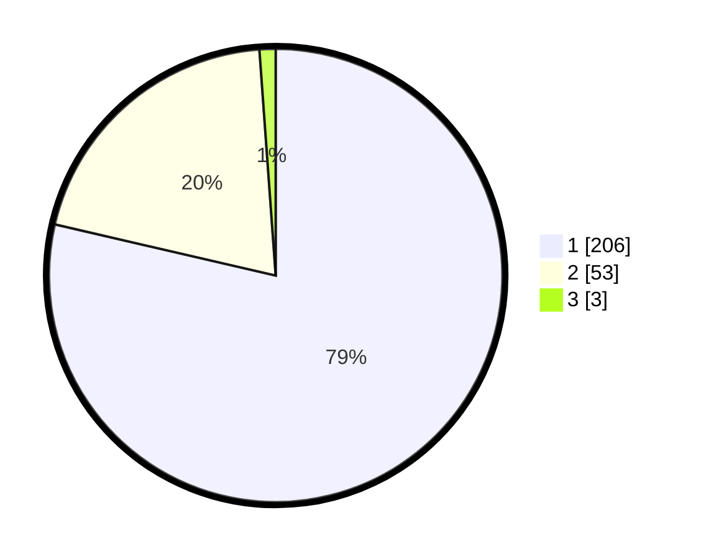

# Hasil

## Grafik

## Tabel

| No. | Nama Paslon    | Suara | Suara (raw) | Persentase |
|:--- |:-------------- | -----:| -----------:| ----------:|
| 1   | ANIES MUHAIMIN | 206   | [206][p-1]  | 78,63      |
| 2   | PRABOWO GIBRAN | 53    | [53][p-2]   | 20,23      |
| 3   | GANJAR MAHFUD  | 3     | [3][p-3]    | 1,15       |

[p-1]: https://github.com/gigit-pemilu/pemilu-2024-11-aceh/blob/main/pilpres/hitung-suara/sub/11-aceh/sub/05-aceh-barat/sub/05-samatiga/sub/2002-cot-darat/sub/003-tps/sub/paslon-1.txt
[p-2]: https://github.com/gigit-pemilu/pemilu-2024-11-aceh/blob/main/pilpres/hitung-suara/sub/11-aceh/sub/05-aceh-barat/sub/05-samatiga/sub/2002-cot-darat/sub/003-tps/sub/paslon-2.txt
[p-3]: https://github.com/gigit-pemilu/pemilu-2024-11-aceh/blob/main/pilpres/hitung-suara/sub/11-aceh/sub/05-aceh-barat/sub/05-samatiga/sub/2002-cot-darat/sub/003-tps/sub/paslon-3.txt

## Foto C Plano

https://sirekap-obj-formc.kpu.go.id/1605/pemilu/ppwp/11/05/05/20/02/1105052002003-20240215-232829--fdb9532b-4d3d-4bd9-9f18-468192bcaa50.jpg

https://sirekap-obj-formc.kpu.go.id/1605/pemilu/ppwp/11/05/05/20/02/1105052002003-20240215-232831--8e65c392-6f08-45f1-bae2-c4d84cbd2536.jpg

https://sirekap-obj-formc.kpu.go.id/1605/pemilu/ppwp/11/05/05/20/02/1105052002003-20240215-232830--e1bb8849-4977-4ccd-a4ce-a48f8b94bf38.jpg

## Metadata

| Key        | Value               |
| ---------- | ------------------- |
| Time Stamp | 2024-02-16 00:00:26 |

## DATA PEMILIH TETAP

Jumlah pemilih dalam DPT: **278**.
 * L: **141**.
 * P: **137**.

## DATA PENGGUNA HAK PILIH

Jumlah pengguna hak pilih dalam DPT: **262**.
 * L: **134**.
 * P: **128**.

Jumlah pengguna hak pilih dalam DPTb: **0**.
 * L: **0**.
 * P: **0**.

Jumlah pengguna hak pilih dalam DPK: **2**.
 * L: **2**.
 * P: **0**.

Jumlah pengguna hak pilih: **264**.
 * L: **136**.
 * P: **128**.

## JUMLAH SUARA SAH DAN TIDAK SAH

JUMLAH SELURUH SUARA SAH: **262**.

JUMLAH SUARA TIDAK SAH: **2**.

JUMLAH SELURUH SUARA SAH DAN SUARA TIDAK SAH: **264**.

