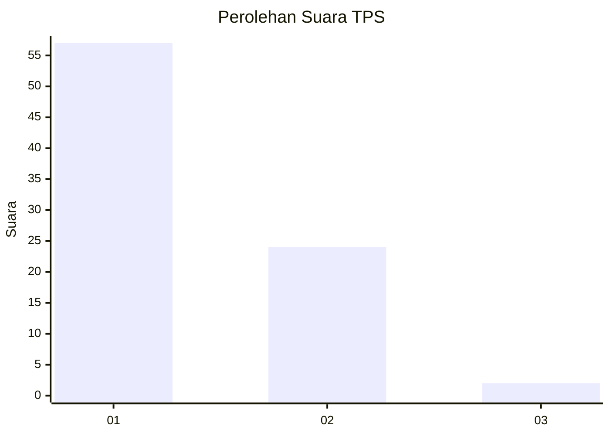
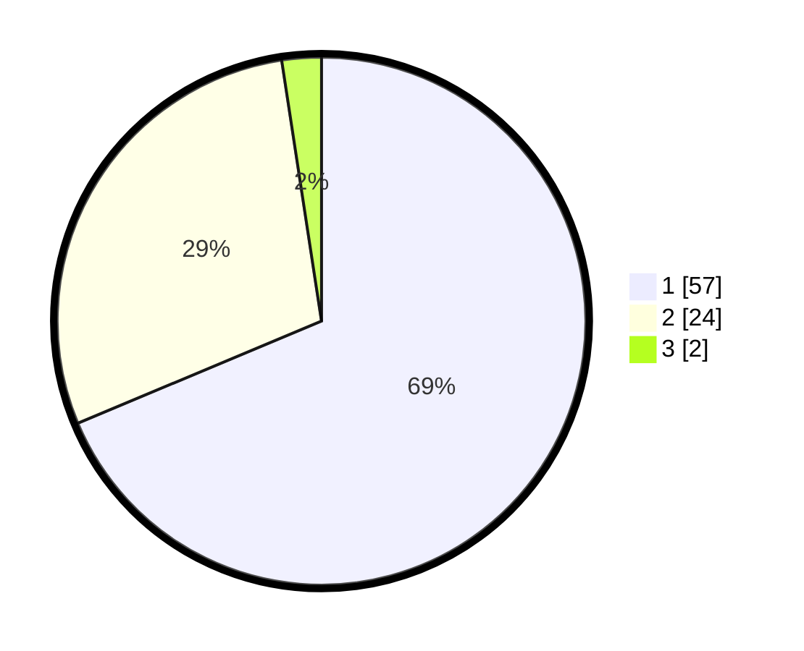

# Hasil

## Grafik

## Tabel

| No. | Nama Paslon    | Suara | Suara (raw) | Persentase |
|:--- |:-------------- | -----:| -----------:| ----------:|
| 1   | ANIES MUHAIMIN | 57    | [57][p-1]   | 68,67      |
| 2   | PRABOWO GIBRAN | 24    | [24][p-2]   | 28,92      |
| 3   | GANJAR MAHFUD  | 2     | [2][p-3]    | 2,41       |

[p-1]: https://github.com/gigit-pemilu/pemilu-2024-11-aceh/blob/main/pilpres/hitung-suara/sub/11-aceh/sub/05-aceh-barat/sub/05-samatiga/sub/2011-gampong-ladang/sub/001-tps/sub/paslon-1.txt
[p-2]: https://github.com/gigit-pemilu/pemilu-2024-11-aceh/blob/main/pilpres/hitung-suara/sub/11-aceh/sub/05-aceh-barat/sub/05-samatiga/sub/2011-gampong-ladang/sub/001-tps/sub/paslon-2.txt
[p-3]: https://github.com/gigit-pemilu/pemilu-2024-11-aceh/blob/main/pilpres/hitung-suara/sub/11-aceh/sub/05-aceh-barat/sub/05-samatiga/sub/2011-gampong-ladang/sub/001-tps/sub/paslon-3.txt

## Foto C Plano

https://sirekap-obj-formc.kpu.go.id/173b/pemilu/ppwp/11/05/05/20/11/1105052011001-20240215-215209--4c908c6e-ca5e-40e8-8fa3-34f19719b5eb.jpg

https://sirekap-obj-formc.kpu.go.id/173b/pemilu/ppwp/11/05/05/20/11/1105052011001-20240215-215211--2fdf59ca-ef1f-42d8-85ea-aa9cdcfe3724.jpg

https://sirekap-obj-formc.kpu.go.id/173b/pemilu/ppwp/11/05/05/20/11/1105052011001-20240215-215210--9ab99a8a-2dc7-4a1d-b8db-b46fb390b61b.jpg

## Metadata

| Key        | Value               |
| ---------- | ------------------- |
| Time Stamp | 2024-02-15 22:30:27 |

## DATA PEMILIH TETAP

Jumlah pemilih dalam DPT: **91**.
 * L: **44**.
 * P: **47**.

## DATA PENGGUNA HAK PILIH

Jumlah pengguna hak pilih dalam DPT: **84**.
 * L: **38**.
 * P: **46**.

Jumlah pengguna hak pilih dalam DPTb: **0**.
 * L: **0**.
 * P: **0**.

Jumlah pengguna hak pilih dalam DPK: **0**.
 * L: **0**.
 * P: **0**.

Jumlah pengguna hak pilih: **84**.
 * L: **38**.
 * P: **46**.

## JUMLAH SUARA SAH DAN TIDAK SAH

JUMLAH SELURUH SUARA SAH: **83**.

JUMLAH SUARA TIDAK SAH: **1**.

JUMLAH SELURUH SUARA SAH DAN SUARA TIDAK SAH: **84**.

