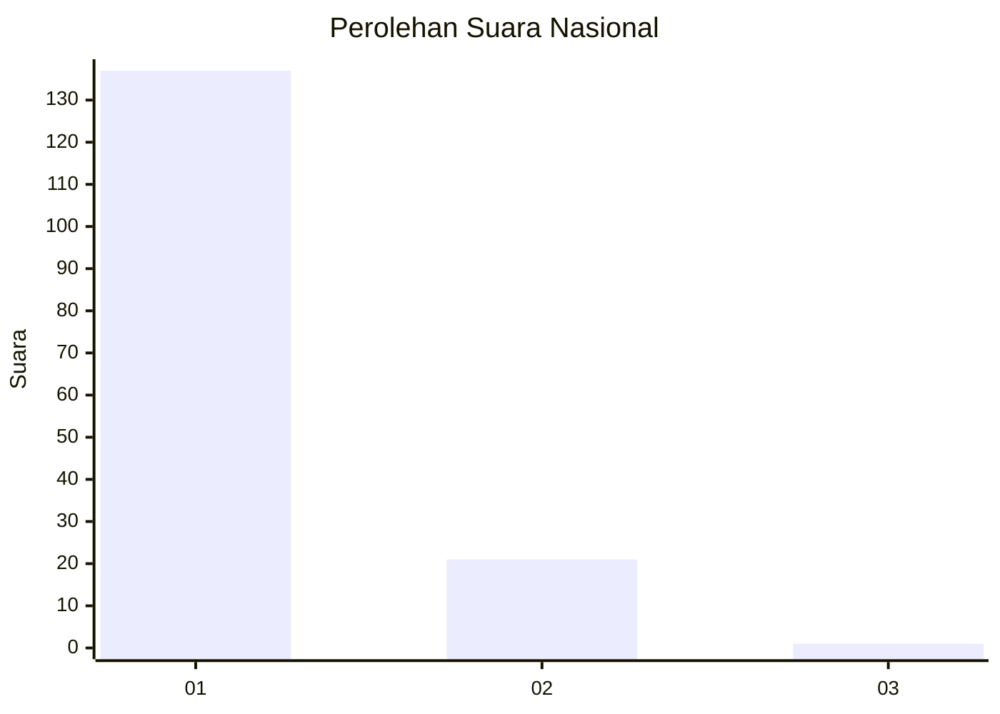
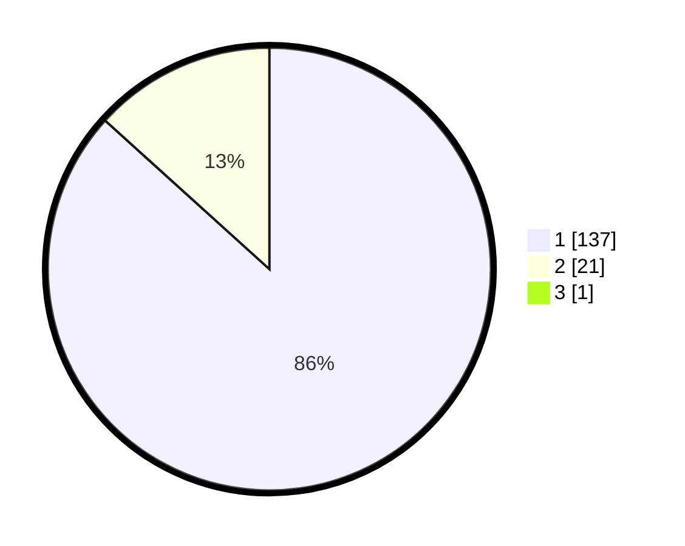

# Hasil

## Grafik

## Tabel

| No. | Nama Paslon    | Suara | Suara (raw) | Persentase |
|:--- |:-------------- | -----:| -----------:| ----------:|
| 1   | ANIES MUHAIMIN | 137   | [137][p-1]  | 86,16      |
| 2   | PRABOWO GIBRAN | 21    | [21][p-2]   | 13,21      |
| 3   | GANJAR MAHFUD  | 1     | [1][p-3]    | 0,63       |

[p-1]: https://github.com/gigit-pemilu/pemilu-2024/blob/main/pilpres/hitung-suara/sub/11-aceh/sub/05-aceh-barat/sub/05-samatiga/sub/2018-leukeun/sub/001-tps/sub/paslon-1.txt
[p-2]: https://github.com/gigit-pemilu/pemilu-2024/blob/main/pilpres/hitung-suara/sub/11-aceh/sub/05-aceh-barat/sub/05-samatiga/sub/2018-leukeun/sub/001-tps/sub/paslon-2.txt
[p-3]: https://github.com/gigit-pemilu/pemilu-2024/blob/main/pilpres/hitung-suara/sub/11-aceh/sub/05-aceh-barat/sub/05-samatiga/sub/2018-leukeun/sub/001-tps/sub/paslon-3.txt

## Foto C Plano

https://sirekap-obj-formc.kpu.go.id/19ad/pemilu/ppwp/11/05/05/20/18/1105052018001-20240214-205717--9bbca1f2-e5a6-4934-bd93-da7589ce6394.jpg

https://sirekap-obj-formc.kpu.go.id/19ad/pemilu/ppwp/11/05/05/20/18/1105052018001-20240214-211413--1008a440-486b-4462-a3f8-8c9923611f09.jpg

https://sirekap-obj-formc.kpu.go.id/19ad/pemilu/ppwp/11/05/05/20/18/1105052018001-20240214-211609--322b8ee6-e918-4f60-b3bf-d1cc67f7086a.jpg

## Metadata

| Key        | Value               |
| ---------- | ------------------- |
| Time Stamp | 2024-02-15 21:01:18 |

