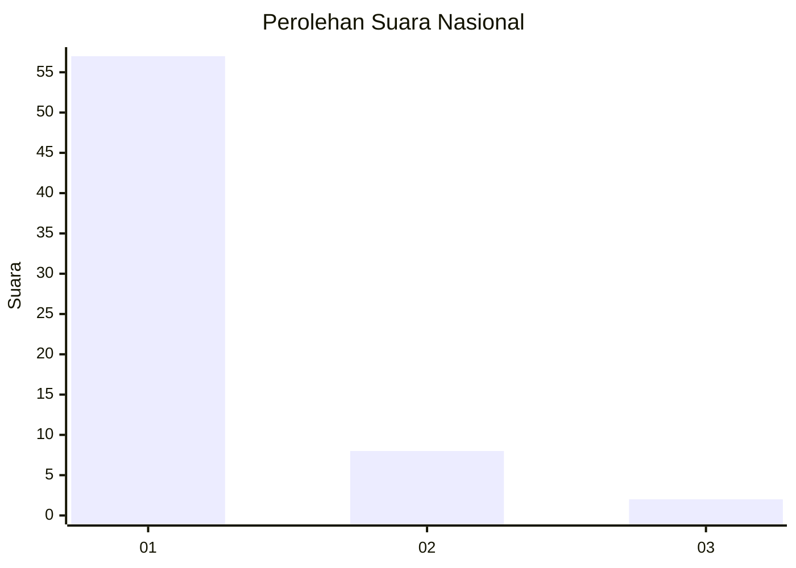
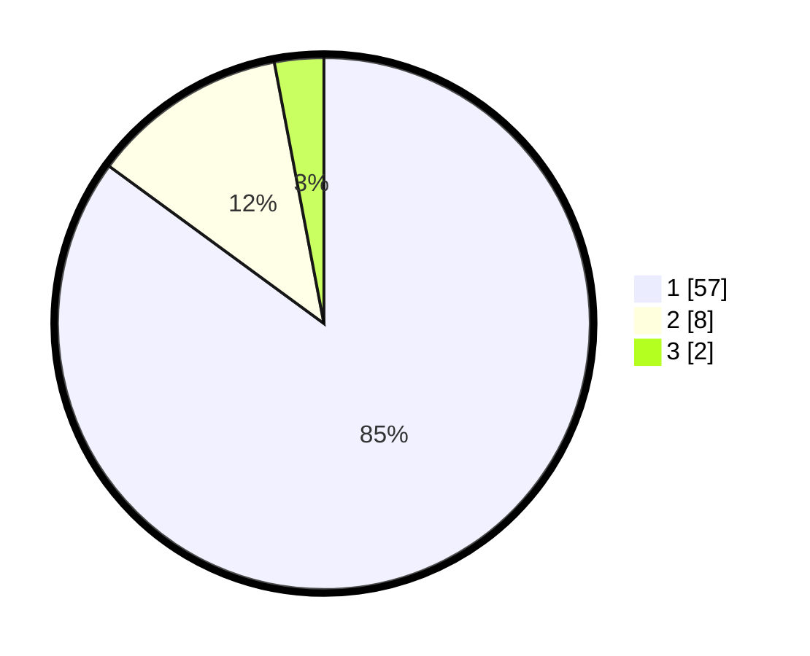

# Hasil

## Grafik

## Tabel

| No. | Nama Paslon    | Suara | Suara (raw) | Persentase |
|:--- |:-------------- | -----:| -----------:| ----------:|
| 1   | ANIES MUHAIMIN | 57    | [57][p-1]   | 85,07      |
| 2   | PRABOWO GIBRAN | 8     | [8][p-2]    | 11,94      |
| 3   | GANJAR MAHFUD  | 2     | [2][p-3]    | 2,99       |

[p-1]: https://github.com/gigit-pemilu/pemilu-2024/blob/main/pilpres/hitung-suara/sub/11-aceh/sub/05-aceh-barat/sub/05-samatiga/sub/2024-rangkileh/sub/001-tps/sub/paslon-1.txt
[p-2]: https://github.com/gigit-pemilu/pemilu-2024/blob/main/pilpres/hitung-suara/sub/11-aceh/sub/05-aceh-barat/sub/05-samatiga/sub/2024-rangkileh/sub/001-tps/sub/paslon-2.txt
[p-3]: https://github.com/gigit-pemilu/pemilu-2024/blob/main/pilpres/hitung-suara/sub/11-aceh/sub/05-aceh-barat/sub/05-samatiga/sub/2024-rangkileh/sub/001-tps/sub/paslon-3.txt

## Foto C Plano

https://sirekap-obj-formc.kpu.go.id/0bd9/pemilu/ppwp/11/05/05/20/24/1105052024001-20240217-170247--24023cae-86de-428c-ae1d-36774e381149.jpg

https://sirekap-obj-formc.kpu.go.id/0bd9/pemilu/ppwp/11/05/05/20/24/1105052024001-20240217-170249--a9c9c18a-4619-41ca-81a5-038f80236d1e.jpg

https://sirekap-obj-formc.kpu.go.id/0bd9/pemilu/ppwp/11/05/05/20/24/1105052024001-20240217-170248--0867eca2-54fd-4db5-97bf-c50ac3d760ba.jpg

## Metadata

| Key        | Value               |
| ---------- | ------------------- |
| Time Stamp | 2024-02-21 20:00:00 |

## DATA PEMILIH TETAP

Jumlah pemilih dalam DPT: **71**.
 * L: **31**.
 * P: **40**.

## DATA PENGGUNA HAK PILIH

Jumlah pengguna hak pilih dalam DPT: **66**.
 * L: **27**.
 * P: **39**.

Jumlah pengguna hak pilih dalam DPTb: **0**.
 * L: **0**.
 * P: **0**.

Jumlah pengguna hak pilih dalam DPK: **1**.
 * L: **0**.
 * P: **1**.

Jumlah pengguna hak pilih: **67**.
 * L: **27**.
 * P: **40**.

## JUMLAH SUARA SAH DAN TIDAK SAH

JUMLAH SELURUH SUARA SAH: **57**.

JUMLAH SUARA TIDAK SAH: **8**.

JUMLAH SELURUH SUARA SAH DAN SUARA TIDAK SAH: **2**.

