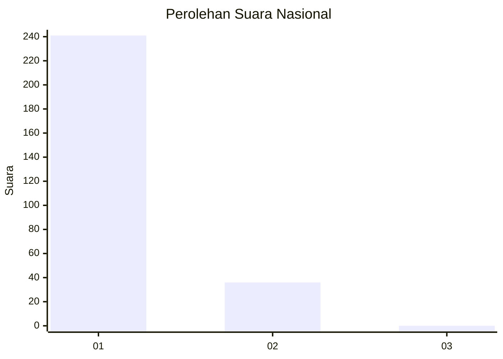
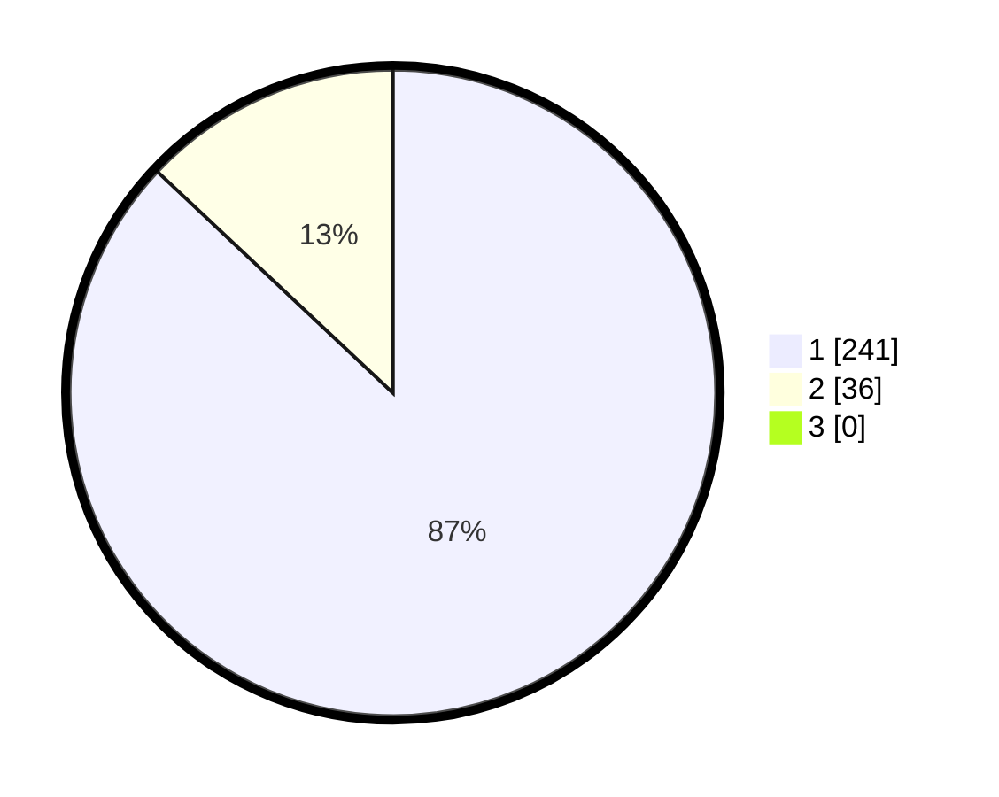

# Hasil

## Grafik

## Tabel

| No. | Nama Paslon    | Suara | Suara (raw) | Persentase |
|:--- |:-------------- | -----:| -----------:| ----------:|
| 1   | ANIES MUHAIMIN | 241   | [241][p-1]  | 87,00      |
| 2   | PRABOWO GIBRAN | 36    | [36][p-2]   | 13,00      |
| 3   | GANJAR MAHFUD  | 0     | [0][p-3]    | 0,00       |

[p-1]: https://github.com/gigit-pemilu/pemilu-2024/blob/main/pilpres/hitung-suara/sub/11-aceh/sub/05-aceh-barat/sub/05-samatiga/sub/2029-suak-geudeubang/sub/001-tps/sub/paslon-1.txt
[p-2]: https://github.com/gigit-pemilu/pemilu-2024/blob/main/pilpres/hitung-suara/sub/11-aceh/sub/05-aceh-barat/sub/05-samatiga/sub/2029-suak-geudeubang/sub/001-tps/sub/paslon-2.txt
[p-3]: https://github.com/gigit-pemilu/pemilu-2024/blob/main/pilpres/hitung-suara/sub/11-aceh/sub/05-aceh-barat/sub/05-samatiga/sub/2029-suak-geudeubang/sub/001-tps/sub/paslon-3.txt

## Foto C Plano

https://sirekap-obj-formc.kpu.go.id/a098/pemilu/ppwp/11/05/05/20/29/1105052029001-20240216-154710--799a8f67-995c-43bb-8c47-5f86d755271b.jpg

https://sirekap-obj-formc.kpu.go.id/a098/pemilu/ppwp/11/05/05/20/29/1105052029001-20240216-154711--ed8084b3-8633-46f6-8a4e-acb83d458608.jpg

https://sirekap-obj-formc.kpu.go.id/a098/pemilu/ppwp/11/05/05/20/29/1105052029001-20240216-154711--075aa26f-eed0-4041-b93d-1af001796f2c.jpg

## Metadata

| Key        | Value               |
| ---------- | ------------------- |
| Time Stamp | 2024-02-16 16:25:10 |

## DATA PEMILIH TETAP

Jumlah pemilih dalam DPT: **298**.
 * L: **148**.
 * P: **150**.

## DATA PENGGUNA HAK PILIH

Jumlah pengguna hak pilih dalam DPT: **263**.
 * L: **125**.
 * P: **138**.

Jumlah pengguna hak pilih dalam DPTb: **13**.
 * L: **10**.
 * P: **3**.

Jumlah pengguna hak pilih dalam DPK: **2**.
 * L: **2**.
 * P: **0**.

Jumlah pengguna hak pilih: **278**.
 * L: **137**.
 * P: **141**.

## JUMLAH SUARA SAH DAN TIDAK SAH

JUMLAH SELURUH SUARA SAH: **277**.

JUMLAH SUARA TIDAK SAH: **2**.

JUMLAH SELURUH SUARA SAH DAN SUARA TIDAK SAH: **279**.

