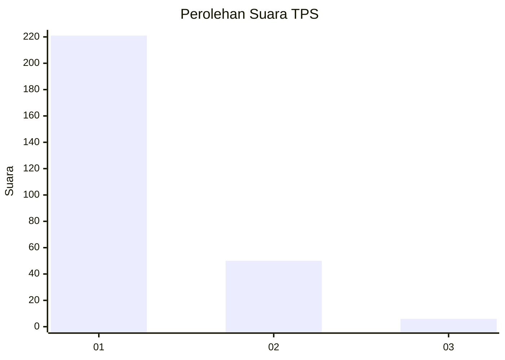
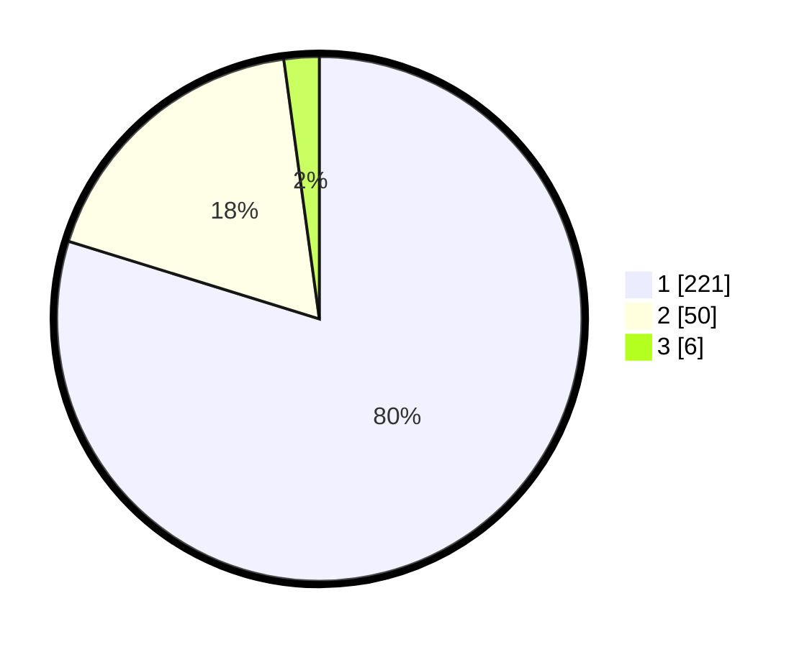

# Hasil

## Grafik

## Tabel

| No. | Nama Paslon    | Suara | Suara (raw) | Persentase |
|:--- |:-------------- | -----:| -----------:| ----------:|
| 1   | ANIES MUHAIMIN | 221   | [221][p-1]  | 79,78      |
| 2   | PRABOWO GIBRAN | 50    | [50][p-2]   | 18,05      |
| 3   | GANJAR MAHFUD  | 6     | [6][p-3]    | 2,17       |

[p-1]: https://github.com/gigit-pemilu/pemilu-2024-11-aceh/blob/main/pilpres/hitung-suara/sub/11-aceh/sub/05-aceh-barat/sub/05-samatiga/sub/2031-suak-timah/sub/001-tps/sub/paslon-1.txt
[p-2]: https://github.com/gigit-pemilu/pemilu-2024-11-aceh/blob/main/pilpres/hitung-suara/sub/11-aceh/sub/05-aceh-barat/sub/05-samatiga/sub/2031-suak-timah/sub/001-tps/sub/paslon-2.txt
[p-3]: https://github.com/gigit-pemilu/pemilu-2024-11-aceh/blob/main/pilpres/hitung-suara/sub/11-aceh/sub/05-aceh-barat/sub/05-samatiga/sub/2031-suak-timah/sub/001-tps/sub/paslon-3.txt

## Foto C Plano

https://sirekap-obj-formc.kpu.go.id/d124/pemilu/ppwp/11/05/05/20/31/1105052031001-20240214-215932--269c1387-728d-4bb4-a04f-b2f222c23a0d.jpg

https://sirekap-obj-formc.kpu.go.id/d124/pemilu/ppwp/11/05/05/20/31/1105052031001-20240214-220016--5746784a-91f8-4619-a682-76e7056dc3aa.jpg

https://sirekap-obj-formc.kpu.go.id/d124/pemilu/ppwp/11/05/05/20/31/1105052031001-20240214-220104--024059e3-fbb8-487d-bddc-57a905c56dbb.jpg

## Metadata

| Key        | Value               |
| ---------- | ------------------- |
| Time Stamp | 2024-02-15 21:01:18 |

