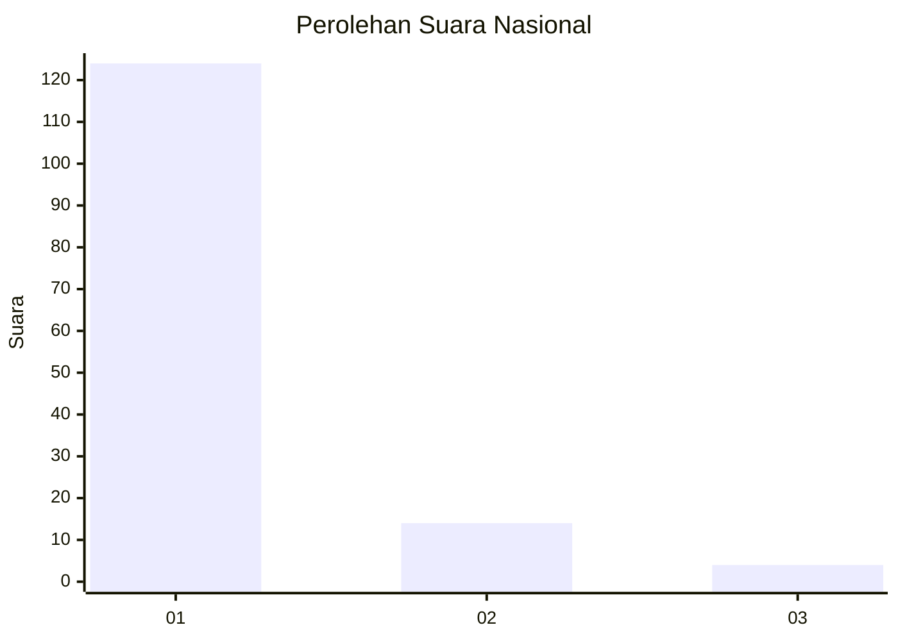
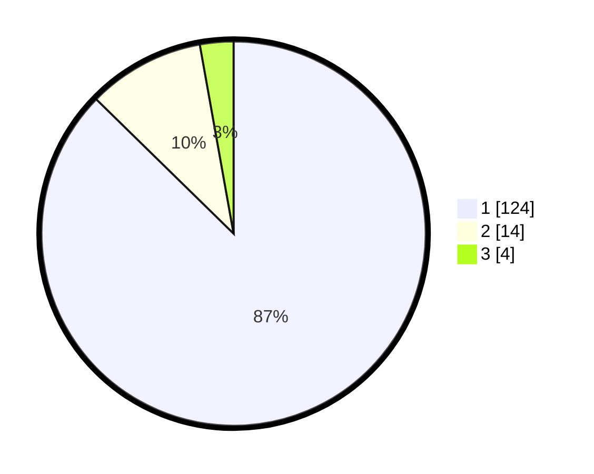

# Hasil

## Grafik

## Tabel

| No. | Nama Paslon    | Suara | Suara (raw) | Persentase |
|:--- |:-------------- | -----:| -----------:| ----------:|
| 1   | ANIES MUHAIMIN | 124   | [124][p-1]  | 87,32      |
| 2   | PRABOWO GIBRAN | 14    | [14][p-2]   | 9,86       |
| 3   | GANJAR MAHFUD  | 4     | [4][p-3]    | 2,82       |

[p-1]: https://github.com/gigit-pemilu/pemilu-2024/blob/main/pilpres/hitung-suara/sub/11-aceh/sub/05-aceh-barat/sub/06-bubon/sub/2002-alue-bakong/sub/001-tps/sub/paslon-1.txt
[p-2]: https://github.com/gigit-pemilu/pemilu-2024/blob/main/pilpres/hitung-suara/sub/11-aceh/sub/05-aceh-barat/sub/06-bubon/sub/2002-alue-bakong/sub/001-tps/sub/paslon-2.txt
[p-3]: https://github.com/gigit-pemilu/pemilu-2024/blob/main/pilpres/hitung-suara/sub/11-aceh/sub/05-aceh-barat/sub/06-bubon/sub/2002-alue-bakong/sub/001-tps/sub/paslon-3.txt

## Foto C Plano

https://sirekap-obj-formc.kpu.go.id/affd/pemilu/ppwp/11/05/06/20/02/1105062002001-20240215-050738--c1e8ec10-1804-4f77-aa87-0c069ca5885f.jpg

https://sirekap-obj-formc.kpu.go.id/affd/pemilu/ppwp/11/05/06/20/02/1105062002001-20240215-050829--61c9450c-5395-41e3-97ba-c7baa68e3aa7.jpg

https://sirekap-obj-formc.kpu.go.id/affd/pemilu/ppwp/11/05/06/20/02/1105062002001-20240215-050907--0903d833-8f0a-4c1c-b719-c13858842df9.jpg

## Metadata

| Key        | Value               |
| ---------- | ------------------- |
| Time Stamp | 2024-02-15 21:01:18 |

