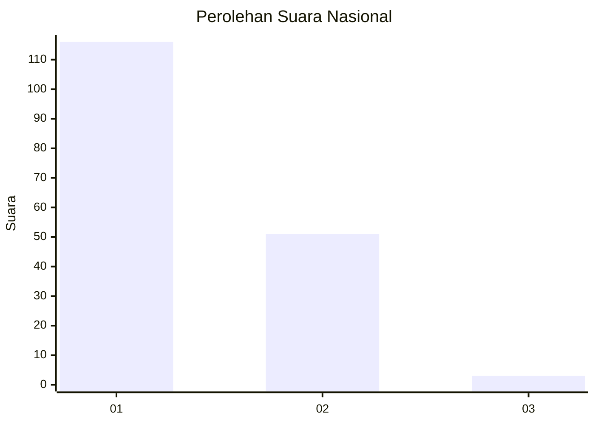
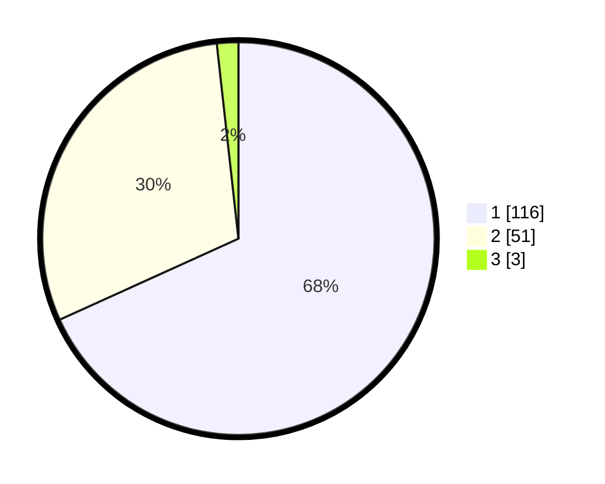

# Hasil

## Grafik

## Tabel

| No. | Nama Paslon    | Suara | Suara (raw) | Persentase |
|:--- |:-------------- | -----:| -----------:| ----------:|
| 1   | ANIES MUHAIMIN | 116   | [116][p-1]  | 68,24      |
| 2   | PRABOWO GIBRAN | 51    | [51][p-2]   | 30,00      |
| 3   | GANJAR MAHFUD  | 3     | [3][p-3]    | 1,76       |

[p-1]: https://github.com/gigit-pemilu/pemilu-2024/blob/main/pilpres/hitung-suara/sub/11-aceh/sub/05-aceh-barat/sub/06-bubon/sub/2003-beurawang/sub/001-tps/sub/paslon-1.txt
[p-2]: https://github.com/gigit-pemilu/pemilu-2024/blob/main/pilpres/hitung-suara/sub/11-aceh/sub/05-aceh-barat/sub/06-bubon/sub/2003-beurawang/sub/001-tps/sub/paslon-2.txt
[p-3]: https://github.com/gigit-pemilu/pemilu-2024/blob/main/pilpres/hitung-suara/sub/11-aceh/sub/05-aceh-barat/sub/06-bubon/sub/2003-beurawang/sub/001-tps/sub/paslon-3.txt

## Foto C Plano

https://sirekap-obj-formc.kpu.go.id/16d7/pemilu/ppwp/11/05/06/20/03/1105062003001-20240215-224100--0f22f1fb-3dc0-4e0b-8612-11cfe3eac6fa.jpg

https://sirekap-obj-formc.kpu.go.id/16d7/pemilu/ppwp/11/05/06/20/03/1105062003001-20240215-224103--1cb19b1f-f9da-4c39-8fe8-809abf037928.jpg

https://sirekap-obj-formc.kpu.go.id/16d7/pemilu/ppwp/11/05/06/20/03/1105062003001-20240215-224102--c50f6642-0924-48bc-92cb-b724d70d49b6.jpg

## Metadata

| Key        | Value               |
| ---------- | ------------------- |
| Time Stamp | 2024-02-16 00:00:26 |

## DATA PEMILIH TETAP

Jumlah pemilih dalam DPT: **191**.
 * L: **88**.
 * P: **103**.

## DATA PENGGUNA HAK PILIH

Jumlah pengguna hak pilih dalam DPT: **170**.
 * L: **79**.
 * P: **91**.

Jumlah pengguna hak pilih dalam DPTb: **3**.
 * L: **1**.
 * P: **2**.

Jumlah pengguna hak pilih dalam DPK: **0**.
 * L: **0**.
 * P: **0**.

Jumlah pengguna hak pilih: **173**.
 * L: **80**.
 * P: **93**.

## JUMLAH SUARA SAH DAN TIDAK SAH

JUMLAH SELURUH SUARA SAH: **170**.

JUMLAH SUARA TIDAK SAH: **3**.

JUMLAH SELURUH SUARA SAH DAN SUARA TIDAK SAH: **173**.

