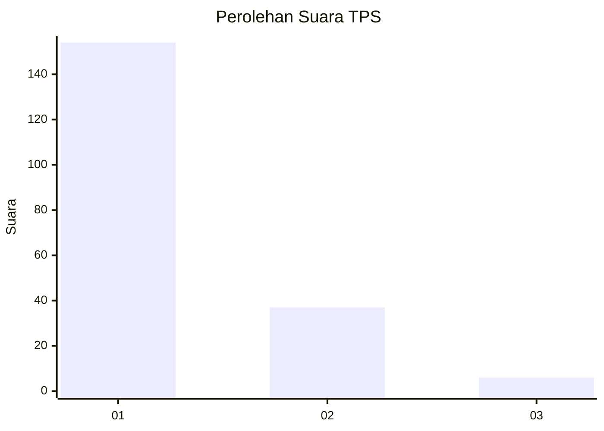
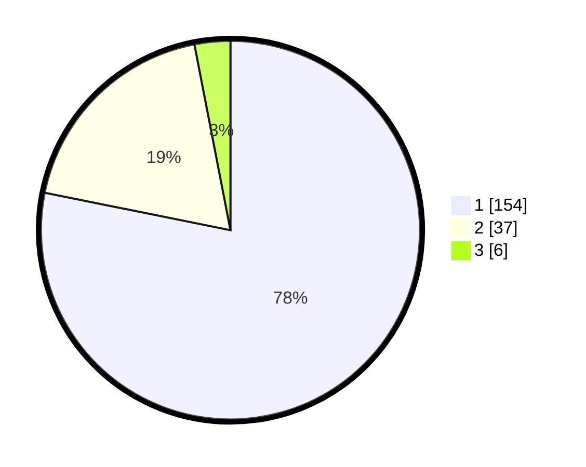

# Hasil

## Grafik

## Tabel

| No. | Nama Paslon    | Suara | Suara (raw) | Persentase |
|:--- |:-------------- | -----:| -----------:| ----------:|
| 1   | ANIES MUHAIMIN | 154   | [154][p-1]  | 78,17      |
| 2   | PRABOWO GIBRAN | 37    | [37][p-2]   | 18,78      |
| 3   | GANJAR MAHFUD  | 6     | [6][p-3]    | 3,05       |

[p-1]: https://github.com/gigit-pemilu/pemilu-2024-11-aceh/blob/main/pilpres/hitung-suara/sub/11-aceh/sub/05-aceh-barat/sub/06-bubon/sub/2004-blang-sibeutong/sub/001-tps/sub/paslon-1.txt
[p-2]: https://github.com/gigit-pemilu/pemilu-2024-11-aceh/blob/main/pilpres/hitung-suara/sub/11-aceh/sub/05-aceh-barat/sub/06-bubon/sub/2004-blang-sibeutong/sub/001-tps/sub/paslon-2.txt
[p-3]: https://github.com/gigit-pemilu/pemilu-2024-11-aceh/blob/main/pilpres/hitung-suara/sub/11-aceh/sub/05-aceh-barat/sub/06-bubon/sub/2004-blang-sibeutong/sub/001-tps/sub/paslon-3.txt

## Foto C Plano

https://sirekap-obj-formc.kpu.go.id/9f37/pemilu/ppwp/11/05/06/20/04/1105062004001-20240216-144606--86923977-7fc2-44b6-9cc1-01e4e000c3d3.jpg

https://sirekap-obj-formc.kpu.go.id/9f37/pemilu/ppwp/11/05/06/20/04/1105062004001-20240216-144608--9b31a408-8608-4c71-8447-a40debfed62b.jpg

https://sirekap-obj-formc.kpu.go.id/9f37/pemilu/ppwp/11/05/06/20/04/1105062004001-20240216-144607--88edd85c-3e6f-4500-a360-1774de43cb0e.jpg

## Metadata

| Key        | Value               |
| ---------- | ------------------- |
| Time Stamp | 2024-02-16 21:01:00 |

## DATA PEMILIH TETAP

Jumlah pemilih dalam DPT: **229**.
 * L: **125**.
 * P: **104**.

## DATA PENGGUNA HAK PILIH

Jumlah pengguna hak pilih dalam DPT: **204**.
 * L: **110**.
 * P: **94**.

Jumlah pengguna hak pilih dalam DPTb: **1**.
 * L: **0**.
 * P: **1**.

Jumlah pengguna hak pilih dalam DPK: **0**.
 * L: **0**.
 * P: **0**.

Jumlah pengguna hak pilih: **205**.
 * L: **110**.
 * P: **95**.

## JUMLAH SUARA SAH DAN TIDAK SAH

JUMLAH SELURUH SUARA SAH: **197**.

JUMLAH SUARA TIDAK SAH: **8**.

JUMLAH SELURUH SUARA SAH DAN SUARA TIDAK SAH: **205**.

