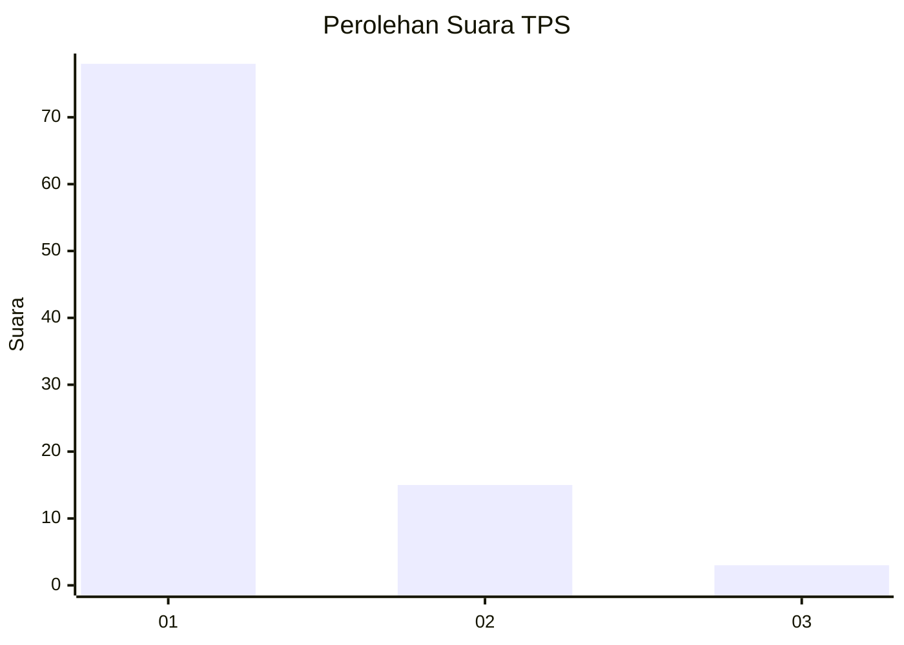
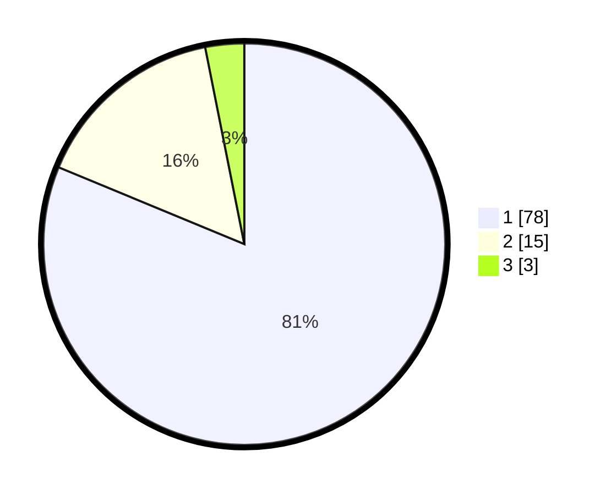

# Hasil

## Grafik

## Tabel

| No. | Nama Paslon    | Suara | Suara (raw) | Persentase |
|:--- |:-------------- | -----:| -----------:| ----------:|
| 1   | ANIES MUHAIMIN | 78    | [78][p-1]   | 81,25      |
| 2   | PRABOWO GIBRAN | 15    | [15][p-2]   | 15,63      |
| 3   | GANJAR MAHFUD  | 3     | [3][p-3]    | 3,13       |

[p-1]: https://github.com/gigit-pemilu/pemilu-2024-11-aceh/blob/main/pilpres/hitung-suara/sub/11-aceh/sub/05-aceh-barat/sub/06-bubon/sub/2006-cot-lada/sub/001-tps/sub/paslon-1.txt
[p-2]: https://github.com/gigit-pemilu/pemilu-2024-11-aceh/blob/main/pilpres/hitung-suara/sub/11-aceh/sub/05-aceh-barat/sub/06-bubon/sub/2006-cot-lada/sub/001-tps/sub/paslon-2.txt
[p-3]: https://github.com/gigit-pemilu/pemilu-2024-11-aceh/blob/main/pilpres/hitung-suara/sub/11-aceh/sub/05-aceh-barat/sub/06-bubon/sub/2006-cot-lada/sub/001-tps/sub/paslon-3.txt

## Foto C Plano

https://sirekap-obj-formc.kpu.go.id/3f67/pemilu/ppwp/11/05/06/20/06/1105062006001-20240216-082022--51c3ee49-fc14-4ddf-b6a9-c76f98b8f006.jpg

https://sirekap-obj-formc.kpu.go.id/3f67/pemilu/ppwp/11/05/06/20/06/1105062006001-20240216-082037--2502f180-4446-4d11-a23a-d713b013c32b.jpg

https://sirekap-obj-formc.kpu.go.id/3f67/pemilu/ppwp/11/05/06/20/06/1105062006001-20240216-082030--b09390ba-a328-4d6b-a1b9-6466db67208e.jpg

## Metadata

| Key        | Value               |
| ---------- | ------------------- |
| Time Stamp | 2024-02-16 21:01:00 |

## DATA PEMILIH TETAP

Jumlah pemilih dalam DPT: **104**.
 * L: **60**.
 * P: **44**.

## DATA PENGGUNA HAK PILIH

Jumlah pengguna hak pilih dalam DPT: **97**.
 * L: **54**.
 * P: **43**.

Jumlah pengguna hak pilih dalam DPTb: **0**.
 * L: **0**.
 * P: **0**.

Jumlah pengguna hak pilih dalam DPK: **0**.
 * L: **0**.
 * P: **0**.

Jumlah pengguna hak pilih: **97**.
 * L: **54**.
 * P: **43**.

## JUMLAH SUARA SAH DAN TIDAK SAH

JUMLAH SELURUH SUARA SAH: **96**.

JUMLAH SUARA TIDAK SAH: **1**.

JUMLAH SELURUH SUARA SAH DAN SUARA TIDAK SAH: **97**.

