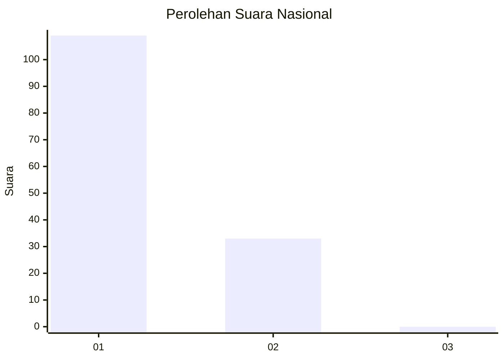
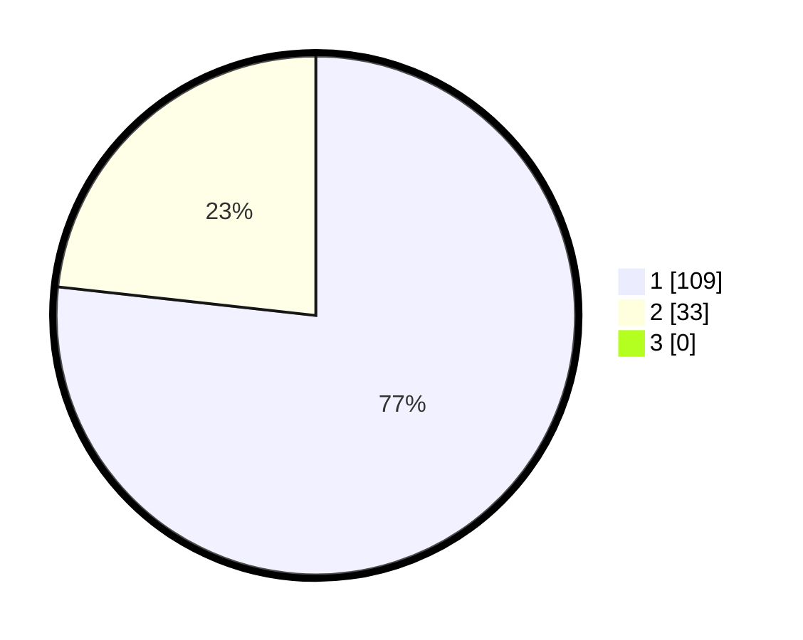

# Hasil

## Grafik

## Tabel

| No. | Nama Paslon    | Suara | Suara (raw) | Persentase |
|:--- |:-------------- | -----:| -----------:| ----------:|
| 1   | ANIES MUHAIMIN | 109   | [109][p-1]  | 76,76      |
| 2   | PRABOWO GIBRAN | 33    | [33][p-2]   | 23,24      |
| 3   | GANJAR MAHFUD  | 0     | [0][p-3]    | 0,00       |

[p-1]: https://github.com/gigit-pemilu/pemilu-2024/blob/main/pilpres/hitung-suara/sub/11-aceh/sub/05-aceh-barat/sub/06-bubon/sub/2017-ulee-blang/sub/001-tps/sub/paslon-1.txt
[p-2]: https://github.com/gigit-pemilu/pemilu-2024/blob/main/pilpres/hitung-suara/sub/11-aceh/sub/05-aceh-barat/sub/06-bubon/sub/2017-ulee-blang/sub/001-tps/sub/paslon-2.txt
[p-3]: https://github.com/gigit-pemilu/pemilu-2024/blob/main/pilpres/hitung-suara/sub/11-aceh/sub/05-aceh-barat/sub/06-bubon/sub/2017-ulee-blang/sub/001-tps/sub/paslon-3.txt

## Foto C Plano

https://sirekap-obj-formc.kpu.go.id/ea10/pemilu/ppwp/11/05/06/20/17/1105062017001-20240214-155631--ce178d7f-d8f4-41c2-8d14-133b8a150541.jpg

https://sirekap-obj-formc.kpu.go.id/ea10/pemilu/ppwp/11/05/06/20/17/1105062017001-20240214-155302--776b1d32-53b6-445c-a5d0-7b62c51974bb.jpg

https://sirekap-obj-formc.kpu.go.id/ea10/pemilu/ppwp/11/05/06/20/17/1105062017001-20240214-155444--97f25521-6d88-42f0-83c5-3a0f40f3c5cd.jpg

## Metadata

| Key        | Value               |
| ---------- | ------------------- |
| Time Stamp | 2024-02-15 22:00:27 |

