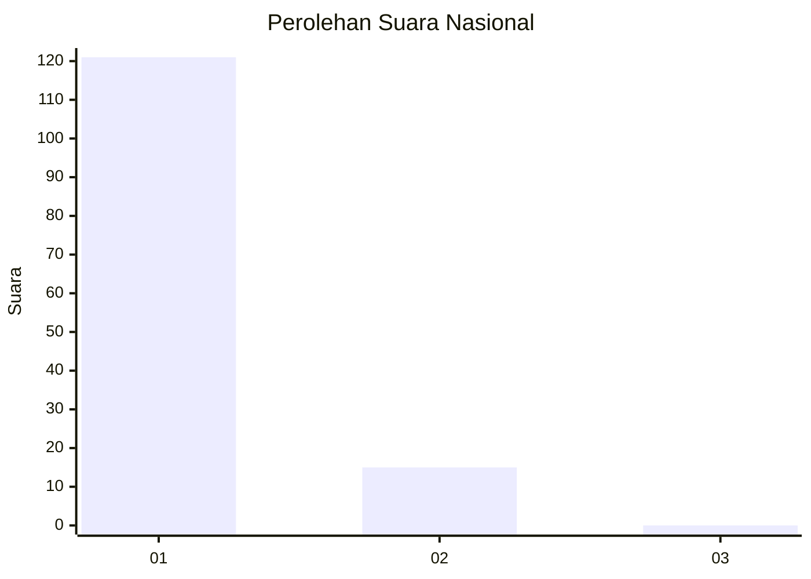
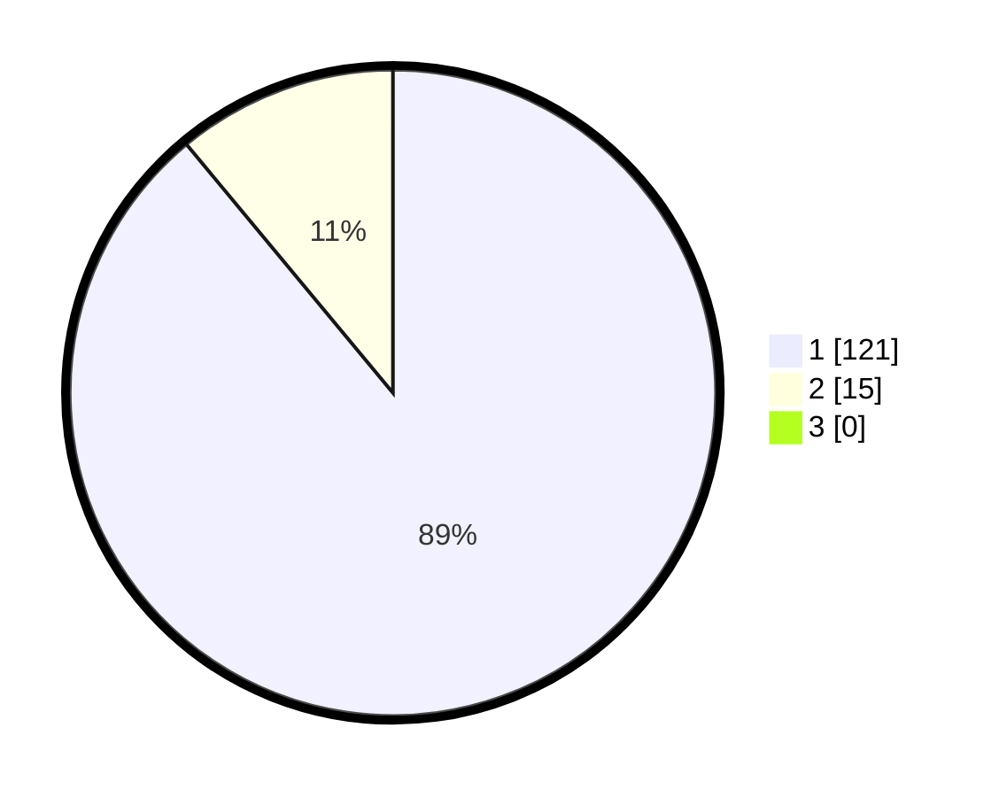

# Hasil

## Grafik

## Tabel

| No. | Nama Paslon    | Suara | Suara (raw) | Persentase |
|:--- |:-------------- | -----:| -----------:| ----------:|
| 1   | ANIES MUHAIMIN | 121   | [121][p-1]  | 88,97      |
| 2   | PRABOWO GIBRAN | 15    | [15][p-2]   | 11,03      |
| 3   | GANJAR MAHFUD  | 0     | [0][p-3]    | 0,00       |

[p-1]: https://github.com/gigit-pemilu/pemilu-2024/blob/main/pilpres/hitung-suara/sub/11-aceh/sub/05-aceh-barat/sub/07-arongan-lambalek/sub/2002-alue-bagok/sub/001-tps/sub/paslon-1.txt
[p-2]: https://github.com/gigit-pemilu/pemilu-2024/blob/main/pilpres/hitung-suara/sub/11-aceh/sub/05-aceh-barat/sub/07-arongan-lambalek/sub/2002-alue-bagok/sub/001-tps/sub/paslon-2.txt
[p-3]: https://github.com/gigit-pemilu/pemilu-2024/blob/main/pilpres/hitung-suara/sub/11-aceh/sub/05-aceh-barat/sub/07-arongan-lambalek/sub/2002-alue-bagok/sub/001-tps/sub/paslon-3.txt

## Foto C Plano

https://sirekap-obj-formc.kpu.go.id/2e38/pemilu/ppwp/11/05/07/20/02/1105072002001-20240215-022619--f005fee9-5a36-4a4e-89c4-8c7776de09fd.jpg

https://sirekap-obj-formc.kpu.go.id/2e38/pemilu/ppwp/11/05/07/20/02/1105072002001-20240215-033531--18bbb7a3-7d3d-485e-868c-d494cc68276d.jpg

https://sirekap-obj-formc.kpu.go.id/2e38/pemilu/ppwp/11/05/07/20/02/1105072002001-20240215-022835--b71ea204-9689-4149-80c6-03712c6ba099.jpg

## Metadata

| Key        | Value               |
| ---------- | ------------------- |
| Time Stamp | 2024-02-16 09:30:28 |

## DATA PEMILIH TETAP

Jumlah pemilih dalam DPT: **156**.
 * L: **74**.
 * P: **82**.

## DATA PENGGUNA HAK PILIH

Jumlah pengguna hak pilih dalam DPT: **140**.
 * L: **65**.
 * P: **75**.

Jumlah pengguna hak pilih dalam DPTb: **0**.
 * L: **0**.
 * P: **0**.

Jumlah pengguna hak pilih dalam DPK: **2**.
 * L: **1**.
 * P: **1**.

Jumlah pengguna hak pilih: **142**.
 * L: **66**.
 * P: **76**.

## JUMLAH SUARA SAH DAN TIDAK SAH

JUMLAH SELURUH SUARA SAH: **136**.

JUMLAH SUARA TIDAK SAH: **6**.

JUMLAH SELURUH SUARA SAH DAN SUARA TIDAK SAH: **142**.

