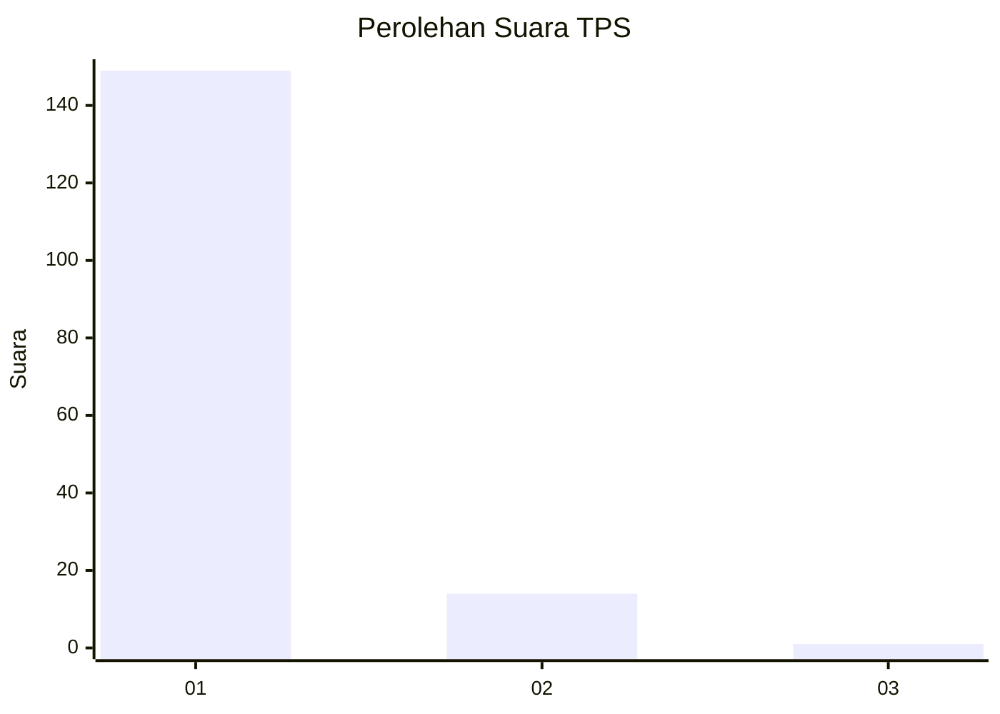
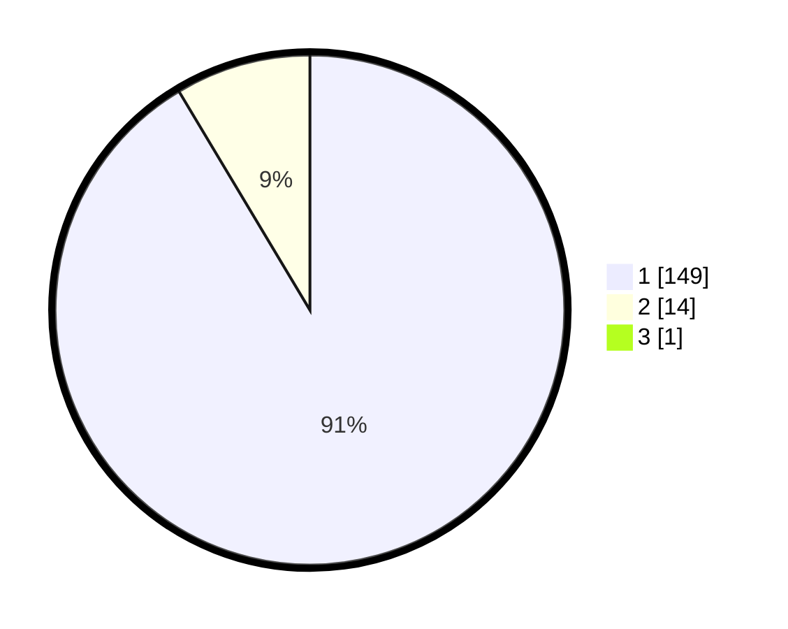

# Hasil

## Grafik

## Tabel

| No. | Nama Paslon    | Suara | Suara (raw) | Persentase |
|:--- |:-------------- | -----:| -----------:| ----------:|
| 1   | ANIES MUHAIMIN | 149   | [149][p-1]  | 90,85      |
| 2   | PRABOWO GIBRAN | 14    | [14][p-2]   | 8,54       |
| 3   | GANJAR MAHFUD  | 1     | [1][p-3]    | 0,61       |

[p-1]: https://github.com/gigit-pemilu/pemilu-2024-11-aceh/blob/main/pilpres/hitung-suara/sub/11-aceh/sub/05-aceh-barat/sub/07-arongan-lambalek/sub/2002-alue-bagok/sub/002-tps/sub/paslon-1.txt
[p-2]: https://github.com/gigit-pemilu/pemilu-2024-11-aceh/blob/main/pilpres/hitung-suara/sub/11-aceh/sub/05-aceh-barat/sub/07-arongan-lambalek/sub/2002-alue-bagok/sub/002-tps/sub/paslon-2.txt
[p-3]: https://github.com/gigit-pemilu/pemilu-2024-11-aceh/blob/main/pilpres/hitung-suara/sub/11-aceh/sub/05-aceh-barat/sub/07-arongan-lambalek/sub/2002-alue-bagok/sub/002-tps/sub/paslon-3.txt

## Foto C Plano

https://sirekap-obj-formc.kpu.go.id/094b/pemilu/ppwp/11/05/07/20/02/1105072002002-20240214-203024--c023eb73-202b-4a05-b08e-9f28d1b48b0b.jpg

https://sirekap-obj-formc.kpu.go.id/094b/pemilu/ppwp/11/05/07/20/02/1105072002002-20240214-203932--c73474ac-cdb9-4d2f-8239-16106bc03078.jpg

https://sirekap-obj-formc.kpu.go.id/094b/pemilu/ppwp/11/05/07/20/02/1105072002002-20240214-204258--85cf368b-902f-48e8-92c9-5006e7110210.jpg

## Metadata

| Key        | Value               |
| ---------- | ------------------- |
| Time Stamp | 2024-02-15 09:00:24 |

