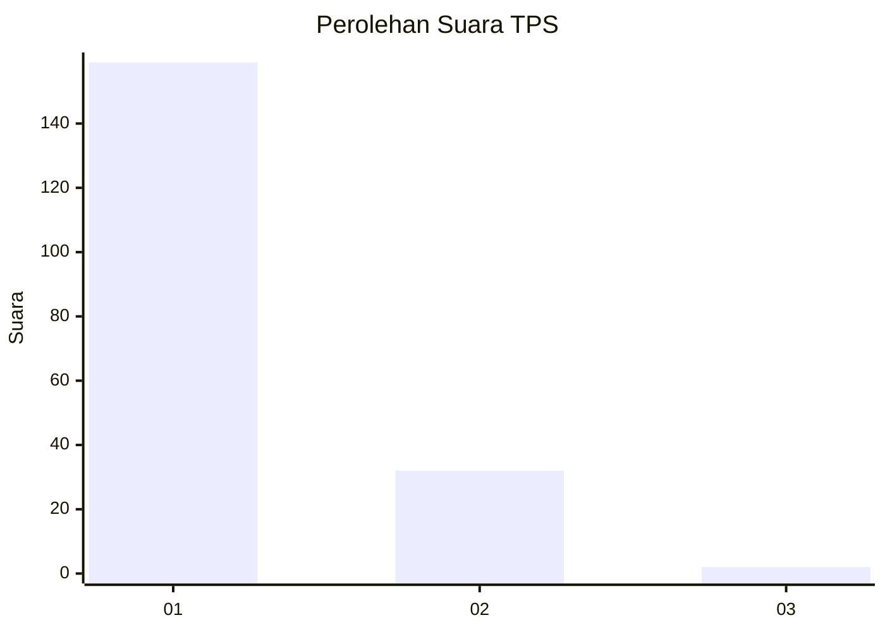
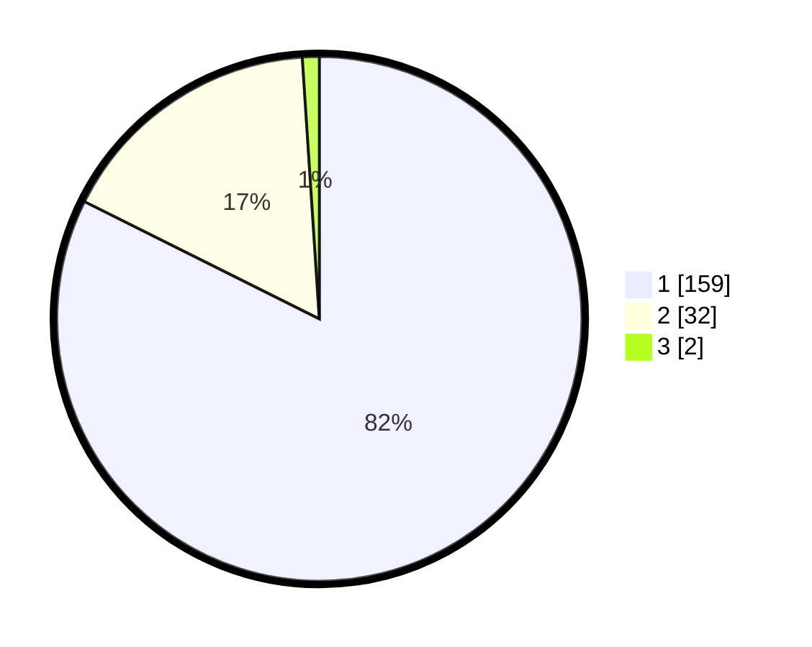

# Hasil

## Grafik

## Tabel

| No. | Nama Paslon    | Suara | Suara (raw) | Persentase |
|:--- |:-------------- | -----:| -----------:| ----------:|
| 1   | ANIES MUHAIMIN | 159   | [159][p-1]  | 82,38      |
| 2   | PRABOWO GIBRAN | 32    | [32][p-2]   | 16,58      |
| 3   | GANJAR MAHFUD  | 2     | [2][p-3]    | 1,04       |

[p-1]: https://github.com/gigit-pemilu/pemilu-2024-11-aceh/blob/main/pilpres/hitung-suara/sub/11-aceh/sub/05-aceh-barat/sub/07-arongan-lambalek/sub/2003-alue-sundak/sub/001-tps/sub/paslon-1.txt
[p-2]: https://github.com/gigit-pemilu/pemilu-2024-11-aceh/blob/main/pilpres/hitung-suara/sub/11-aceh/sub/05-aceh-barat/sub/07-arongan-lambalek/sub/2003-alue-sundak/sub/001-tps/sub/paslon-2.txt
[p-3]: https://github.com/gigit-pemilu/pemilu-2024-11-aceh/blob/main/pilpres/hitung-suara/sub/11-aceh/sub/05-aceh-barat/sub/07-arongan-lambalek/sub/2003-alue-sundak/sub/001-tps/sub/paslon-3.txt

## Foto C Plano

https://sirekap-obj-formc.kpu.go.id/ded8/pemilu/ppwp/11/05/07/20/03/1105072003001-20240215-135130--8d7c5237-3d3e-4f90-b0ec-cf5cc41c8378.jpg

https://sirekap-obj-formc.kpu.go.id/ded8/pemilu/ppwp/11/05/07/20/03/1105072003001-20240215-140249--95bf3865-8e79-4bda-b9a5-73901e55fe1c.jpg

https://sirekap-obj-formc.kpu.go.id/ded8/pemilu/ppwp/11/05/07/20/03/1105072003001-20240215-141157--d10ea1e8-2ada-4781-81d8-c98398f3e03d.jpg

## Metadata

| Key        | Value               |
| ---------- | ------------------- |
| Time Stamp | 2024-02-15 22:00:27 |

