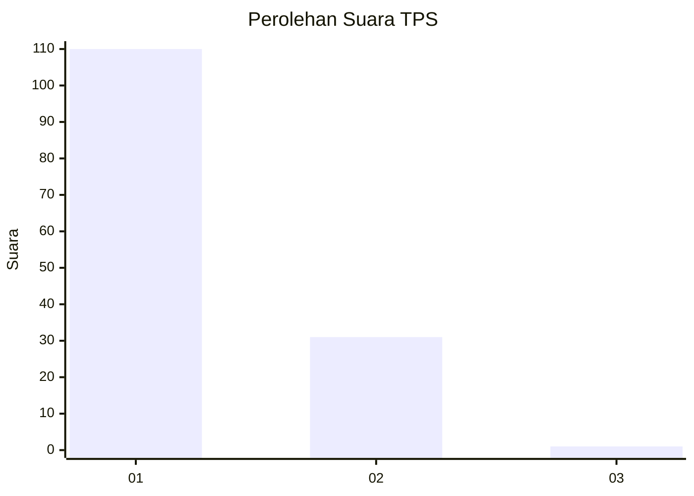
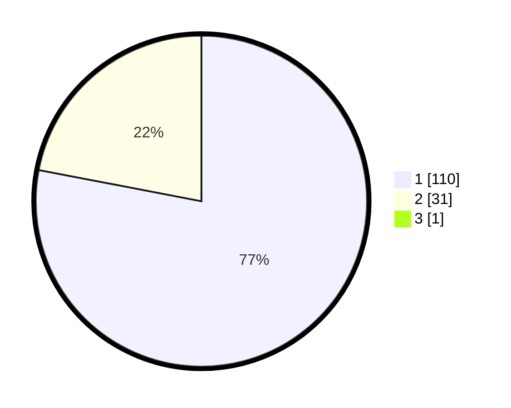

# Hasil

## Grafik

## Tabel

| No. | Nama Paslon    | Suara | Suara (raw) | Persentase |
|:--- |:-------------- | -----:| -----------:| ----------:|
| 1   | ANIES MUHAIMIN | 110   | [110][p-1]  | 77,46      |
| 2   | PRABOWO GIBRAN | 31    | [31][p-2]   | 21,83      |
| 3   | GANJAR MAHFUD  | 1     | [1][p-3]    | 0,70       |

[p-1]: https://github.com/gigit-pemilu/pemilu-2024-11-aceh/blob/main/pilpres/hitung-suara/sub/11-aceh/sub/05-aceh-barat/sub/07-arongan-lambalek/sub/2014-panton-bahagia/sub/001-tps/sub/paslon-1.txt
[p-2]: https://github.com/gigit-pemilu/pemilu-2024-11-aceh/blob/main/pilpres/hitung-suara/sub/11-aceh/sub/05-aceh-barat/sub/07-arongan-lambalek/sub/2014-panton-bahagia/sub/001-tps/sub/paslon-2.txt
[p-3]: https://github.com/gigit-pemilu/pemilu-2024-11-aceh/blob/main/pilpres/hitung-suara/sub/11-aceh/sub/05-aceh-barat/sub/07-arongan-lambalek/sub/2014-panton-bahagia/sub/001-tps/sub/paslon-3.txt

## Foto C Plano

https://sirekap-obj-formc.kpu.go.id/6f03/pemilu/ppwp/11/05/07/20/14/1105072014001-20240215-051928--887a58d4-ae8f-44c6-a35c-3703292c1b0b.jpg

https://sirekap-obj-formc.kpu.go.id/6f03/pemilu/ppwp/11/05/07/20/14/1105072014001-20240215-100029--a7f3a467-50a5-4620-af56-5c09a83ac4e1.jpg

https://sirekap-obj-formc.kpu.go.id/6f03/pemilu/ppwp/11/05/07/20/14/1105072014001-20240215-051546--3d7586af-72f8-4488-aa89-a213f69323ae.jpg

## Metadata

| Key        | Value               |
| ---------- | ------------------- |
| Time Stamp | 2024-02-15 22:00:27 |

