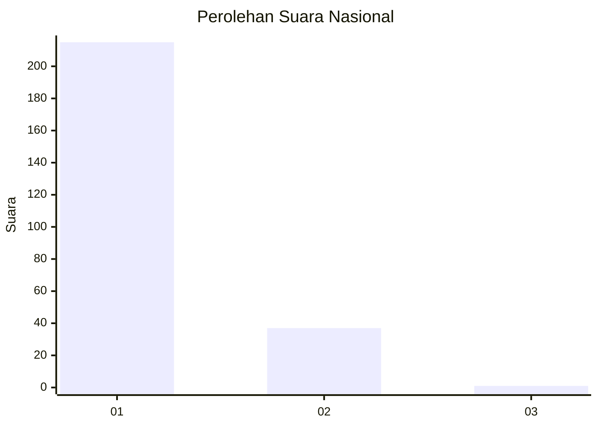
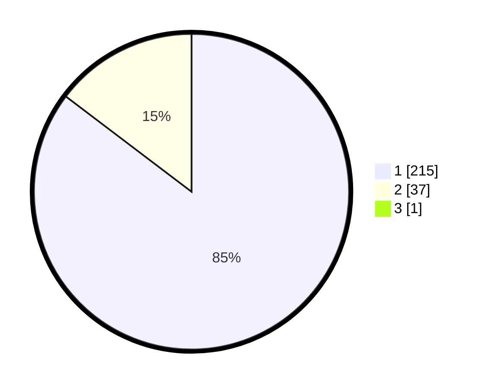

# Hasil

## Grafik

## Tabel

| No. | Nama Paslon    | Suara | Suara (raw) | Persentase |
|:--- |:-------------- | -----:| -----------:| ----------:|
| 1   | ANIES MUHAIMIN | 215   | [215][p-1]  | 84,98      |
| 2   | PRABOWO GIBRAN | 37    | [37][p-2]   | 14,62      |
| 3   | GANJAR MAHFUD  | 1     | [1][p-3]    | 0,40       |

[p-1]: https://github.com/gigit-pemilu/pemilu-2024/blob/main/pilpres/hitung-suara/sub/11-aceh/sub/05-aceh-barat/sub/07-arongan-lambalek/sub/2015-peulanteu-lb/sub/002-tps/sub/paslon-1.txt
[p-2]: https://github.com/gigit-pemilu/pemilu-2024/blob/main/pilpres/hitung-suara/sub/11-aceh/sub/05-aceh-barat/sub/07-arongan-lambalek/sub/2015-peulanteu-lb/sub/002-tps/sub/paslon-2.txt
[p-3]: https://github.com/gigit-pemilu/pemilu-2024/blob/main/pilpres/hitung-suara/sub/11-aceh/sub/05-aceh-barat/sub/07-arongan-lambalek/sub/2015-peulanteu-lb/sub/002-tps/sub/paslon-3.txt

## Foto C Plano

https://sirekap-obj-formc.kpu.go.id/e484/pemilu/ppwp/11/05/07/20/15/1105072015002-20240214-210621--250802a4-b6ca-466d-9838-cda435c0ee0a.jpg

https://sirekap-obj-formc.kpu.go.id/e484/pemilu/ppwp/11/05/07/20/15/1105072015002-20240214-210759--12519519-51d3-44eb-9aba-34607fede6d5.jpg

https://sirekap-obj-formc.kpu.go.id/e484/pemilu/ppwp/11/05/07/20/15/1105072015002-20240214-210934--87b506bd-09c4-4664-ab28-80dfbb9fe783.jpg

## Metadata

| Key        | Value               |
| ---------- | ------------------- |
| Time Stamp | 2024-02-15 22:00:27 |

