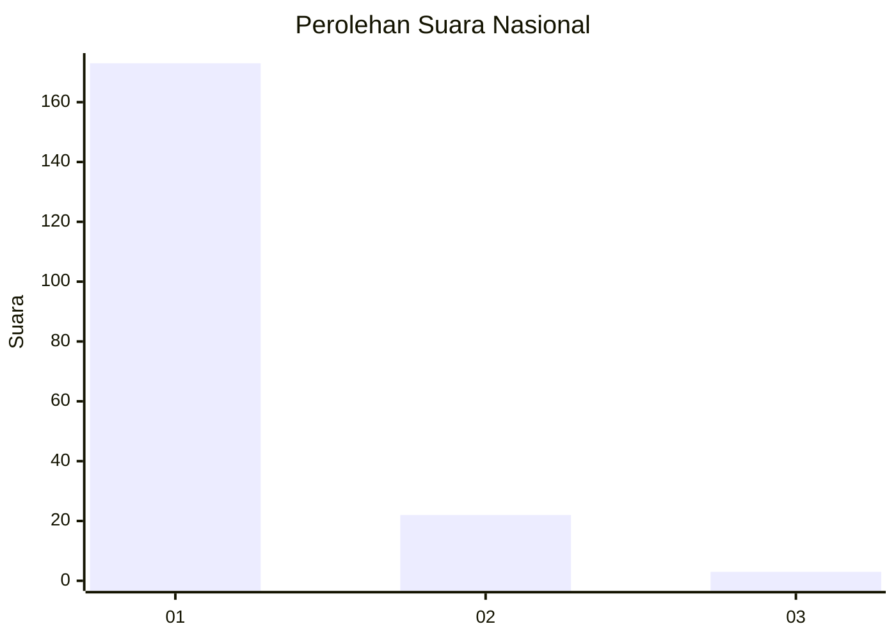
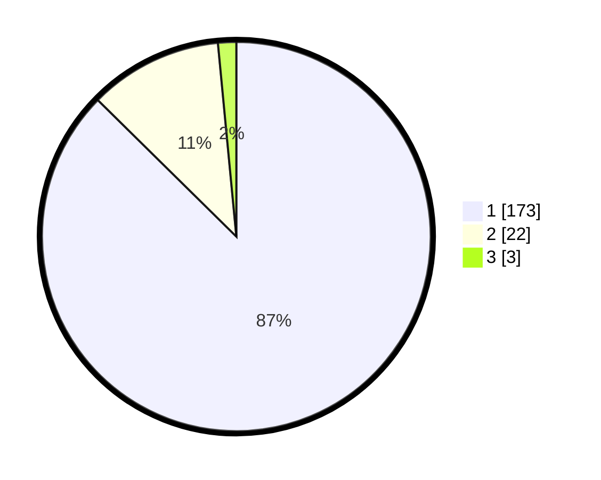

# Hasil

## Grafik

## Tabel

| No. | Nama Paslon    | Suara | Suara (raw) | Persentase |
|:--- |:-------------- | -----:| -----------:| ----------:|
| 1   | ANIES MUHAIMIN | 173   | [173][p-1]  | 87,37      |
| 2   | PRABOWO GIBRAN | 22    | [22][p-2]   | 11,11      |
| 3   | GANJAR MAHFUD  | 3     | [3][p-3]    | 1,52       |

[p-1]: https://github.com/gigit-pemilu/pemilu-2024/blob/main/pilpres/hitung-suara/sub/11-aceh/sub/05-aceh-barat/sub/07-arongan-lambalek/sub/2020-suak-bidok/sub/001-tps/sub/paslon-1.txt
[p-2]: https://github.com/gigit-pemilu/pemilu-2024/blob/main/pilpres/hitung-suara/sub/11-aceh/sub/05-aceh-barat/sub/07-arongan-lambalek/sub/2020-suak-bidok/sub/001-tps/sub/paslon-2.txt
[p-3]: https://github.com/gigit-pemilu/pemilu-2024/blob/main/pilpres/hitung-suara/sub/11-aceh/sub/05-aceh-barat/sub/07-arongan-lambalek/sub/2020-suak-bidok/sub/001-tps/sub/paslon-3.txt

## Foto C Plano

https://sirekap-obj-formc.kpu.go.id/bdf0/pemilu/ppwp/11/05/07/20/20/1105072020001-20240215-070742--c049b2c7-a800-4382-b678-3483cdb861ec.jpg

https://sirekap-obj-formc.kpu.go.id/bdf0/pemilu/ppwp/11/05/07/20/20/1105072020001-20240215-023109--5e89426c-4305-4789-8d5a-b6523eea9fea.jpg

https://sirekap-obj-formc.kpu.go.id/bdf0/pemilu/ppwp/11/05/07/20/20/1105072020001-20240215-120923--ef825daf-4d64-46f9-b5d5-7414d03bc7de.jpg

## Metadata

| Key        | Value               |
| ---------- | ------------------- |
| Time Stamp | 2024-02-15 18:00:26 |

