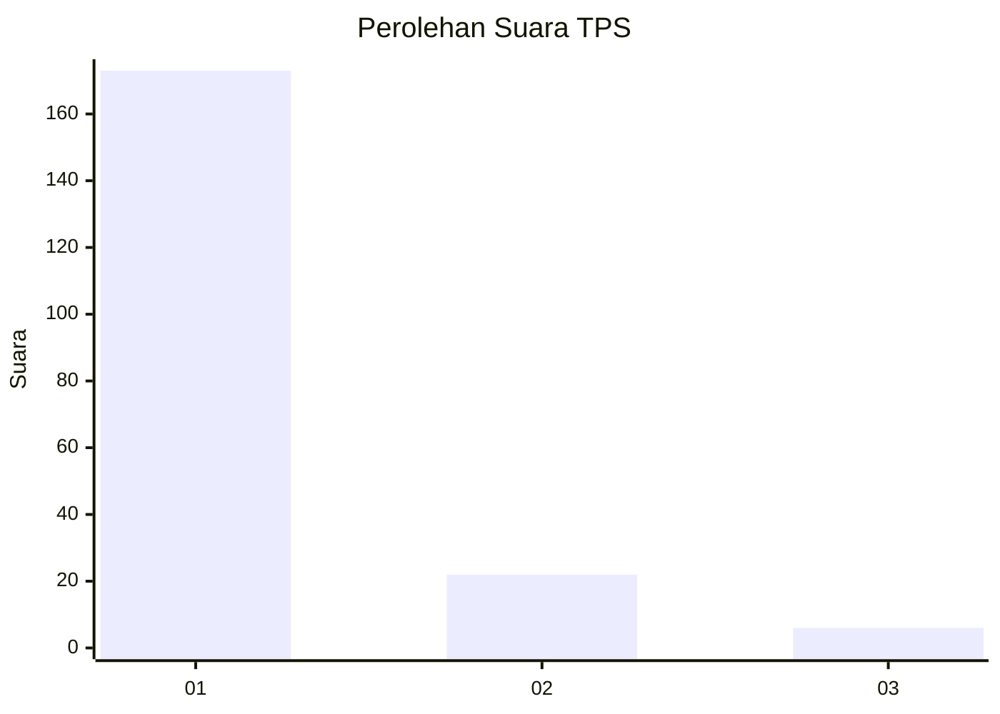
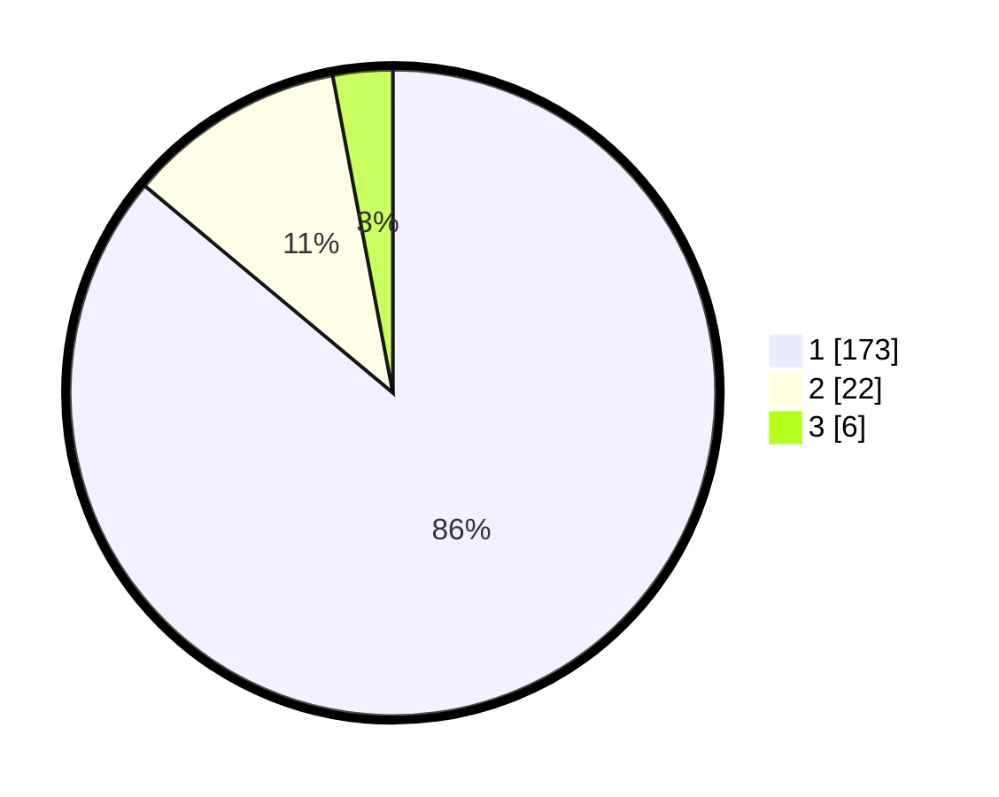

# Hasil

## Grafik

## Tabel

| No. | Nama Paslon    | Suara | Suara (raw) | Persentase |
|:--- |:-------------- | -----:| -----------:| ----------:|
| 1   | ANIES MUHAIMIN | 173   | [173][p-1]  | 86,07      |
| 2   | PRABOWO GIBRAN | 22    | [22][p-2]   | 10,95      |
| 3   | GANJAR MAHFUD  | 6     | [6][p-3]    | 2,99       |

[p-1]: https://github.com/gigit-pemilu/pemilu-2024-11-aceh/blob/main/pilpres/hitung-suara/sub/11-aceh/sub/05-aceh-barat/sub/07-arongan-lambalek/sub/2021-simpang-peut/sub/002-tps/sub/paslon-1.txt
[p-2]: https://github.com/gigit-pemilu/pemilu-2024-11-aceh/blob/main/pilpres/hitung-suara/sub/11-aceh/sub/05-aceh-barat/sub/07-arongan-lambalek/sub/2021-simpang-peut/sub/002-tps/sub/paslon-2.txt
[p-3]: https://github.com/gigit-pemilu/pemilu-2024-11-aceh/blob/main/pilpres/hitung-suara/sub/11-aceh/sub/05-aceh-barat/sub/07-arongan-lambalek/sub/2021-simpang-peut/sub/002-tps/sub/paslon-3.txt

## Foto C Plano

https://sirekap-obj-formc.kpu.go.id/f9dc/pemilu/ppwp/11/05/07/20/21/1105072021002-20240215-020031--c3e3d45b-6570-4386-99af-7f122b5c396f.jpg

https://sirekap-obj-formc.kpu.go.id/f9dc/pemilu/ppwp/11/05/07/20/21/1105072021002-20240214-211409--58c691f9-57d0-4b1d-8c2c-25e67c9e5a66.jpg

https://sirekap-obj-formc.kpu.go.id/f9dc/pemilu/ppwp/11/05/07/20/21/1105072021002-20240214-211628--d94f31a1-a90f-48bf-97ec-ea7c52d0f395.jpg

## Metadata

| Key        | Value               |
| ---------- | ------------------- |
| Time Stamp | 2024-02-15 22:00:27 |

