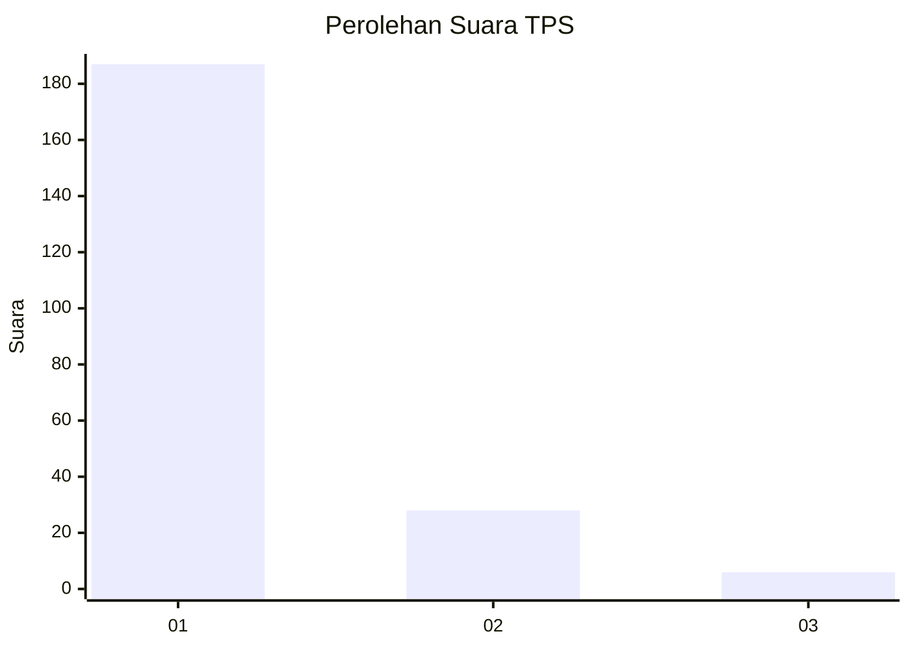
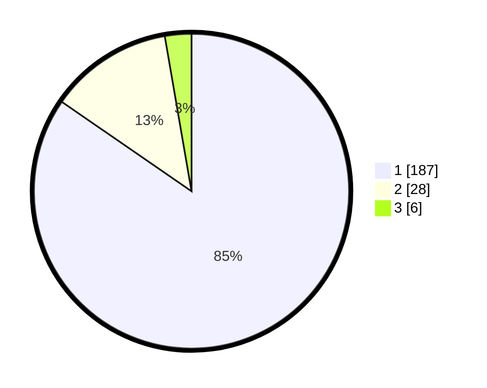

# Hasil

## Grafik

## Tabel

| No. | Nama Paslon    | Suara | Suara (raw) | Persentase |
|:--- |:-------------- | -----:| -----------:| ----------:|
| 1   | ANIES MUHAIMIN | 187   | [187][p-1]  | 84,62      |
| 2   | PRABOWO GIBRAN | 28    | [28][p-2]   | 12,67      |
| 3   | GANJAR MAHFUD  | 6     | [6][p-3]    | 2,71       |

[p-1]: https://github.com/gigit-pemilu/pemilu-2024-11-aceh/blob/main/pilpres/hitung-suara/sub/11-aceh/sub/05-aceh-barat/sub/07-arongan-lambalek/sub/2021-simpang-peut/sub/003-tps/sub/paslon-1.txt
[p-2]: https://github.com/gigit-pemilu/pemilu-2024-11-aceh/blob/main/pilpres/hitung-suara/sub/11-aceh/sub/05-aceh-barat/sub/07-arongan-lambalek/sub/2021-simpang-peut/sub/003-tps/sub/paslon-2.txt
[p-3]: https://github.com/gigit-pemilu/pemilu-2024-11-aceh/blob/main/pilpres/hitung-suara/sub/11-aceh/sub/05-aceh-barat/sub/07-arongan-lambalek/sub/2021-simpang-peut/sub/003-tps/sub/paslon-3.txt

## Foto C Plano

https://sirekap-obj-formc.kpu.go.id/ff0d/pemilu/ppwp/11/05/07/20/21/1105072021003-20240214-200634--84cd7d49-7c6d-4e86-87f5-29a0fb7066e0.jpg

https://sirekap-obj-formc.kpu.go.id/ff0d/pemilu/ppwp/11/05/07/20/21/1105072021003-20240214-200800--370dc1be-9c6d-4019-874d-4a7d6b0d6058.jpg

https://sirekap-obj-formc.kpu.go.id/ff0d/pemilu/ppwp/11/05/07/20/21/1105072021003-20240214-200838--7bce9efb-9e1b-4ba6-bb4c-a23bb6d479a6.jpg

## Metadata

| Key        | Value               |
| ---------- | ------------------- |
| Time Stamp | 2024-02-15 22:00:27 |

