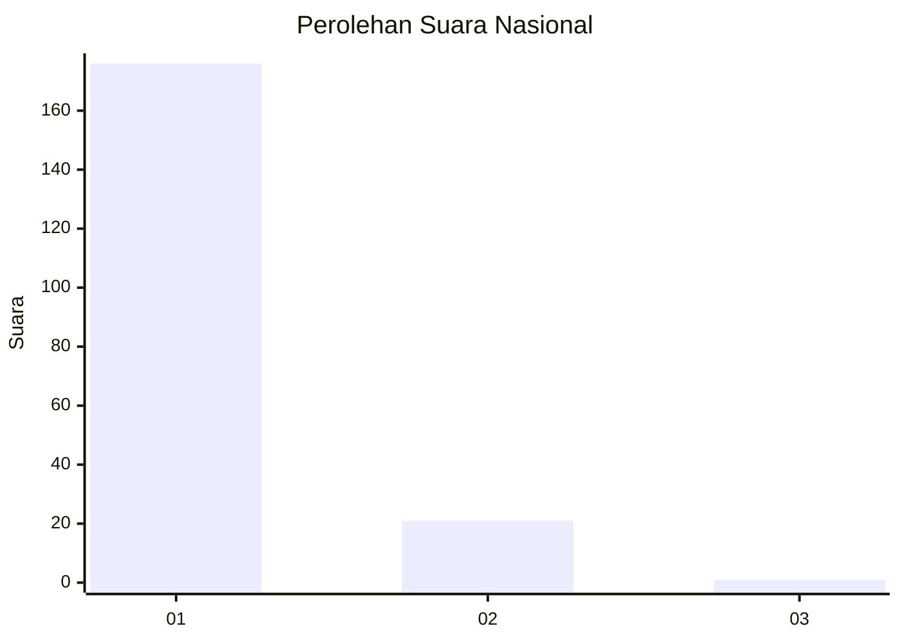
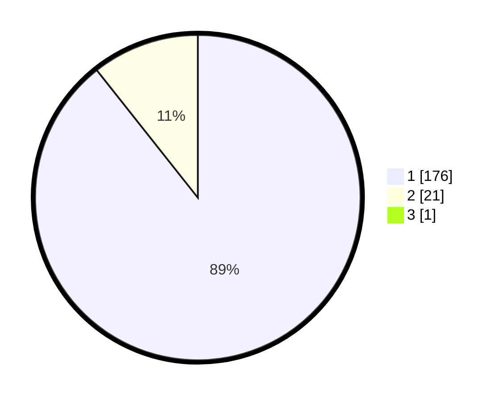

# Hasil

## Grafik

## Tabel

| No. | Nama Paslon    | Suara | Suara (raw) | Persentase |
|:--- |:-------------- | -----:| -----------:| ----------:|
| 1   | ANIES MUHAIMIN | 176   | [176][p-1]  | 88,89      |
| 2   | PRABOWO GIBRAN | 21    | [21][p-2]   | 10,61      |
| 3   | GANJAR MAHFUD  | 1     | [1][p-3]    | 0,51       |

[p-1]: https://github.com/gigit-pemilu/pemilu-2024/blob/main/pilpres/hitung-suara/sub/11-aceh/sub/05-aceh-barat/sub/07-arongan-lambalek/sub/2025-ujong-simpang/sub/002-tps/sub/paslon-1.txt
[p-2]: https://github.com/gigit-pemilu/pemilu-2024/blob/main/pilpres/hitung-suara/sub/11-aceh/sub/05-aceh-barat/sub/07-arongan-lambalek/sub/2025-ujong-simpang/sub/002-tps/sub/paslon-2.txt
[p-3]: https://github.com/gigit-pemilu/pemilu-2024/blob/main/pilpres/hitung-suara/sub/11-aceh/sub/05-aceh-barat/sub/07-arongan-lambalek/sub/2025-ujong-simpang/sub/002-tps/sub/paslon-3.txt

## Foto C Plano

https://sirekap-obj-formc.kpu.go.id/db2f/pemilu/ppwp/11/05/07/20/25/1105072025002-20240215-021627--755393cb-4fbe-4260-9a1a-8449458fb5ed.jpg

https://sirekap-obj-formc.kpu.go.id/db2f/pemilu/ppwp/11/05/07/20/25/1105072025002-20240215-022539--6c4c0a03-0d5f-4771-81fc-cd4c954c9cd3.jpg

https://sirekap-obj-formc.kpu.go.id/db2f/pemilu/ppwp/11/05/07/20/25/1105072025002-20240215-022246--4ca45796-2cc5-4cfb-93e9-222054eacd54.jpg

## Metadata

| Key        | Value               |
| ---------- | ------------------- |
| Time Stamp | 2024-02-15 15:00:29 |

