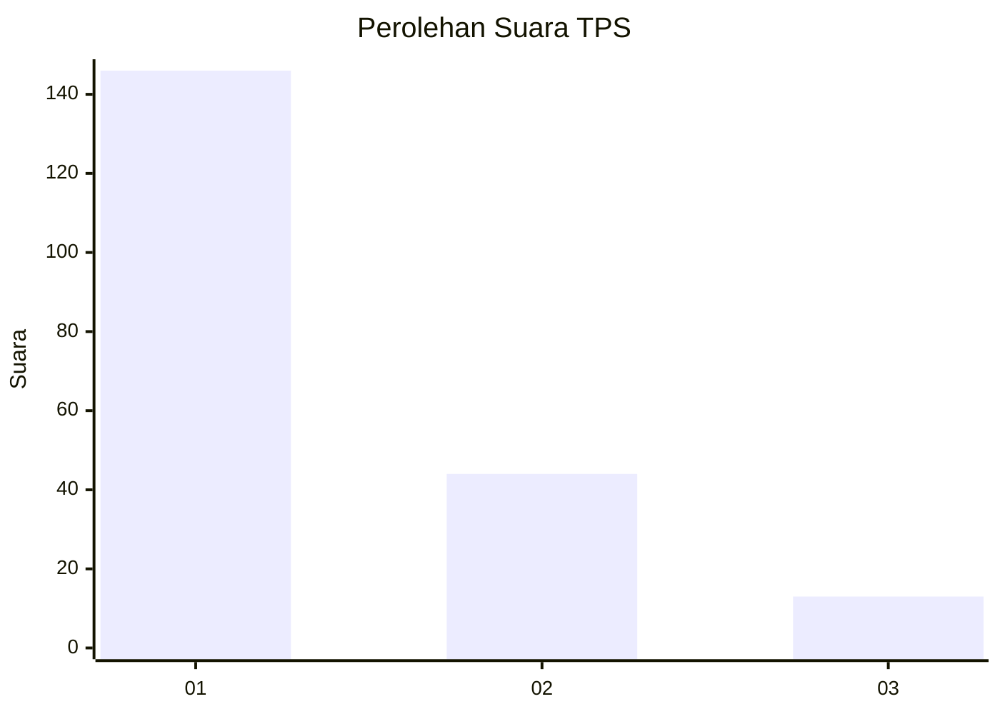
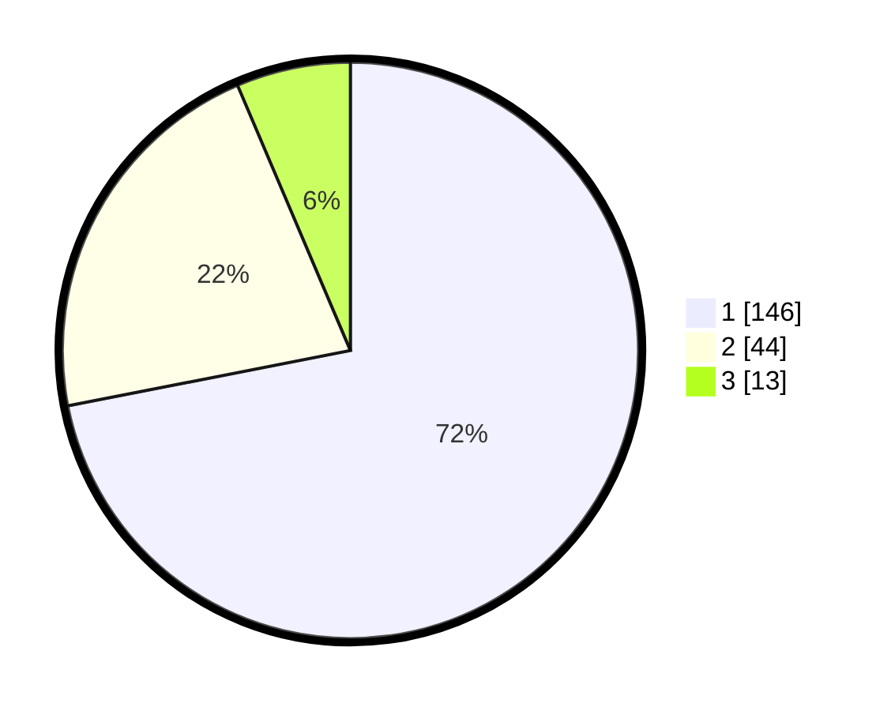

# Hasil

## Grafik

## Tabel

| No. | Nama Paslon    | Suara | Suara (raw) | Persentase |
|:--- |:-------------- | -----:| -----------:| ----------:|
| 1   | ANIES MUHAIMIN | 146   | [146][p-1]  | 71,92      |
| 2   | PRABOWO GIBRAN | 44    | [44][p-2]   | 21,67      |
| 3   | GANJAR MAHFUD  | 13    | [13][p-3]   | 6,40       |

[p-1]: https://github.com/gigit-pemilu/pemilu-2024-11-aceh/blob/main/pilpres/hitung-suara/sub/11-aceh/sub/05-aceh-barat/sub/07-arongan-lambalek/sub/2026-gunong-pulo/sub/001-tps/sub/paslon-1.txt
[p-2]: https://github.com/gigit-pemilu/pemilu-2024-11-aceh/blob/main/pilpres/hitung-suara/sub/11-aceh/sub/05-aceh-barat/sub/07-arongan-lambalek/sub/2026-gunong-pulo/sub/001-tps/sub/paslon-2.txt
[p-3]: https://github.com/gigit-pemilu/pemilu-2024-11-aceh/blob/main/pilpres/hitung-suara/sub/11-aceh/sub/05-aceh-barat/sub/07-arongan-lambalek/sub/2026-gunong-pulo/sub/001-tps/sub/paslon-3.txt

## Foto C Plano

https://sirekap-obj-formc.kpu.go.id/ac9e/pemilu/ppwp/11/05/07/20/26/1105072026001-20240214-184527--3448e735-7084-4445-956d-464f58796b7f.jpg

https://sirekap-obj-formc.kpu.go.id/ac9e/pemilu/ppwp/11/05/07/20/26/1105072026001-20240214-184959--855a290b-dafc-4ff7-b380-a53fd5d79023.jpg

https://sirekap-obj-formc.kpu.go.id/ac9e/pemilu/ppwp/11/05/07/20/26/1105072026001-20240214-185140--fe926889-4759-4054-b70c-4a87f7198e80.jpg

## Metadata

| Key        | Value               |
| ---------- | ------------------- |
| Time Stamp | 2024-02-15 22:00:27 |

