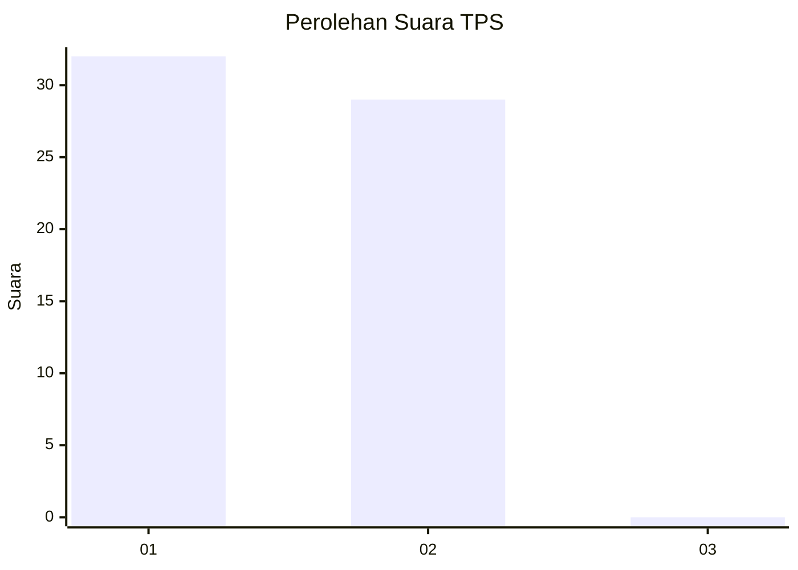
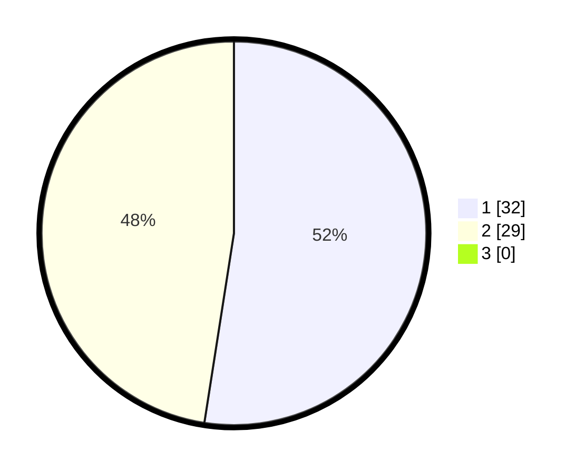

# Hasil

## Grafik

## Tabel

| No. | Nama Paslon    | Suara | Suara (raw) | Persentase |
|:--- |:-------------- | -----:| -----------:| ----------:|
| 1   | ANIES MUHAIMIN | 32    | [32][p-1]   | 52,46      |
| 2   | PRABOWO GIBRAN | 29    | [29][p-2]   | 47,54      |
| 3   | GANJAR MAHFUD  | 0     | [0][p-3]    | 0,00       |

[p-1]: https://github.com/gigit-pemilu/pemilu-2024-11-aceh/blob/main/pilpres/hitung-suara/sub/11-aceh/sub/05-aceh-barat/sub/07-arongan-lambalek/sub/2027-karang-hampa/sub/001-tps/sub/paslon-1.txt
[p-2]: https://github.com/gigit-pemilu/pemilu-2024-11-aceh/blob/main/pilpres/hitung-suara/sub/11-aceh/sub/05-aceh-barat/sub/07-arongan-lambalek/sub/2027-karang-hampa/sub/001-tps/sub/paslon-2.txt
[p-3]: https://github.com/gigit-pemilu/pemilu-2024-11-aceh/blob/main/pilpres/hitung-suara/sub/11-aceh/sub/05-aceh-barat/sub/07-arongan-lambalek/sub/2027-karang-hampa/sub/001-tps/sub/paslon-3.txt

## Foto C Plano

https://sirekap-obj-formc.kpu.go.id/e4fa/pemilu/ppwp/11/05/07/20/27/1105072027001-20240215-160135--c77816ad-4173-46a6-b22b-f153726c88a0.jpg

https://sirekap-obj-formc.kpu.go.id/e4fa/pemilu/ppwp/11/05/07/20/27/1105072027001-20240215-160806--e3cd6180-b593-4d70-a561-520e7cc6439f.jpg

https://sirekap-obj-formc.kpu.go.id/e4fa/pemilu/ppwp/11/05/07/20/27/1105072027001-20240215-161058--f942b0a7-d8a3-4208-b48c-e286b37f0c77.jpg

## Metadata

| Key        | Value               |
| ---------- | ------------------- |
| Time Stamp | 2024-02-16 22:01:00 |

