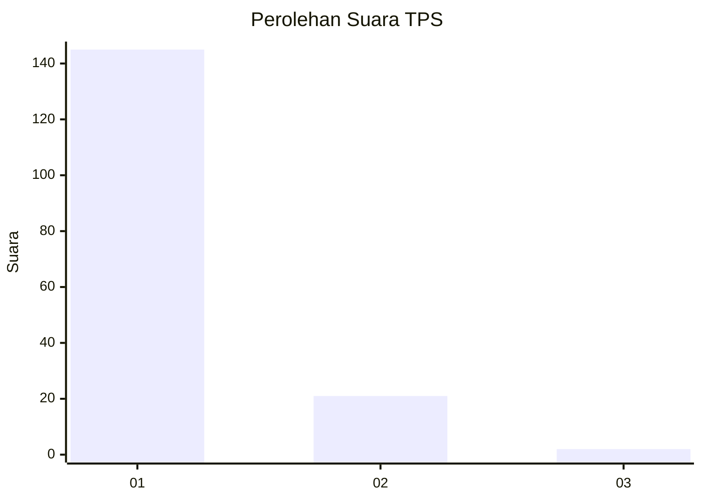
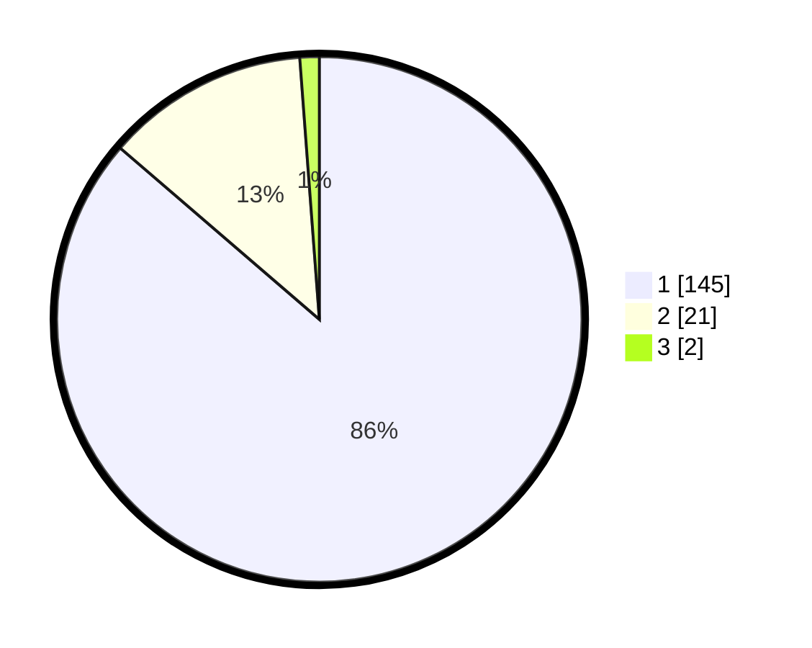

# Hasil

## Grafik

## Tabel

| No. | Nama Paslon    | Suara | Suara (raw) | Persentase |
|:--- |:-------------- | -----:| -----------:| ----------:|
| 1   | ANIES MUHAIMIN | 145   | [145][p-1]  | 86,31      |
| 2   | PRABOWO GIBRAN | 21    | [21][p-2]   | 12,50      |
| 3   | GANJAR MAHFUD  | 2     | [2][p-3]    | 1,19       |

[p-1]: https://github.com/gigit-pemilu/pemilu-2024-11-aceh/blob/main/pilpres/hitung-suara/sub/11-aceh/sub/05-aceh-barat/sub/08-pante-ceureumen/sub/2001-seumara/sub/002-tps/sub/paslon-1.txt
[p-2]: https://github.com/gigit-pemilu/pemilu-2024-11-aceh/blob/main/pilpres/hitung-suara/sub/11-aceh/sub/05-aceh-barat/sub/08-pante-ceureumen/sub/2001-seumara/sub/002-tps/sub/paslon-2.txt
[p-3]: https://github.com/gigit-pemilu/pemilu-2024-11-aceh/blob/main/pilpres/hitung-suara/sub/11-aceh/sub/05-aceh-barat/sub/08-pante-ceureumen/sub/2001-seumara/sub/002-tps/sub/paslon-3.txt

## Foto C Plano

https://sirekap-obj-formc.kpu.go.id/8d18/pemilu/ppwp/11/05/08/20/01/1105082001002-20240219-001550--69d8d4a6-dcb7-4d65-8ac8-25abc3943e41.jpg

https://sirekap-obj-formc.kpu.go.id/8d18/pemilu/ppwp/11/05/08/20/01/1105082001002-20240219-001551--843328e7-4f36-4a44-ba9c-29b16fb856d4.jpg

https://sirekap-obj-formc.kpu.go.id/8d18/pemilu/ppwp/11/05/08/20/01/1105082001002-20240219-001550--2aec16b3-e37a-46bf-9dc6-91193b535e81.jpg

## Metadata

| Key        | Value               |
| ---------- | ------------------- |
| Time Stamp | 2024-02-21 20:00:00 |

## DATA PEMILIH TETAP

Jumlah pemilih dalam DPT: **173**.
 * L: **83**.
 * P: **90**.

## DATA PENGGUNA HAK PILIH

Jumlah pengguna hak pilih dalam DPT: **165**.
 * L: **77**.
 * P: **88**.

Jumlah pengguna hak pilih dalam DPTb: **2**.
 * L: **0**.
 * P: **2**.

Jumlah pengguna hak pilih dalam DPK: **1**.
 * L: **0**.
 * P: **1**.

Jumlah pengguna hak pilih: **168**.
 * L: **77**.
 * P: **91**.

## JUMLAH SUARA SAH DAN TIDAK SAH

JUMLAH SELURUH SUARA SAH: **168**.

JUMLAH SUARA TIDAK SAH: **0**.

JUMLAH SELURUH SUARA SAH DAN SUARA TIDAK SAH: **168**.

