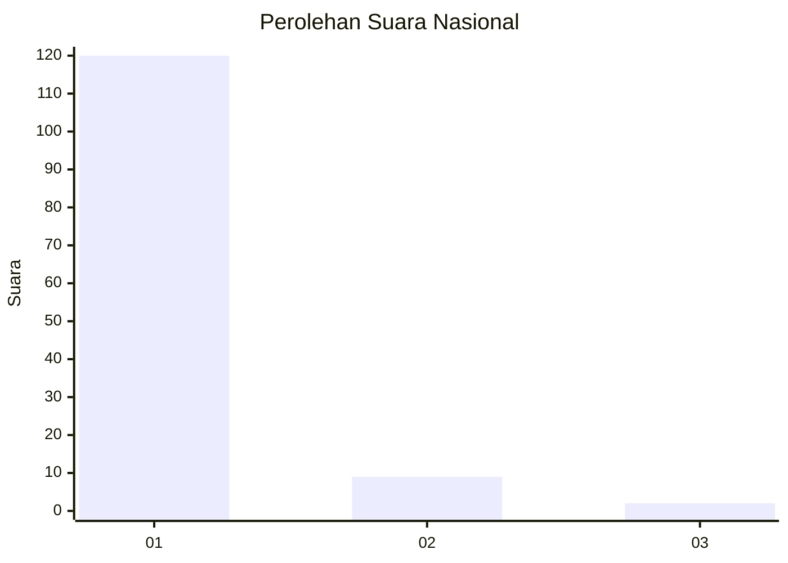
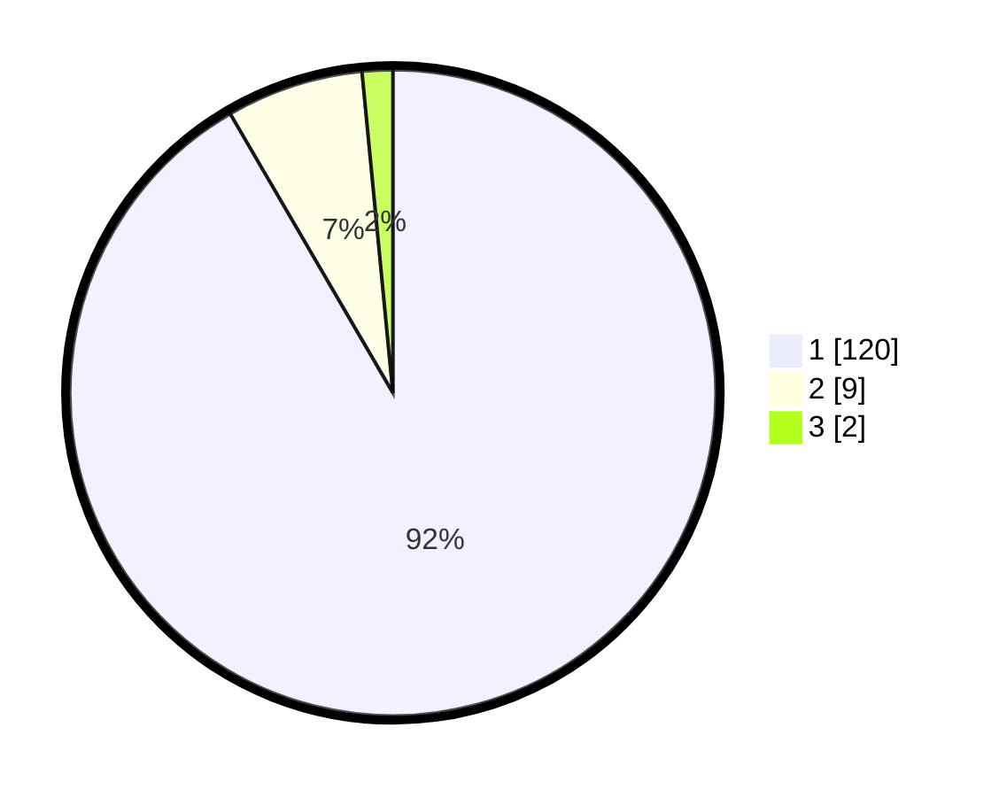

# Hasil

## Grafik

## Tabel

| No. | Nama Paslon    | Suara | Suara (raw) | Persentase |
|:--- |:-------------- | -----:| -----------:| ----------:|
| 1   | ANIES MUHAIMIN | 120   | [120][p-1]  | 91,60      |
| 2   | PRABOWO GIBRAN | 9     | [9][p-2]    | 6,87       |
| 3   | GANJAR MAHFUD  | 2     | [2][p-3]    | 1,53       |

[p-1]: https://github.com/gigit-pemilu/pemilu-2024/blob/main/pilpres/hitung-suara/sub/11-aceh/sub/05-aceh-barat/sub/08-pante-ceureumen/sub/2002-babah-lueng/sub/001-tps/sub/paslon-1.txt
[p-2]: https://github.com/gigit-pemilu/pemilu-2024/blob/main/pilpres/hitung-suara/sub/11-aceh/sub/05-aceh-barat/sub/08-pante-ceureumen/sub/2002-babah-lueng/sub/001-tps/sub/paslon-2.txt
[p-3]: https://github.com/gigit-pemilu/pemilu-2024/blob/main/pilpres/hitung-suara/sub/11-aceh/sub/05-aceh-barat/sub/08-pante-ceureumen/sub/2002-babah-lueng/sub/001-tps/sub/paslon-3.txt

## Foto C Plano

https://sirekap-obj-formc.kpu.go.id/df96/pemilu/ppwp/11/05/08/20/02/1105082002001-20240219-141854--e62f46c2-4a4c-49f5-8fe3-04ab39ba3187.jpg

https://sirekap-obj-formc.kpu.go.id/df96/pemilu/ppwp/11/05/08/20/02/1105082002001-20240219-141957--544262e0-1e1b-4193-b182-0afde4f990d2.jpg

https://sirekap-obj-formc.kpu.go.id/df96/pemilu/ppwp/11/05/08/20/02/1105082002001-20240219-142041--3962c7b1-3f11-4af5-a88c-02c0ad926748.jpg

## Metadata

| Key        | Value               |
| ---------- | ------------------- |
| Time Stamp | 2024-02-19 15:00:00 |

## DATA PEMILIH TETAP

Jumlah pemilih dalam DPT: **149**.
 * L: **72**.
 * P: **77**.

## DATA PENGGUNA HAK PILIH

Jumlah pengguna hak pilih dalam DPT: **142**.
 * L: **71**.
 * P: **71**.

Jumlah pengguna hak pilih dalam DPTb: **0**.
 * L: **0**.
 * P: **0**.

Jumlah pengguna hak pilih dalam DPK: **0**.
 * L: **0**.
 * P: **0**.

Jumlah pengguna hak pilih: **142**.
 * L: **71**.
 * P: **71**.

## JUMLAH SUARA SAH DAN TIDAK SAH

JUMLAH SELURUH SUARA SAH: **141**.

JUMLAH SUARA TIDAK SAH: **1**.

JUMLAH SELURUH SUARA SAH DAN SUARA TIDAK SAH: **142**.

