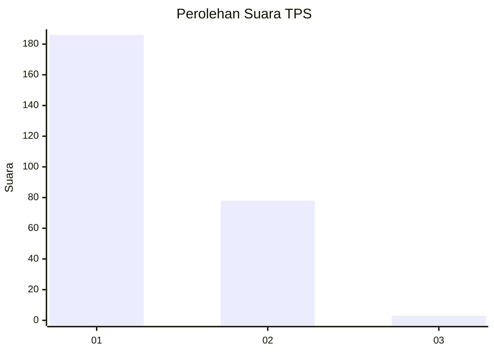
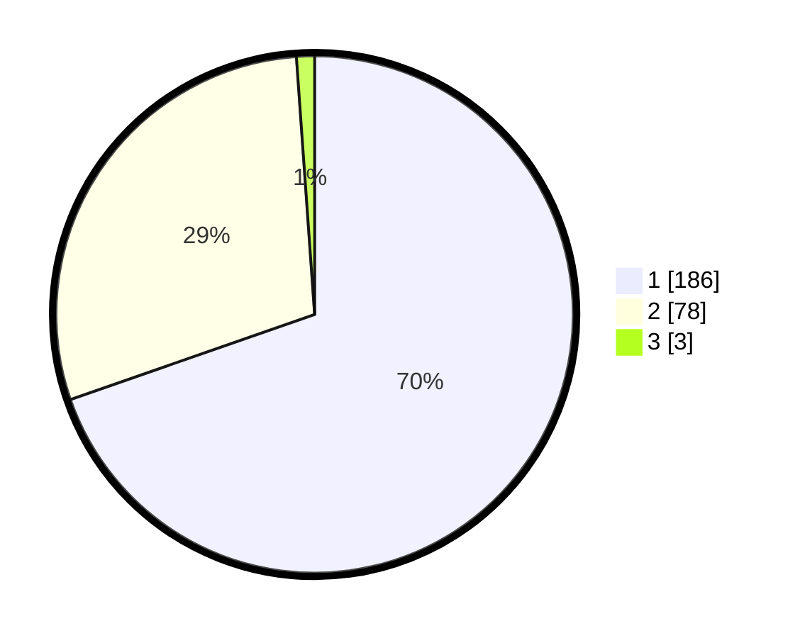

# Hasil

## Grafik

## Tabel

| No. | Nama Paslon    | Suara | Suara (raw) | Persentase |
|:--- |:-------------- | -----:| -----------:| ----------:|
| 1   | ANIES MUHAIMIN | 186   | [186][p-1]  | 69,66      |
| 2   | PRABOWO GIBRAN | 78    | [78][p-2]   | 29,21      |
| 3   | GANJAR MAHFUD  | 3     | [3][p-3]    | 1,12       |

[p-1]: https://github.com/gigit-pemilu/pemilu-2024-11-aceh/blob/main/pilpres/hitung-suara/sub/11-aceh/sub/05-aceh-barat/sub/09-meureubo/sub/2002-ranto-panyang-timur/sub/003-tps/sub/paslon-1.txt
[p-2]: https://github.com/gigit-pemilu/pemilu-2024-11-aceh/blob/main/pilpres/hitung-suara/sub/11-aceh/sub/05-aceh-barat/sub/09-meureubo/sub/2002-ranto-panyang-timur/sub/003-tps/sub/paslon-2.txt
[p-3]: https://github.com/gigit-pemilu/pemilu-2024-11-aceh/blob/main/pilpres/hitung-suara/sub/11-aceh/sub/05-aceh-barat/sub/09-meureubo/sub/2002-ranto-panyang-timur/sub/003-tps/sub/paslon-3.txt

## Foto C Plano

https://sirekap-obj-formc.kpu.go.id/a78b/pemilu/ppwp/11/05/09/20/02/1105092002003-20240214-202414--a5c99613-79c2-4310-8549-72698e3159d2.jpg

https://sirekap-obj-formc.kpu.go.id/a78b/pemilu/ppwp/11/05/09/20/02/1105092002003-20240214-202630--4e0384b0-6563-40dc-a4a5-6e6dbcfe2394.jpg

## Metadata

| Key        | Value               |
| ---------- | ------------------- |
| Time Stamp | 2024-02-15 22:00:27 |

