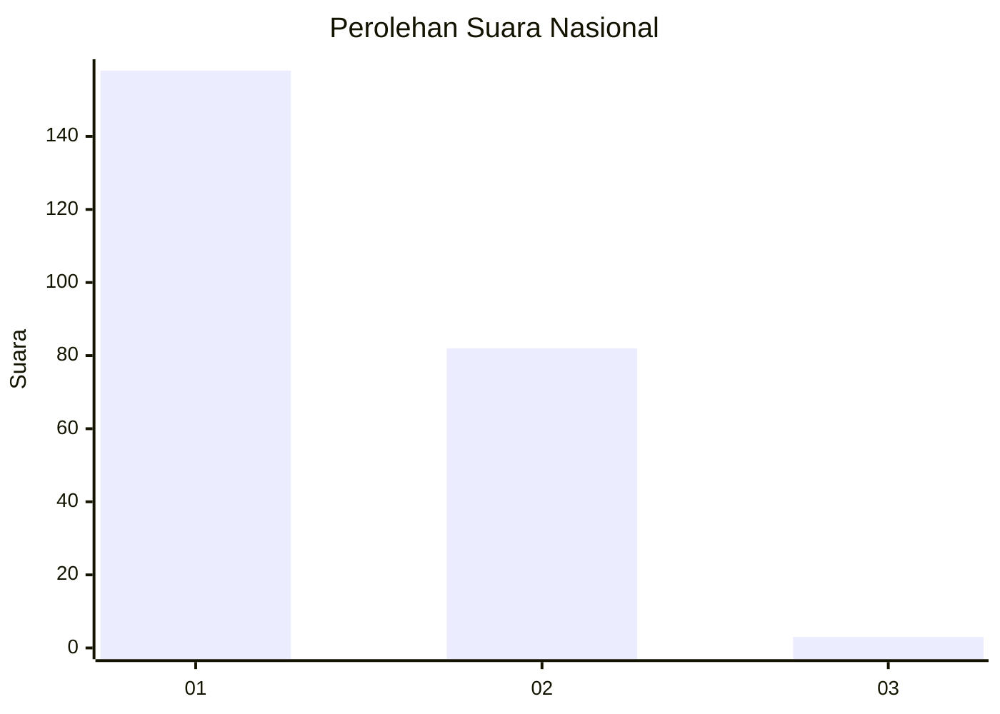
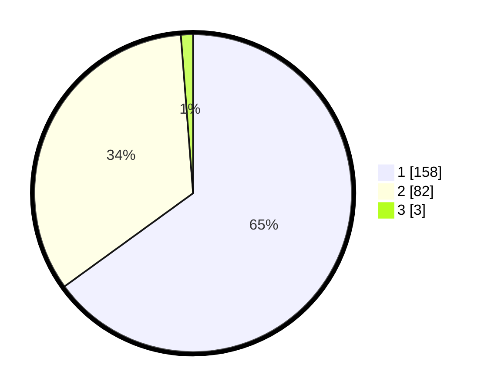

# Hasil

## Grafik

## Tabel

| No. | Nama Paslon    | Suara | Suara (raw) | Persentase |
|:--- |:-------------- | -----:| -----------:| ----------:|
| 1   | ANIES MUHAIMIN | 158   | [158][p-1]  | 65,02      |
| 2   | PRABOWO GIBRAN | 82    | [82][p-2]   | 33,74      |
| 3   | GANJAR MAHFUD  | 3     | [3][p-3]    | 1,23       |

[p-1]: https://github.com/gigit-pemilu/pemilu-2024/blob/main/pilpres/hitung-suara/sub/11-aceh/sub/05-aceh-barat/sub/09-meureubo/sub/2002-ranto-panyang-timur/sub/004-tps/sub/paslon-1.txt
[p-2]: https://github.com/gigit-pemilu/pemilu-2024/blob/main/pilpres/hitung-suara/sub/11-aceh/sub/05-aceh-barat/sub/09-meureubo/sub/2002-ranto-panyang-timur/sub/004-tps/sub/paslon-2.txt
[p-3]: https://github.com/gigit-pemilu/pemilu-2024/blob/main/pilpres/hitung-suara/sub/11-aceh/sub/05-aceh-barat/sub/09-meureubo/sub/2002-ranto-panyang-timur/sub/004-tps/sub/paslon-3.txt

## Foto C Plano

https://sirekap-obj-formc.kpu.go.id/4ee6/pemilu/ppwp/11/05/09/20/02/1105092002004-20240221-112924--de7b2ea9-90bb-4dda-82bd-58ca0608e36e.jpg

https://sirekap-obj-formc.kpu.go.id/4ee6/pemilu/ppwp/11/05/09/20/02/1105092002004-20240221-112926--a11694ee-9201-4afe-9318-17572c2662ca.jpg

https://sirekap-obj-formc.kpu.go.id/4ee6/pemilu/ppwp/11/05/09/20/02/1105092002004-20240221-112925--baca49f4-66c9-4a00-a869-1c4fb2f0831a.jpg

## Metadata

| Key        | Value               |
| ---------- | ------------------- |
| Time Stamp | 2024-02-24 22:31:28 |

## DATA PEMILIH TETAP

Jumlah pemilih dalam DPT: **276**.
 * L: **131**.
 * P: **145**.

## DATA PENGGUNA HAK PILIH

Jumlah pengguna hak pilih dalam DPT: **245**.
 * L: **115**.
 * P: **130**.

Jumlah pengguna hak pilih dalam DPTb: **0**.
 * L: **0**.
 * P: **0**.

Jumlah pengguna hak pilih dalam DPK: **4**.
 * L: **3**.
 * P: **1**.

Jumlah pengguna hak pilih: **249**.
 * L: **118**.
 * P: **131**.

## JUMLAH SUARA SAH DAN TIDAK SAH

JUMLAH SELURUH SUARA SAH: **243**.

JUMLAH SUARA TIDAK SAH: **6**.

JUMLAH SELURUH SUARA SAH DAN SUARA TIDAK SAH: **249**.

