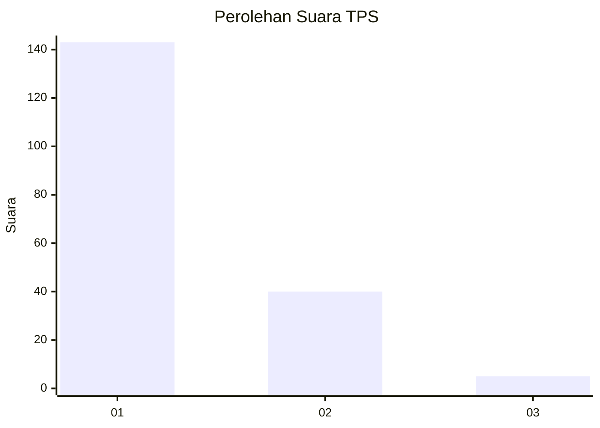
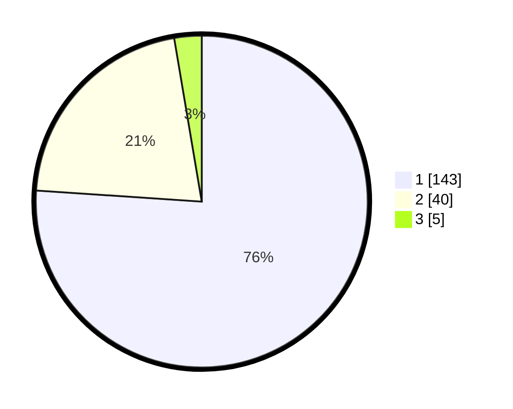

# Hasil

## Grafik

## Tabel

| No. | Nama Paslon    | Suara | Suara (raw) | Persentase |
|:--- |:-------------- | -----:| -----------:| ----------:|
| 1   | ANIES MUHAIMIN | 143   | [143][p-1]  | 76,06      |
| 2   | PRABOWO GIBRAN | 40    | [40][p-2]   | 21,28      |
| 3   | GANJAR MAHFUD  | 5     | [5][p-3]    | 2,66       |

[p-1]: https://github.com/gigit-pemilu/pemilu-2024-11-aceh/blob/main/pilpres/hitung-suara/sub/11-aceh/sub/05-aceh-barat/sub/09-meureubo/sub/2003-mesjid-tuha/sub/002-tps/sub/paslon-1.txt
[p-2]: https://github.com/gigit-pemilu/pemilu-2024-11-aceh/blob/main/pilpres/hitung-suara/sub/11-aceh/sub/05-aceh-barat/sub/09-meureubo/sub/2003-mesjid-tuha/sub/002-tps/sub/paslon-2.txt
[p-3]: https://github.com/gigit-pemilu/pemilu-2024-11-aceh/blob/main/pilpres/hitung-suara/sub/11-aceh/sub/05-aceh-barat/sub/09-meureubo/sub/2003-mesjid-tuha/sub/002-tps/sub/paslon-3.txt

## Foto C Plano

https://sirekap-obj-formc.kpu.go.id/953d/pemilu/ppwp/11/05/09/20/03/1105092003002-20240214-201519--e4d3cf25-7b79-4809-835a-4b53c5881529.jpg

https://sirekap-obj-formc.kpu.go.id/953d/pemilu/ppwp/11/05/09/20/03/1105092003002-20240214-200728--cf01cde7-d121-4453-835d-b276b1880759.jpg

https://sirekap-obj-formc.kpu.go.id/953d/pemilu/ppwp/11/05/09/20/03/1105092003002-20240214-200820--6c6f47bf-7f57-4343-995c-2d02c0a455ac.jpg

## Metadata

| Key        | Value               |
| ---------- | ------------------- |
| Time Stamp | 2024-02-16 22:01:00 |

