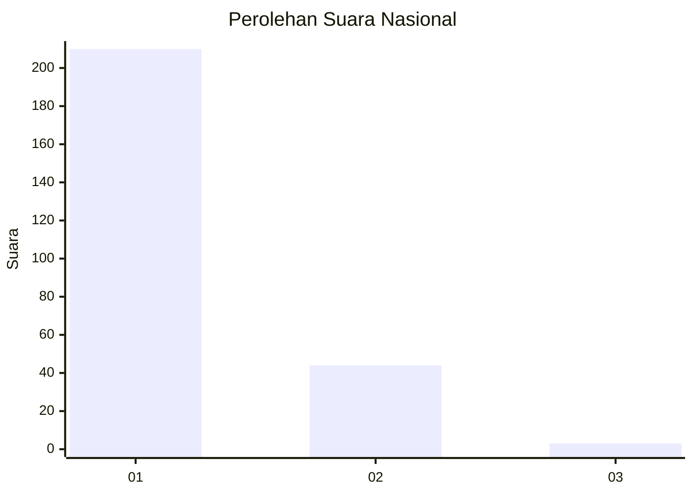
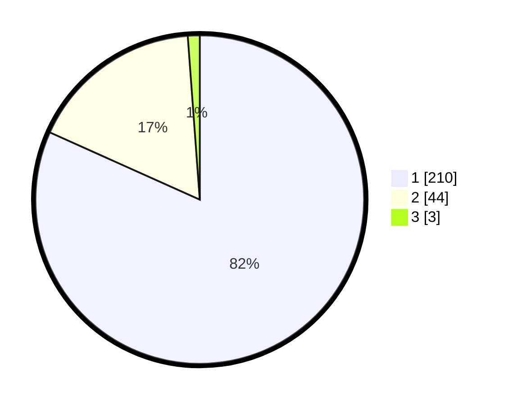

# Hasil

## Grafik

## Tabel

| No. | Nama Paslon    | Suara | Suara (raw) | Persentase |
|:--- |:-------------- | -----:| -----------:| ----------:|
| 1   | ANIES MUHAIMIN | 210   | [210][p-1]  | 81,71      |
| 2   | PRABOWO GIBRAN | 44    | [44][p-2]   | 17,12      |
| 3   | GANJAR MAHFUD  | 3     | [3][p-3]    | 1,17       |

[p-1]: https://github.com/gigit-pemilu/pemilu-2024/blob/main/pilpres/hitung-suara/sub/11-aceh/sub/05-aceh-barat/sub/09-meureubo/sub/2004-ujong-tanoh-darat/sub/003-tps/sub/paslon-1.txt
[p-2]: https://github.com/gigit-pemilu/pemilu-2024/blob/main/pilpres/hitung-suara/sub/11-aceh/sub/05-aceh-barat/sub/09-meureubo/sub/2004-ujong-tanoh-darat/sub/003-tps/sub/paslon-2.txt
[p-3]: https://github.com/gigit-pemilu/pemilu-2024/blob/main/pilpres/hitung-suara/sub/11-aceh/sub/05-aceh-barat/sub/09-meureubo/sub/2004-ujong-tanoh-darat/sub/003-tps/sub/paslon-3.txt

## Foto C Plano

https://sirekap-obj-formc.kpu.go.id/5ba1/pemilu/ppwp/11/05/09/20/04/1105092004003-20240214-204109--052959b5-2b84-47f8-b139-acee48ee1912.jpg

https://sirekap-obj-formc.kpu.go.id/5ba1/pemilu/ppwp/11/05/09/20/04/1105092004003-20240214-204248--abaa6708-6074-42f3-be03-83e246797290.jpg

https://sirekap-obj-formc.kpu.go.id/5ba1/pemilu/ppwp/11/05/09/20/04/1105092004003-20240214-204606--e8cdd9d4-1e18-4047-8750-a6dc795e2468.jpg

## Metadata

| Key        | Value               |
| ---------- | ------------------- |
| Time Stamp | 2024-02-15 16:30:25 |

## DATA PEMILIH TETAP

Jumlah pemilih dalam DPT: **290**.
 * L: **137**.
 * P: **153**.

## DATA PENGGUNA HAK PILIH

Jumlah pengguna hak pilih dalam DPT: **258**.
 * L: **124**.
 * P: **134**.

Jumlah pengguna hak pilih dalam DPTb: **5**.
 * L: **2**.
 * P: **3**.

Jumlah pengguna hak pilih dalam DPK: **5**.
 * L: **2**.
 * P: **3**.

Jumlah pengguna hak pilih: **268**.
 * L: **128**.
 * P: **140**.

## JUMLAH SUARA SAH DAN TIDAK SAH

JUMLAH SELURUH SUARA SAH: **257**.

JUMLAH SUARA TIDAK SAH: **11**.

JUMLAH SELURUH SUARA SAH DAN SUARA TIDAK SAH: **268**.

