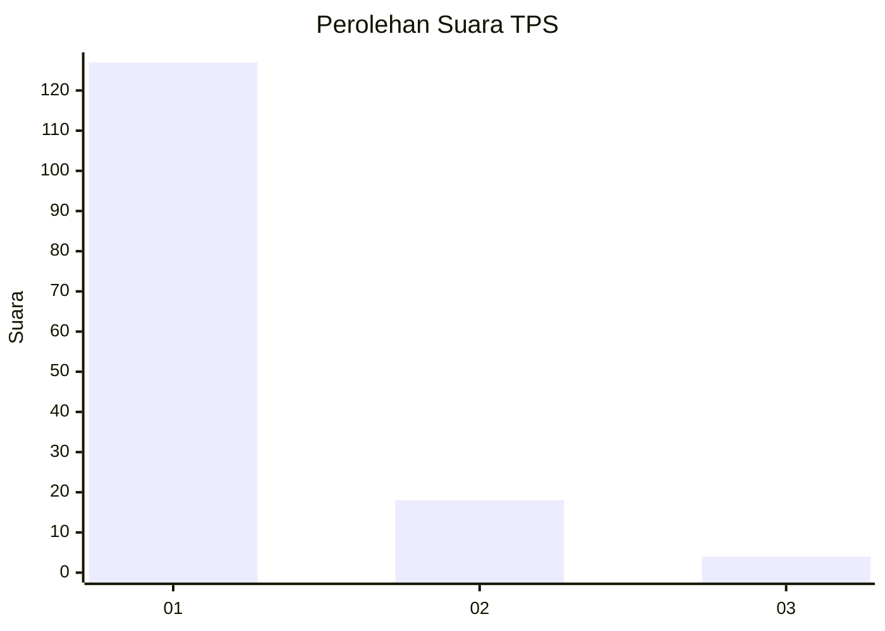
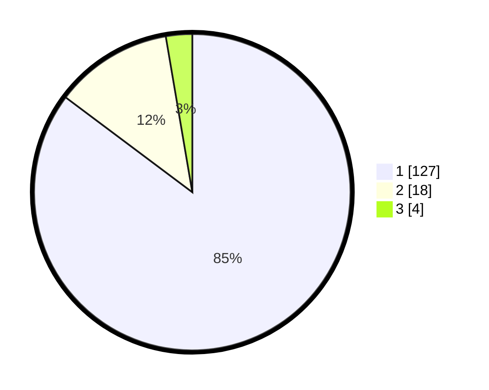

# Hasil

## Grafik

## Tabel

| No. | Nama Paslon    | Suara | Suara (raw) | Persentase |
|:--- |:-------------- | -----:| -----------:| ----------:|
| 1   | ANIES MUHAIMIN | 127   | [127][p-1]  | 85,23      |
| 2   | PRABOWO GIBRAN | 18    | [18][p-2]   | 12,08      |
| 3   | GANJAR MAHFUD  | 4     | [4][p-3]    | 2,68       |

[p-1]: https://github.com/gigit-pemilu/pemilu-2024-11-aceh/blob/main/pilpres/hitung-suara/sub/11-aceh/sub/05-aceh-barat/sub/09-meureubo/sub/2009-paya-baro-ranto-p/sub/001-tps/sub/paslon-1.txt
[p-2]: https://github.com/gigit-pemilu/pemilu-2024-11-aceh/blob/main/pilpres/hitung-suara/sub/11-aceh/sub/05-aceh-barat/sub/09-meureubo/sub/2009-paya-baro-ranto-p/sub/001-tps/sub/paslon-2.txt
[p-3]: https://github.com/gigit-pemilu/pemilu-2024-11-aceh/blob/main/pilpres/hitung-suara/sub/11-aceh/sub/05-aceh-barat/sub/09-meureubo/sub/2009-paya-baro-ranto-p/sub/001-tps/sub/paslon-3.txt

## Foto C Plano

https://sirekap-obj-formc.kpu.go.id/90b2/pemilu/ppwp/11/05/09/20/09/1105092009001-20240214-200253--c3c08865-3821-4310-83f1-5b1822060c68.jpg

https://sirekap-obj-formc.kpu.go.id/90b2/pemilu/ppwp/11/05/09/20/09/1105092009001-20240214-200420--60336a59-ea01-4bef-9ddf-d6c0756eeb70.jpg

https://sirekap-obj-formc.kpu.go.id/90b2/pemilu/ppwp/11/05/09/20/09/1105092009001-20240214-200633--59adf2da-fca9-4670-8764-b21e37235db5.jpg

## Metadata

| Key        | Value               |
| ---------- | ------------------- |
| Time Stamp | 2024-02-16 22:01:00 |

