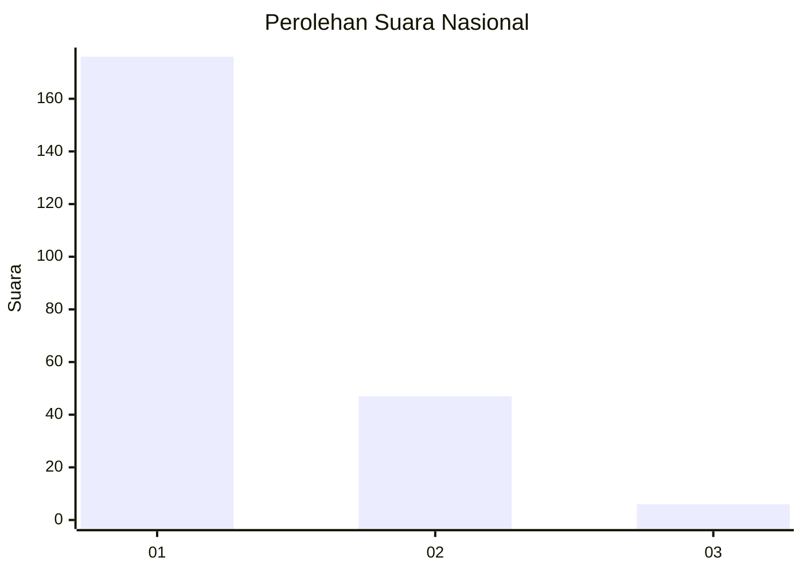
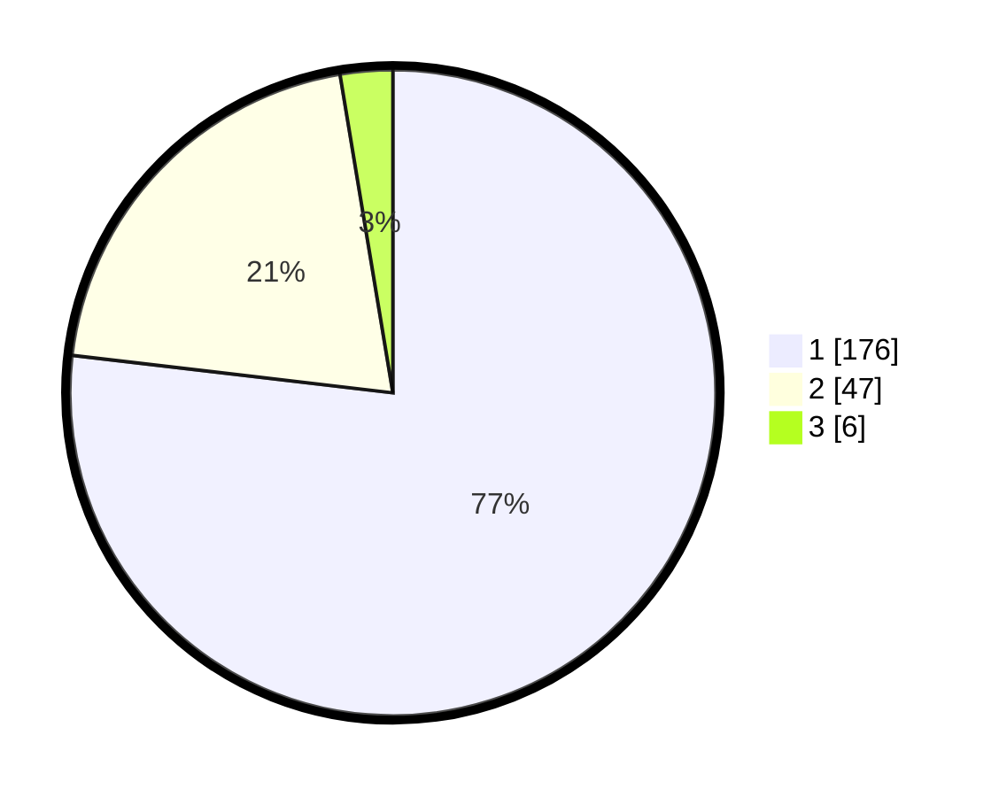

# Hasil

## Grafik

## Tabel

| No. | Nama Paslon    | Suara | Suara (raw) | Persentase |
|:--- |:-------------- | -----:| -----------:| ----------:|
| 1   | ANIES MUHAIMIN | 176   | [176][p-1]  | 76,86      |
| 2   | PRABOWO GIBRAN | 47    | [47][p-2]   | 20,52      |
| 3   | GANJAR MAHFUD  | 6     | [6][p-3]    | 2,62       |

[p-1]: https://github.com/gigit-pemilu/pemilu-2024/blob/main/pilpres/hitung-suara/sub/11-aceh/sub/05-aceh-barat/sub/09-meureubo/sub/2010-ranub-dong/sub/002-tps/sub/paslon-1.txt
[p-2]: https://github.com/gigit-pemilu/pemilu-2024/blob/main/pilpres/hitung-suara/sub/11-aceh/sub/05-aceh-barat/sub/09-meureubo/sub/2010-ranub-dong/sub/002-tps/sub/paslon-2.txt
[p-3]: https://github.com/gigit-pemilu/pemilu-2024/blob/main/pilpres/hitung-suara/sub/11-aceh/sub/05-aceh-barat/sub/09-meureubo/sub/2010-ranub-dong/sub/002-tps/sub/paslon-3.txt

## Foto C Plano

https://sirekap-obj-formc.kpu.go.id/39dd/pemilu/ppwp/11/05/09/20/10/1105092010002-20240215-123108--614a4cb1-83cc-4ef6-9395-248bf2a67d91.jpg

https://sirekap-obj-formc.kpu.go.id/39dd/pemilu/ppwp/11/05/09/20/10/1105092010002-20240215-143842--d6b7dacd-4d7a-4e26-a2bb-74d344a174ad.jpg

https://sirekap-obj-formc.kpu.go.id/39dd/pemilu/ppwp/11/05/09/20/10/1105092010002-20240215-125523--799cb9c0-51c0-49dc-b6d1-cdc3ad40d27d.jpg

## Metadata

| Key        | Value               |
| ---------- | ------------------- |
| Time Stamp | 2024-02-16 22:01:00 |

