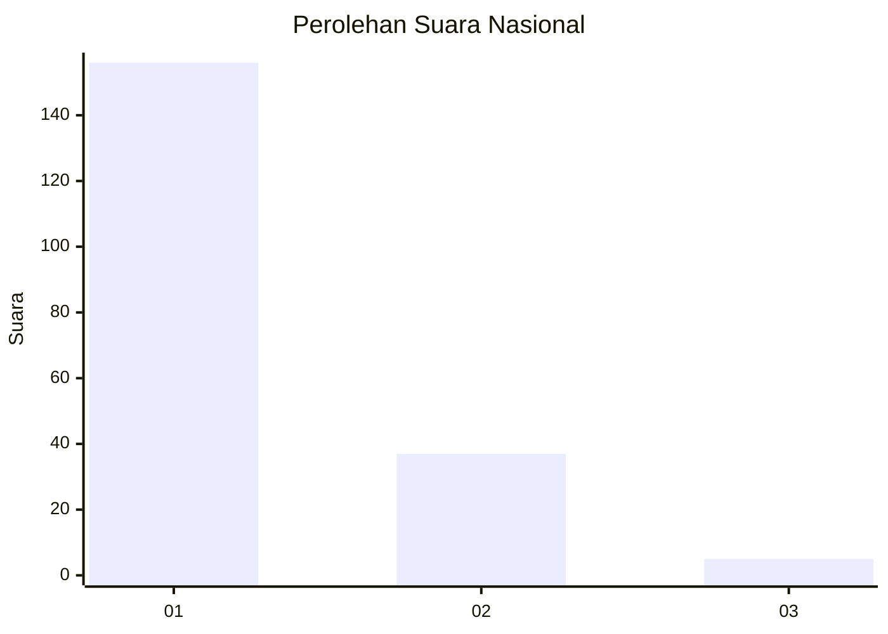
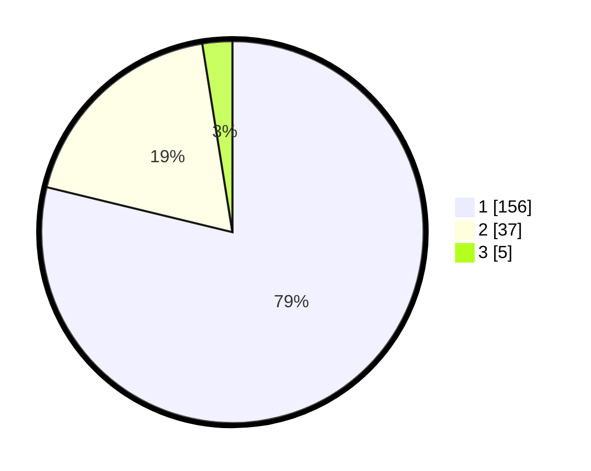

# Hasil

## Grafik

## Tabel

| No. | Nama Paslon    | Suara | Suara (raw) | Persentase |
|:--- |:-------------- | -----:| -----------:| ----------:|
| 1   | ANIES MUHAIMIN | 156   | [156][p-1]  | 78,79      |
| 2   | PRABOWO GIBRAN | 37    | [37][p-2]   | 18,69      |
| 3   | GANJAR MAHFUD  | 5     | [5][p-3]    | 2,53       |

[p-1]: https://github.com/gigit-pemilu/pemilu-2024/blob/main/pilpres/hitung-suara/sub/11-aceh/sub/05-aceh-barat/sub/09-meureubo/sub/2011-pasi-pinang/sub/001-tps/sub/paslon-1.txt
[p-2]: https://github.com/gigit-pemilu/pemilu-2024/blob/main/pilpres/hitung-suara/sub/11-aceh/sub/05-aceh-barat/sub/09-meureubo/sub/2011-pasi-pinang/sub/001-tps/sub/paslon-2.txt
[p-3]: https://github.com/gigit-pemilu/pemilu-2024/blob/main/pilpres/hitung-suara/sub/11-aceh/sub/05-aceh-barat/sub/09-meureubo/sub/2011-pasi-pinang/sub/001-tps/sub/paslon-3.txt

## Foto C Plano

https://sirekap-obj-formc.kpu.go.id/a62d/pemilu/ppwp/11/05/09/20/11/1105092011001-20240214-205925--d354980e-935d-484a-ad86-45942c180ff4.jpg

https://sirekap-obj-formc.kpu.go.id/a62d/pemilu/ppwp/11/05/09/20/11/1105092011001-20240214-205645--57b8a728-29aa-4bec-af9b-ae02c1cf1c64.jpg

## Metadata

| Key        | Value               |
| ---------- | ------------------- |
| Time Stamp | 2024-02-16 22:01:00 |

