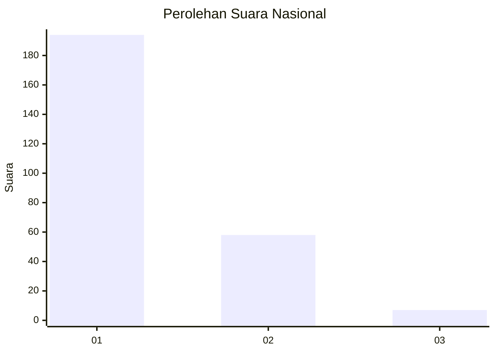
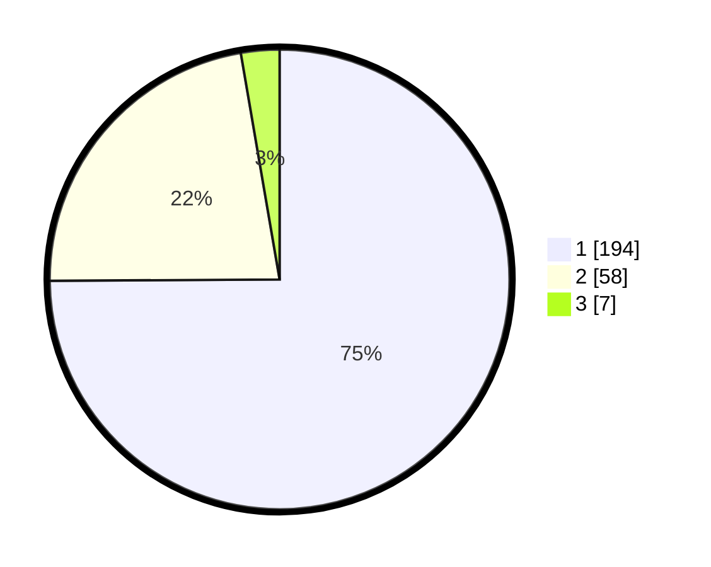

# Hasil

## Grafik

## Tabel

| No. | Nama Paslon    | Suara | Suara (raw) | Persentase |
|:--- |:-------------- | -----:| -----------:| ----------:|
| 1   | ANIES MUHAIMIN | 194   | [194][p-1]  | 74,90      |
| 2   | PRABOWO GIBRAN | 58    | [58][p-2]   | 22,39      |
| 3   | GANJAR MAHFUD  | 7     | [7][p-3]    | 2,70       |

[p-1]: https://github.com/gigit-pemilu/pemilu-2024/blob/main/pilpres/hitung-suara/sub/11-aceh/sub/05-aceh-barat/sub/09-meureubo/sub/2013-meureubo/sub/001-tps/sub/paslon-1.txt
[p-2]: https://github.com/gigit-pemilu/pemilu-2024/blob/main/pilpres/hitung-suara/sub/11-aceh/sub/05-aceh-barat/sub/09-meureubo/sub/2013-meureubo/sub/001-tps/sub/paslon-2.txt
[p-3]: https://github.com/gigit-pemilu/pemilu-2024/blob/main/pilpres/hitung-suara/sub/11-aceh/sub/05-aceh-barat/sub/09-meureubo/sub/2013-meureubo/sub/001-tps/sub/paslon-3.txt

## Foto C Plano

https://sirekap-obj-formc.kpu.go.id/7dce/pemilu/ppwp/11/05/09/20/13/1105092013001-20240214-203503--fa0f2cd5-335b-4b09-989f-ff0a5acedf28.jpg

https://sirekap-obj-formc.kpu.go.id/7dce/pemilu/ppwp/11/05/09/20/13/1105092013001-20240214-203521--b0ca108f-1243-4227-9bd4-d1b76c521fe0.jpg

## Metadata

| Key        | Value               |
| ---------- | ------------------- |
| Time Stamp | 2024-02-16 22:01:00 |

