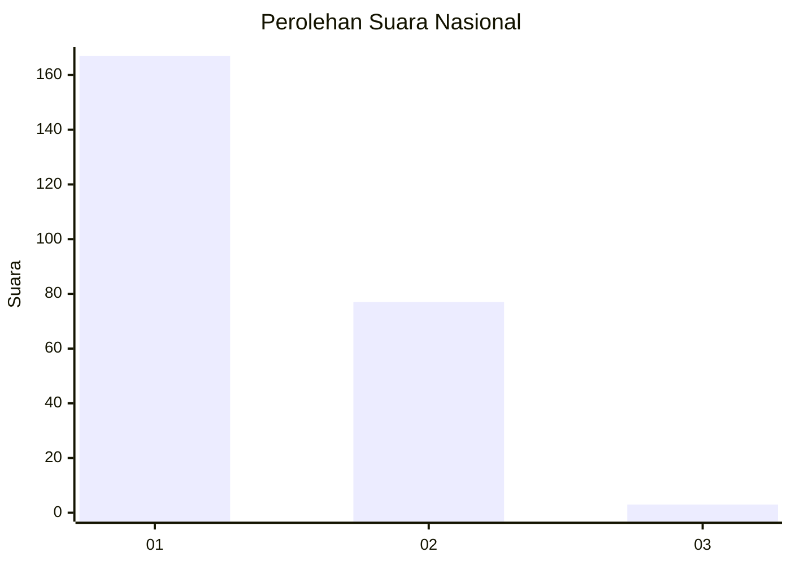
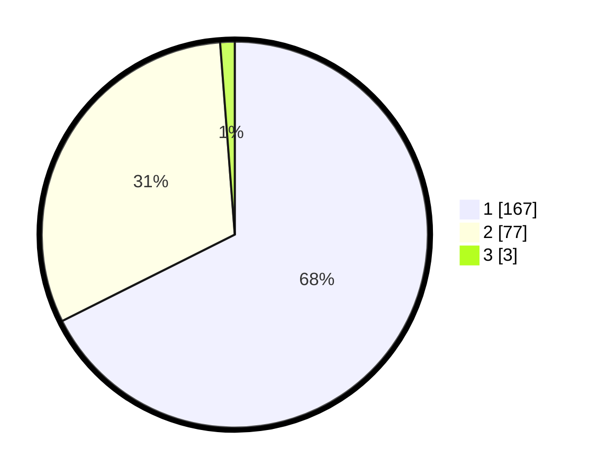

# Hasil

## Grafik

## Tabel

| No. | Nama Paslon    | Suara | Suara (raw) | Persentase |
|:--- |:-------------- | -----:| -----------:| ----------:|
| 1   | ANIES MUHAIMIN | 167   | [167][p-1]  | 67,61      |
| 2   | PRABOWO GIBRAN | 77    | [77][p-2]   | 31,17      |
| 3   | GANJAR MAHFUD  | 3     | [3][p-3]    | 1,21       |

[p-1]: https://github.com/gigit-pemilu/pemilu-2024/blob/main/pilpres/hitung-suara/sub/11-aceh/sub/05-aceh-barat/sub/09-meureubo/sub/2013-meureubo/sub/005-tps/sub/paslon-1.txt
[p-2]: https://github.com/gigit-pemilu/pemilu-2024/blob/main/pilpres/hitung-suara/sub/11-aceh/sub/05-aceh-barat/sub/09-meureubo/sub/2013-meureubo/sub/005-tps/sub/paslon-2.txt
[p-3]: https://github.com/gigit-pemilu/pemilu-2024/blob/main/pilpres/hitung-suara/sub/11-aceh/sub/05-aceh-barat/sub/09-meureubo/sub/2013-meureubo/sub/005-tps/sub/paslon-3.txt

## Foto C Plano

https://sirekap-obj-formc.kpu.go.id/6725/pemilu/ppwp/11/05/09/20/13/1105092013005-20240214-220352--1503e7aa-31de-40b6-818b-70e919c15234.jpg

https://sirekap-obj-formc.kpu.go.id/6725/pemilu/ppwp/11/05/09/20/13/1105092013005-20240215-175128--de78c236-bde0-4e15-96d0-131cacc7efa3.jpg

https://sirekap-obj-formc.kpu.go.id/6725/pemilu/ppwp/11/05/09/20/13/1105092013005-20240214-190858--a6358cb9-ee86-4768-bfa1-9c6ef8a2e954.jpg

## Metadata

| Key        | Value               |
| ---------- | ------------------- |
| Time Stamp | 2024-02-16 22:01:00 |

