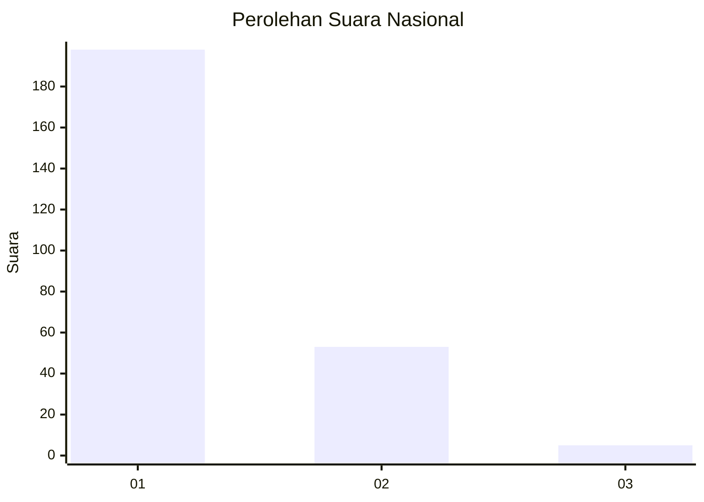
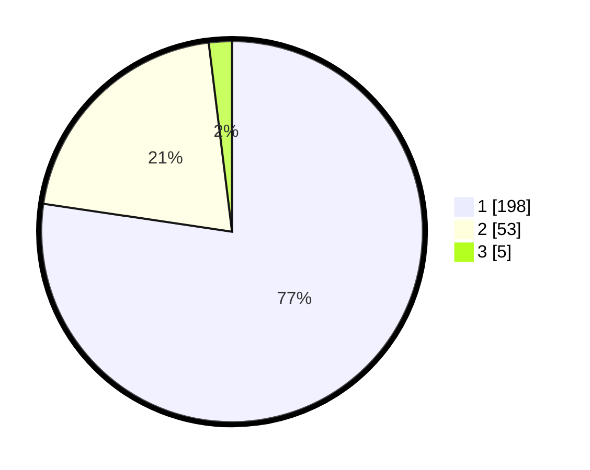

# Hasil

## Grafik

## Tabel

| No. | Nama Paslon    | Suara | Suara (raw) | Persentase |
|:--- |:-------------- | -----:| -----------:| ----------:|
| 1   | ANIES MUHAIMIN | 198   | [198][p-1]  | 77,34      |
| 2   | PRABOWO GIBRAN | 53    | [53][p-2]   | 20,70      |
| 3   | GANJAR MAHFUD  | 5     | [5][p-3]    | 1,95       |

[p-1]: https://github.com/gigit-pemilu/pemilu-2024/blob/main/pilpres/hitung-suara/sub/11-aceh/sub/05-aceh-barat/sub/09-meureubo/sub/2013-meureubo/sub/006-tps/sub/paslon-1.txt
[p-2]: https://github.com/gigit-pemilu/pemilu-2024/blob/main/pilpres/hitung-suara/sub/11-aceh/sub/05-aceh-barat/sub/09-meureubo/sub/2013-meureubo/sub/006-tps/sub/paslon-2.txt
[p-3]: https://github.com/gigit-pemilu/pemilu-2024/blob/main/pilpres/hitung-suara/sub/11-aceh/sub/05-aceh-barat/sub/09-meureubo/sub/2013-meureubo/sub/006-tps/sub/paslon-3.txt

## Foto C Plano

https://sirekap-obj-formc.kpu.go.id/c412/pemilu/ppwp/11/05/09/20/13/1105092013006-20240215-171052--e869d3ff-af7c-4650-af37-08bf85a5c771.jpg

https://sirekap-obj-formc.kpu.go.id/c412/pemilu/ppwp/11/05/09/20/13/1105092013006-20240215-171123--b8ee99db-b8f1-4957-a1b2-68df6fe4b602.jpg

https://sirekap-obj-formc.kpu.go.id/c412/pemilu/ppwp/11/05/09/20/13/1105092013006-20240215-171133--0bdbe967-e9f3-47d0-8868-1549199e0c54.jpg

## Metadata

| Key        | Value               |
| ---------- | ------------------- |
| Time Stamp | 2024-02-15 19:30:26 |

