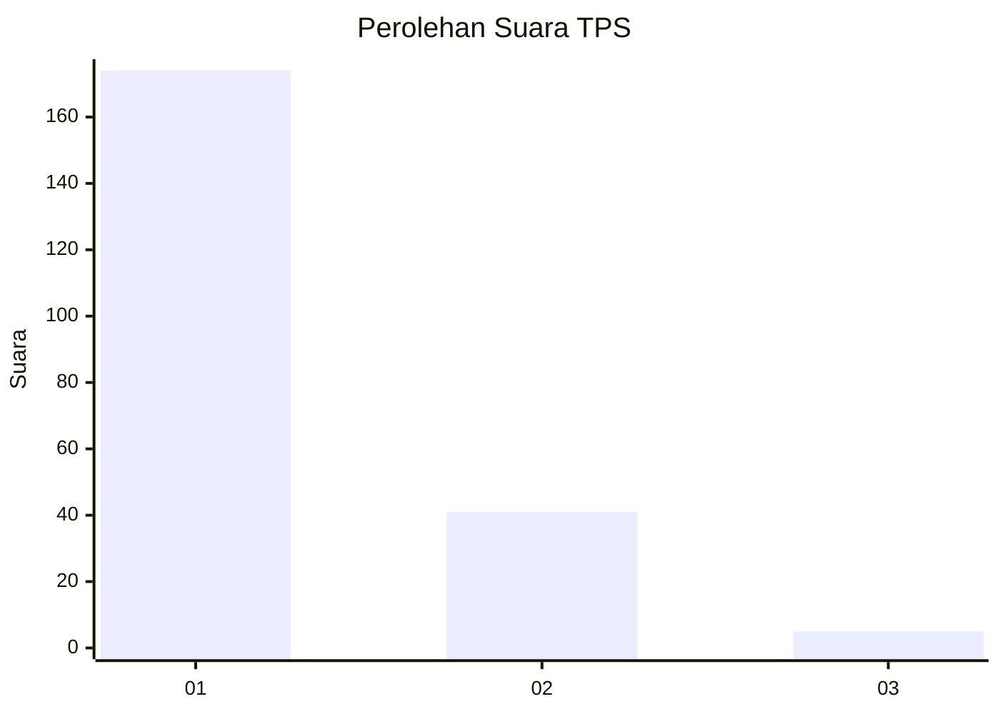
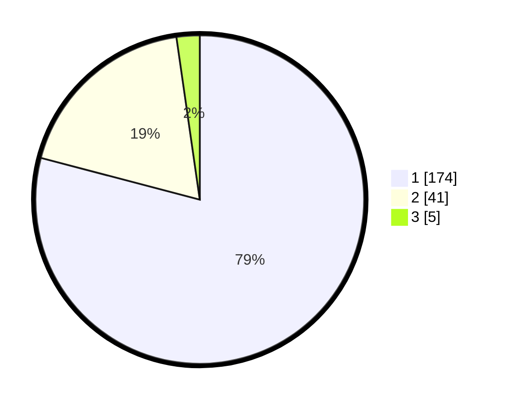

# Hasil

## Grafik

## Tabel

| No. | Nama Paslon    | Suara | Suara (raw) | Persentase |
|:--- |:-------------- | -----:| -----------:| ----------:|
| 1   | ANIES MUHAIMIN | 174   | [174][p-1]  | 79,09      |
| 2   | PRABOWO GIBRAN | 41    | [41][p-2]   | 18,64      |
| 3   | GANJAR MAHFUD  | 5     | [5][p-3]    | 2,27       |

[p-1]: https://github.com/gigit-pemilu/pemilu-2024-11-aceh/blob/main/pilpres/hitung-suara/sub/11-aceh/sub/05-aceh-barat/sub/09-meureubo/sub/2014-langung/sub/002-tps/sub/paslon-1.txt
[p-2]: https://github.com/gigit-pemilu/pemilu-2024-11-aceh/blob/main/pilpres/hitung-suara/sub/11-aceh/sub/05-aceh-barat/sub/09-meureubo/sub/2014-langung/sub/002-tps/sub/paslon-2.txt
[p-3]: https://github.com/gigit-pemilu/pemilu-2024-11-aceh/blob/main/pilpres/hitung-suara/sub/11-aceh/sub/05-aceh-barat/sub/09-meureubo/sub/2014-langung/sub/002-tps/sub/paslon-3.txt

## Foto C Plano

https://sirekap-obj-formc.kpu.go.id/8fb4/pemilu/ppwp/11/05/09/20/14/1105092014002-20240214-214732--ca4531c5-a103-4735-9a0f-f3a75f422839.jpg

https://sirekap-obj-formc.kpu.go.id/8fb4/pemilu/ppwp/11/05/09/20/14/1105092014002-20240214-215521--60254d9a-c313-4eee-8bc1-9da73c72a930.jpg

https://sirekap-obj-formc.kpu.go.id/8fb4/pemilu/ppwp/11/05/09/20/14/1105092014002-20240214-220144--c4e9a84a-7cfd-40c1-861e-f6d63580f88a.jpg

## Metadata

| Key        | Value               |
| ---------- | ------------------- |
| Time Stamp | 2024-02-16 22:01:00 |

