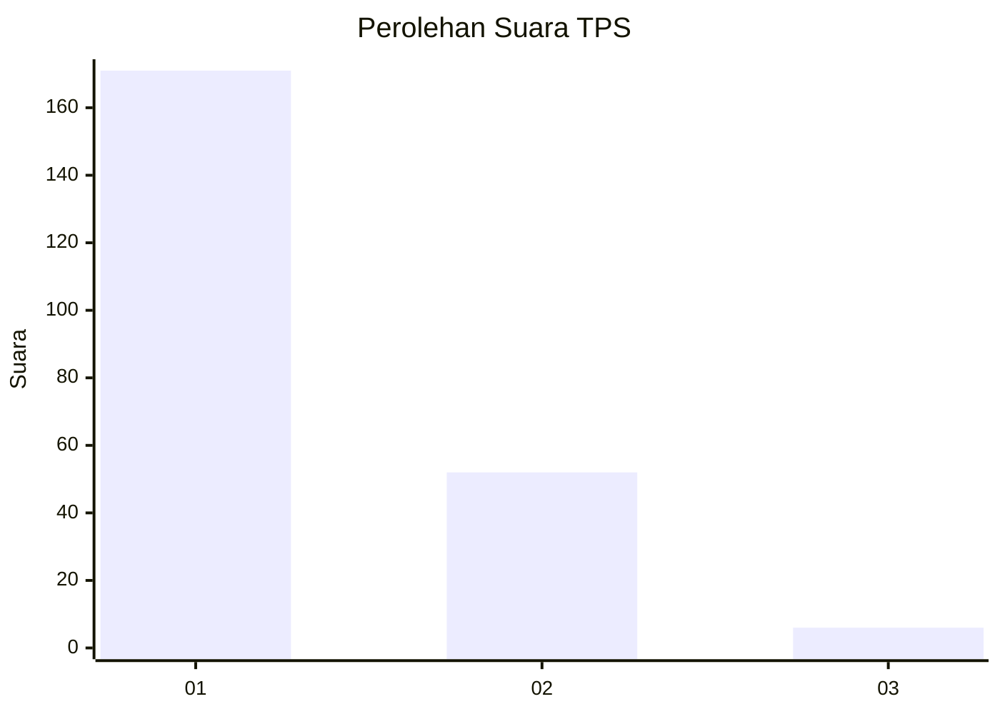
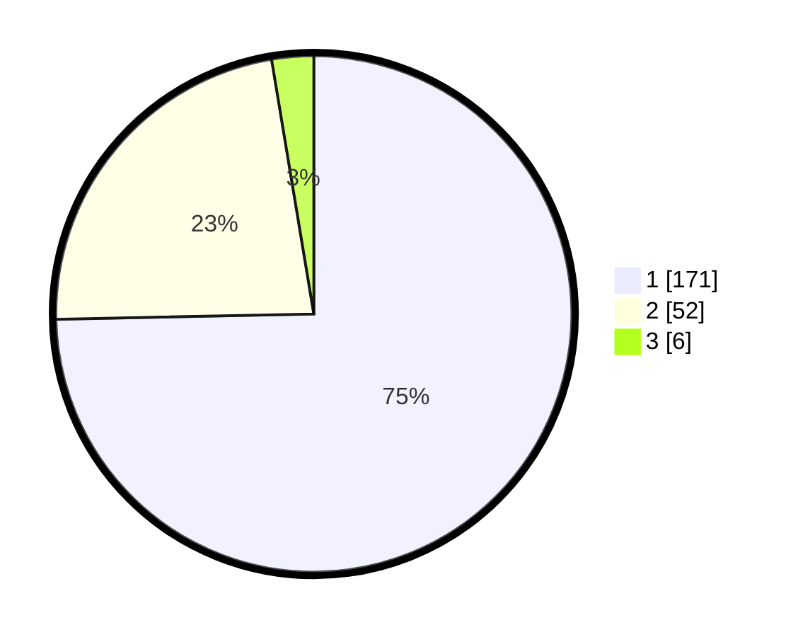

# Hasil

## Grafik

## Tabel

| No. | Nama Paslon    | Suara | Suara (raw) | Persentase |
|:--- |:-------------- | -----:| -----------:| ----------:|
| 1   | ANIES MUHAIMIN | 171   | [171][p-1]  | 74,67      |
| 2   | PRABOWO GIBRAN | 52    | [52][p-2]   | 22,71      |
| 3   | GANJAR MAHFUD  | 6     | [6][p-3]    | 2,62       |

[p-1]: https://github.com/gigit-pemilu/pemilu-2024-11-aceh/blob/main/pilpres/hitung-suara/sub/11-aceh/sub/05-aceh-barat/sub/09-meureubo/sub/2014-langung/sub/006-tps/sub/paslon-1.txt
[p-2]: https://github.com/gigit-pemilu/pemilu-2024-11-aceh/blob/main/pilpres/hitung-suara/sub/11-aceh/sub/05-aceh-barat/sub/09-meureubo/sub/2014-langung/sub/006-tps/sub/paslon-2.txt
[p-3]: https://github.com/gigit-pemilu/pemilu-2024-11-aceh/blob/main/pilpres/hitung-suara/sub/11-aceh/sub/05-aceh-barat/sub/09-meureubo/sub/2014-langung/sub/006-tps/sub/paslon-3.txt

## Foto C Plano

https://sirekap-obj-formc.kpu.go.id/9d46/pemilu/ppwp/11/05/09/20/14/1105092014006-20240214-185206--ce3b89e3-4b5b-487c-8ed8-b66b828320b8.jpg

https://sirekap-obj-formc.kpu.go.id/9d46/pemilu/ppwp/11/05/09/20/14/1105092014006-20240214-185320--c931bd67-3f63-49e1-b353-53e2e85d0e98.jpg

https://sirekap-obj-formc.kpu.go.id/9d46/pemilu/ppwp/11/05/09/20/14/1105092014006-20240214-185409--7c7189d1-b47f-47c8-8bd1-fc13fb2bcc4b.jpg

## Metadata

| Key        | Value               |
| ---------- | ------------------- |
| Time Stamp | 2024-02-16 22:01:00 |

