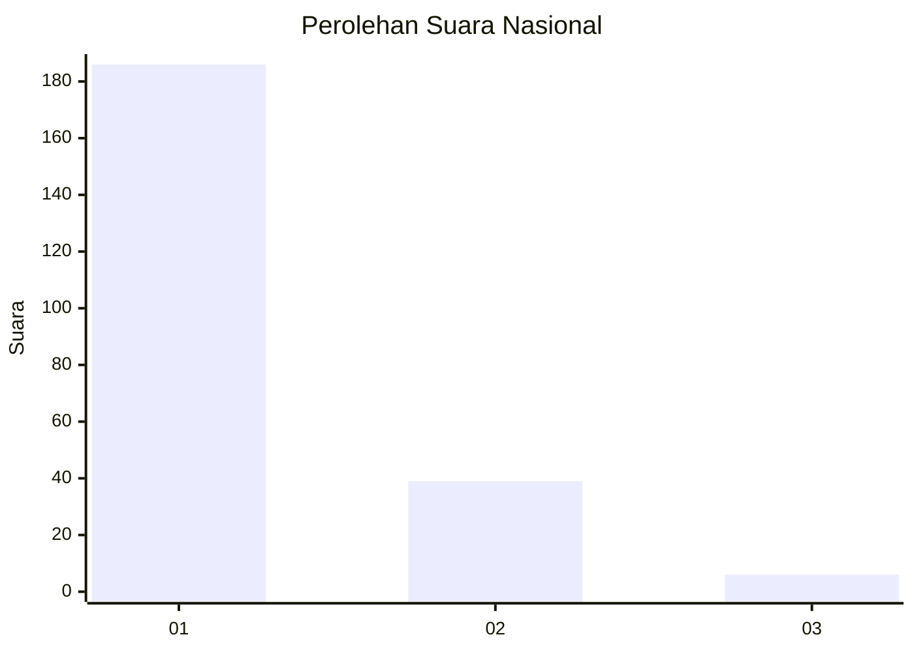
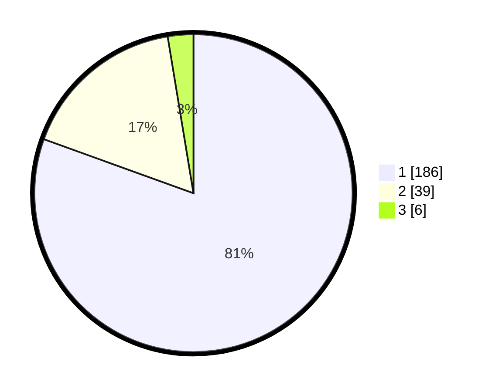

# Hasil

## Grafik

## Tabel

| No. | Nama Paslon    | Suara | Suara (raw) | Persentase |
|:--- |:-------------- | -----:| -----------:| ----------:|
| 1   | ANIES MUHAIMIN | 186   | [186][p-1]  | 80,52      |
| 2   | PRABOWO GIBRAN | 39    | [39][p-2]   | 16,88      |
| 3   | GANJAR MAHFUD  | 6     | [6][p-3]    | 2,60       |

[p-1]: https://github.com/gigit-pemilu/pemilu-2024/blob/main/pilpres/hitung-suara/sub/11-aceh/sub/05-aceh-barat/sub/09-meureubo/sub/2015-gunong-kleng/sub/005-tps/sub/paslon-1.txt
[p-2]: https://github.com/gigit-pemilu/pemilu-2024/blob/main/pilpres/hitung-suara/sub/11-aceh/sub/05-aceh-barat/sub/09-meureubo/sub/2015-gunong-kleng/sub/005-tps/sub/paslon-2.txt
[p-3]: https://github.com/gigit-pemilu/pemilu-2024/blob/main/pilpres/hitung-suara/sub/11-aceh/sub/05-aceh-barat/sub/09-meureubo/sub/2015-gunong-kleng/sub/005-tps/sub/paslon-3.txt

## Foto C Plano

https://sirekap-obj-formc.kpu.go.id/40aa/pemilu/ppwp/11/05/09/20/15/1105092015005-20240214-231028--1e71bcf9-5938-42a9-96ae-2258a0e938f5.jpg

https://sirekap-obj-formc.kpu.go.id/40aa/pemilu/ppwp/11/05/09/20/15/1105092015005-20240214-231102--bb8762a7-a1a0-4fd5-bd87-bf294ebb76fc.jpg

https://sirekap-obj-formc.kpu.go.id/40aa/pemilu/ppwp/11/05/09/20/15/1105092015005-20240214-231105--de7f095f-2269-4a41-a978-c907f7c38490.jpg

## Metadata

| Key        | Value               |
| ---------- | ------------------- |
| Time Stamp | 2024-02-15 19:30:26 |

## DATA PEMILIH TETAP

Jumlah pemilih dalam DPT: **253**.
 * L: **721**.
 * P: **132**.

## DATA PENGGUNA HAK PILIH

Jumlah pengguna hak pilih dalam DPT: **226**.
 * L: **103**.
 * P: **123**.

Jumlah pengguna hak pilih dalam DPTb: **4**.
 * L: **1**.
 * P: **3**.

Jumlah pengguna hak pilih dalam DPK: **3**.
 * L: **2**.
 * P: **1**.

Jumlah pengguna hak pilih: **233**.
 * L: **106**.
 * P: **126**.

## JUMLAH SUARA SAH DAN TIDAK SAH

JUMLAH SELURUH SUARA SAH: **231**.

JUMLAH SUARA TIDAK SAH: **2**.

JUMLAH SELURUH SUARA SAH DAN SUARA TIDAK SAH: **233**.

