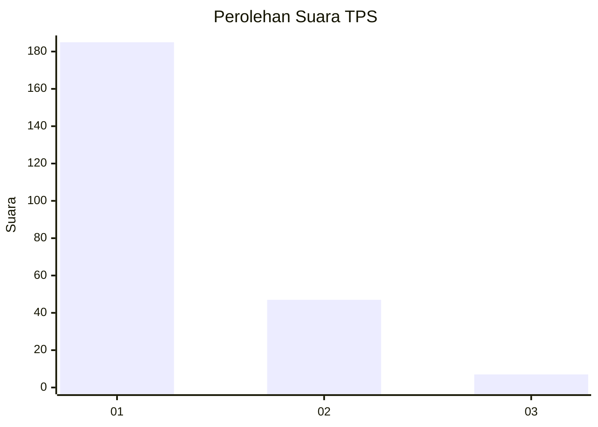
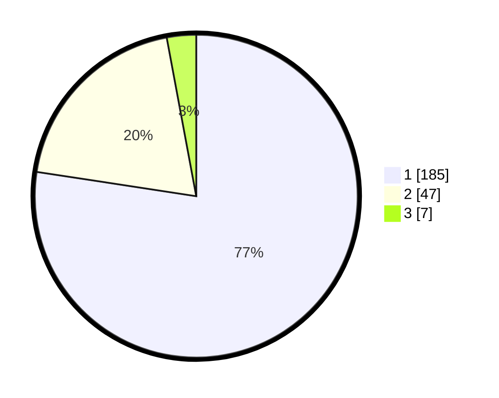

# Hasil

## Grafik

## Tabel

| No. | Nama Paslon    | Suara | Suara (raw) | Persentase |
|:--- |:-------------- | -----:| -----------:| ----------:|
| 1   | ANIES MUHAIMIN | 185   | [185][p-1]  | 77,41      |
| 2   | PRABOWO GIBRAN | 47    | [47][p-2]   | 19,67      |
| 3   | GANJAR MAHFUD  | 7     | [7][p-3]    | 2,93       |

[p-1]: https://github.com/gigit-pemilu/pemilu-2024-11-aceh/blob/main/pilpres/hitung-suara/sub/11-aceh/sub/05-aceh-barat/sub/09-meureubo/sub/2017-peunaga-rayeuk/sub/002-tps/sub/paslon-1.txt
[p-2]: https://github.com/gigit-pemilu/pemilu-2024-11-aceh/blob/main/pilpres/hitung-suara/sub/11-aceh/sub/05-aceh-barat/sub/09-meureubo/sub/2017-peunaga-rayeuk/sub/002-tps/sub/paslon-2.txt
[p-3]: https://github.com/gigit-pemilu/pemilu-2024-11-aceh/blob/main/pilpres/hitung-suara/sub/11-aceh/sub/05-aceh-barat/sub/09-meureubo/sub/2017-peunaga-rayeuk/sub/002-tps/sub/paslon-3.txt

## Foto C Plano

https://sirekap-obj-formc.kpu.go.id/0d68/pemilu/ppwp/11/05/09/20/17/1105092017002-20240214-195612--633424c7-27c1-454e-b07c-1ae855bc8e0d.jpg

https://sirekap-obj-formc.kpu.go.id/0d68/pemilu/ppwp/11/05/09/20/17/1105092017002-20240214-195751--9be5eb40-9f94-445a-8f26-b2747066fff8.jpg

https://sirekap-obj-formc.kpu.go.id/0d68/pemilu/ppwp/11/05/09/20/17/1105092017002-20240214-200052--87d322a3-1a8f-407d-af1d-4322ad2ace69.jpg

## Metadata

| Key        | Value               |
| ---------- | ------------------- |
| Time Stamp | 2024-02-16 22:01:00 |

