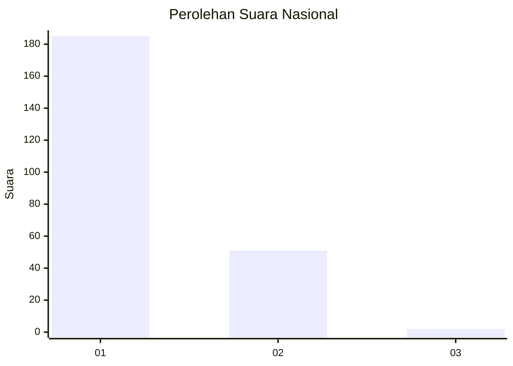
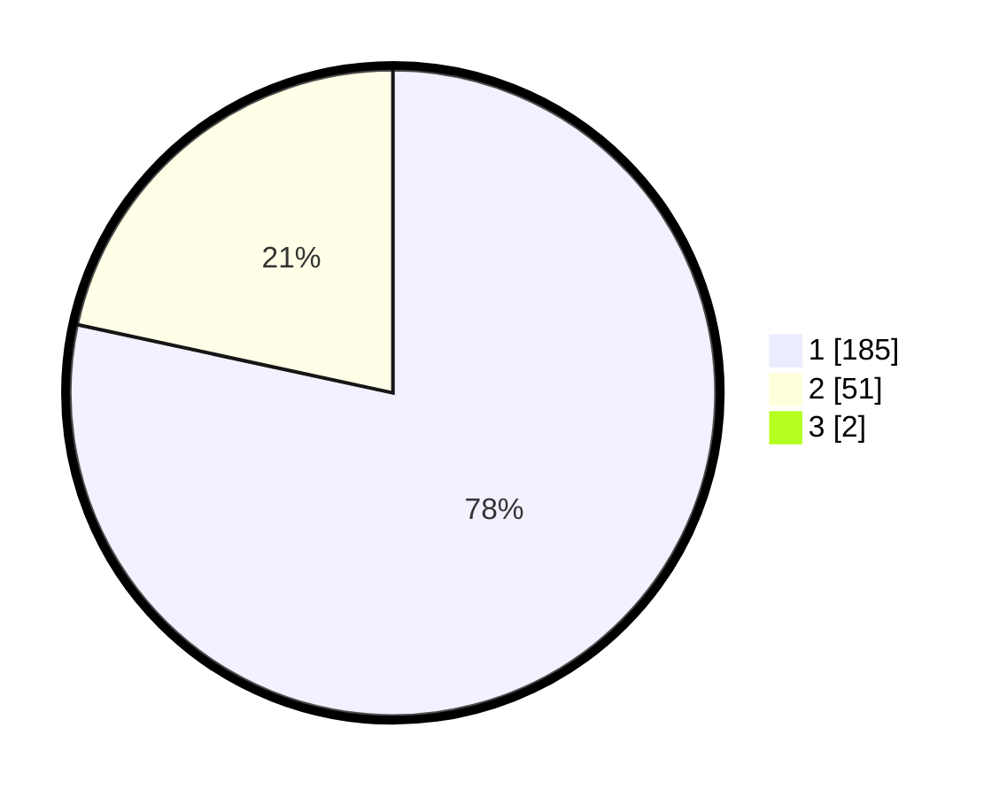

# Hasil

## Grafik

## Tabel

| No. | Nama Paslon    | Suara | Suara (raw) | Persentase |
|:--- |:-------------- | -----:| -----------:| ----------:|
| 1   | ANIES MUHAIMIN | 185   | [185][p-1]  | 77,73      |
| 2   | PRABOWO GIBRAN | 51    | [51][p-2]   | 21,43      |
| 3   | GANJAR MAHFUD  | 2     | [2][p-3]    | 0,84       |

[p-1]: https://github.com/gigit-pemilu/pemilu-2024/blob/main/pilpres/hitung-suara/sub/11-aceh/sub/05-aceh-barat/sub/09-meureubo/sub/2017-peunaga-rayeuk/sub/003-tps/sub/paslon-1.txt
[p-2]: https://github.com/gigit-pemilu/pemilu-2024/blob/main/pilpres/hitung-suara/sub/11-aceh/sub/05-aceh-barat/sub/09-meureubo/sub/2017-peunaga-rayeuk/sub/003-tps/sub/paslon-2.txt
[p-3]: https://github.com/gigit-pemilu/pemilu-2024/blob/main/pilpres/hitung-suara/sub/11-aceh/sub/05-aceh-barat/sub/09-meureubo/sub/2017-peunaga-rayeuk/sub/003-tps/sub/paslon-3.txt

## Foto C Plano

https://sirekap-obj-formc.kpu.go.id/446f/pemilu/ppwp/11/05/09/20/17/1105092017003-20240215-105534--182abe9b-447e-45e5-a458-8df0990f6367.jpg

https://sirekap-obj-formc.kpu.go.id/446f/pemilu/ppwp/11/05/09/20/17/1105092017003-20240215-105626--cddbcdd6-c928-45ee-990c-7934f4508158.jpg

https://sirekap-obj-formc.kpu.go.id/446f/pemilu/ppwp/11/05/09/20/17/1105092017003-20240215-105735--efeb3a7f-5f12-4ce6-9d22-ba9122e0682e.jpg

## Metadata

| Key        | Value               |
| ---------- | ------------------- |
| Time Stamp | 2024-02-16 22:01:00 |

