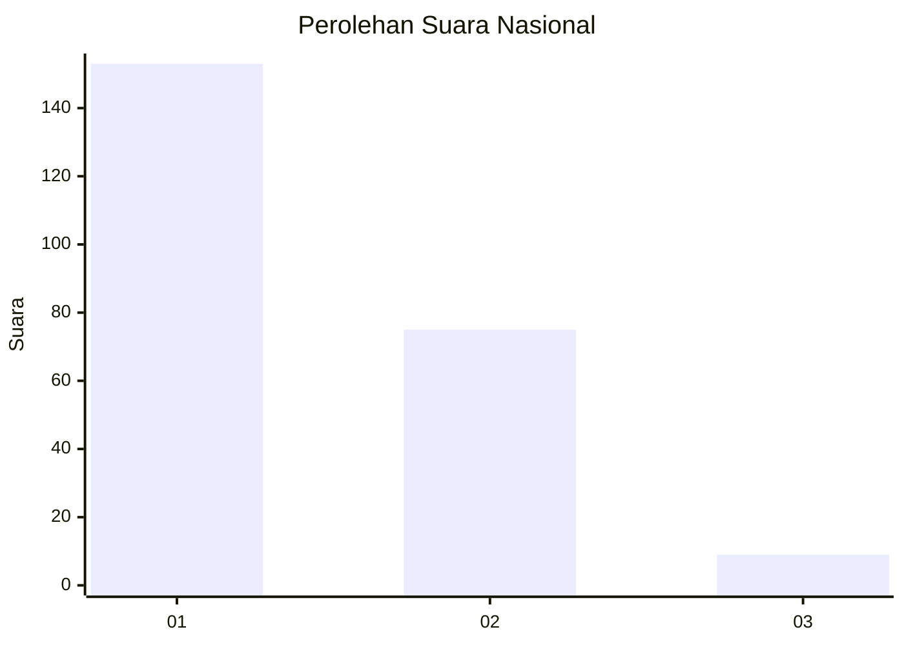
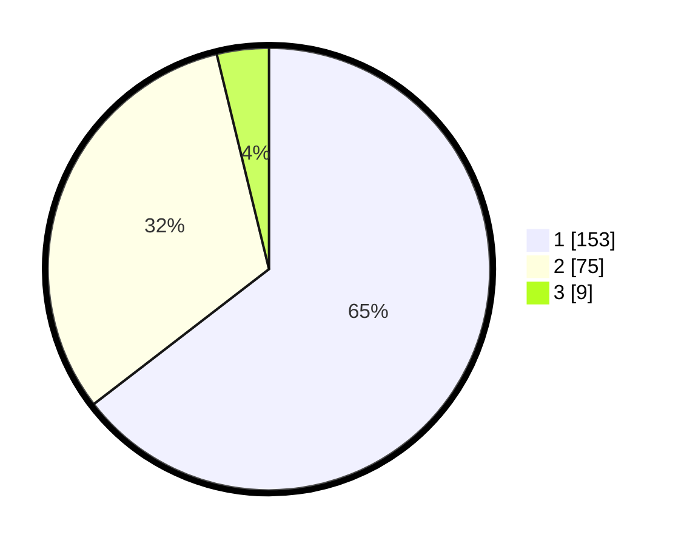

# Hasil

## Grafik

## Tabel

| No. | Nama Paslon    | Suara | Suara (raw) | Persentase |
|:--- |:-------------- | -----:| -----------:| ----------:|
| 1   | ANIES MUHAIMIN | 153   | [153][p-1]  | 64,56      |
| 2   | PRABOWO GIBRAN | 75    | [75][p-2]   | 31,65      |
| 3   | GANJAR MAHFUD  | 9     | [9][p-3]    | 3,80       |

[p-1]: https://github.com/gigit-pemilu/pemilu-2024/blob/main/pilpres/hitung-suara/sub/11-aceh/sub/05-aceh-barat/sub/09-meureubo/sub/2017-peunaga-rayeuk/sub/004-tps/sub/paslon-1.txt
[p-2]: https://github.com/gigit-pemilu/pemilu-2024/blob/main/pilpres/hitung-suara/sub/11-aceh/sub/05-aceh-barat/sub/09-meureubo/sub/2017-peunaga-rayeuk/sub/004-tps/sub/paslon-2.txt
[p-3]: https://github.com/gigit-pemilu/pemilu-2024/blob/main/pilpres/hitung-suara/sub/11-aceh/sub/05-aceh-barat/sub/09-meureubo/sub/2017-peunaga-rayeuk/sub/004-tps/sub/paslon-3.txt

## Foto C Plano

https://sirekap-obj-formc.kpu.go.id/1f05/pemilu/ppwp/11/05/09/20/17/1105092017004-20240214-193744--19b7a374-fec8-41ad-8d31-e67c116e1228.jpg

https://sirekap-obj-formc.kpu.go.id/1f05/pemilu/ppwp/11/05/09/20/17/1105092017004-20240215-014810--a2aa6759-52c8-4bf9-9746-90b3827dccf9.jpg

## Metadata

| Key        | Value               |
| ---------- | ------------------- |
| Time Stamp | 2024-02-25 17:00:00 |

