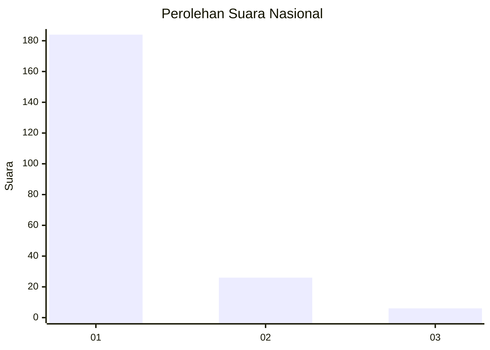
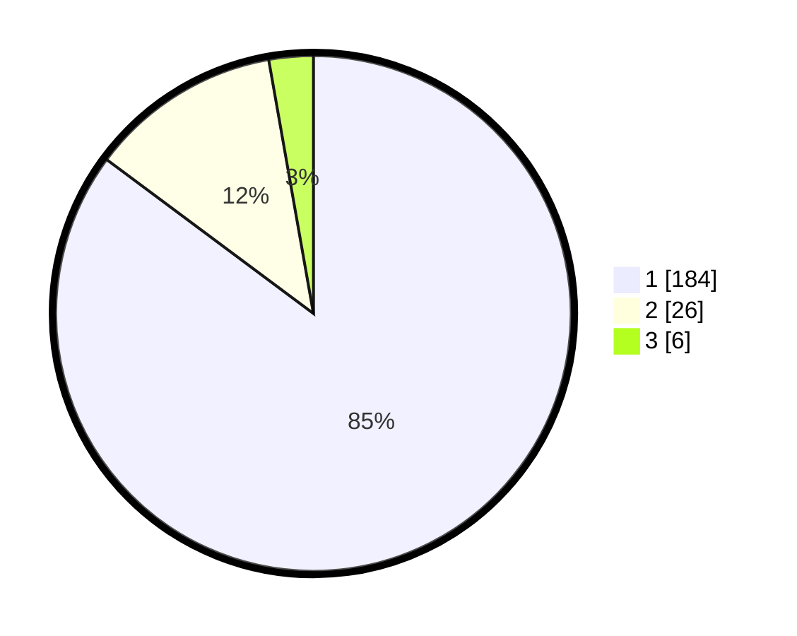

# Hasil

## Grafik

## Tabel

| No. | Nama Paslon    | Suara | Suara (raw) | Persentase |
|:--- |:-------------- | -----:| -----------:| ----------:|
| 1   | ANIES MUHAIMIN | 184   | [184][p-1]  | 85,19      |
| 2   | PRABOWO GIBRAN | 26    | [26][p-2]   | 12,04      |
| 3   | GANJAR MAHFUD  | 6     | [6][p-3]    | 2,78       |

[p-1]: https://github.com/gigit-pemilu/pemilu-2024/blob/main/pilpres/hitung-suara/sub/11-aceh/sub/05-aceh-barat/sub/09-meureubo/sub/2019-peunaga-cut-ujong/sub/001-tps/sub/paslon-1.txt
[p-2]: https://github.com/gigit-pemilu/pemilu-2024/blob/main/pilpres/hitung-suara/sub/11-aceh/sub/05-aceh-barat/sub/09-meureubo/sub/2019-peunaga-cut-ujong/sub/001-tps/sub/paslon-2.txt
[p-3]: https://github.com/gigit-pemilu/pemilu-2024/blob/main/pilpres/hitung-suara/sub/11-aceh/sub/05-aceh-barat/sub/09-meureubo/sub/2019-peunaga-cut-ujong/sub/001-tps/sub/paslon-3.txt

## Foto C Plano

https://sirekap-obj-formc.kpu.go.id/33dc/pemilu/ppwp/11/05/09/20/19/1105092019001-20240215-094148--22e44cde-9aaa-4283-a622-3798cd652455.jpg

https://sirekap-obj-formc.kpu.go.id/33dc/pemilu/ppwp/11/05/09/20/19/1105092019001-20240215-094454--29f2d01a-06b5-40c7-bf0f-b6ecb260de59.jpg

## Metadata

| Key        | Value               |
| ---------- | ------------------- |
| Time Stamp | 2024-02-15 19:30:26 |

