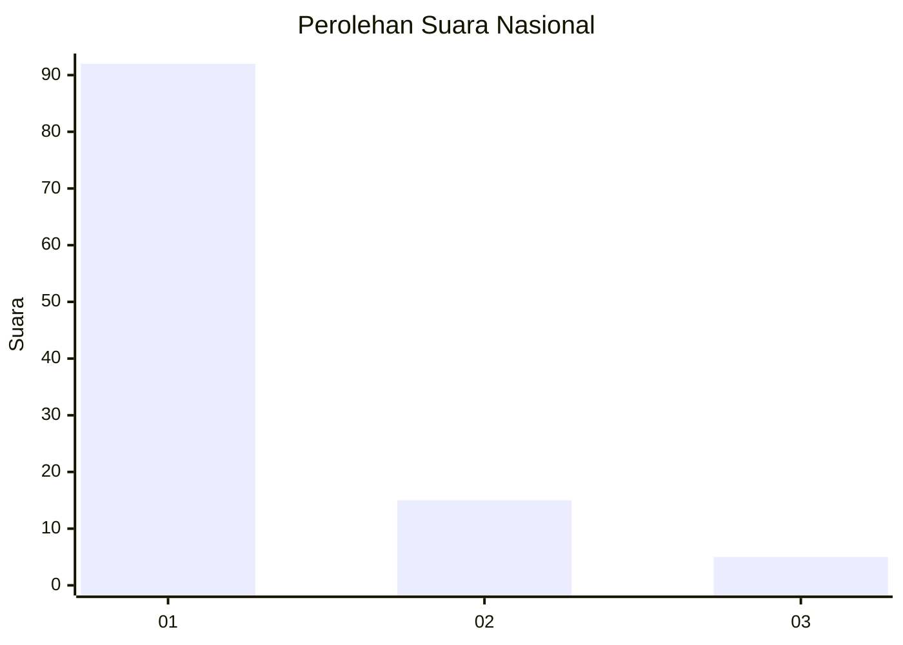
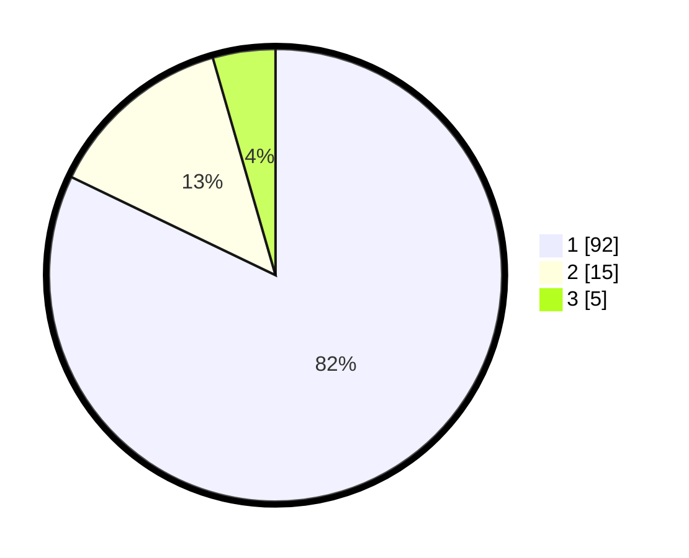

# Hasil

## Grafik

## Tabel

| No. | Nama Paslon    | Suara | Suara (raw) | Persentase |
|:--- |:-------------- | -----:| -----------:| ----------:|
| 1   | ANIES MUHAIMIN | 92    | [92][p-1]   | 82,14      |
| 2   | PRABOWO GIBRAN | 15    | [15][p-2]   | 13,39      |
| 3   | GANJAR MAHFUD  | 5     | [5][p-3]    | 4,46       |

[p-1]: https://github.com/gigit-pemilu/pemilu-2024/blob/main/pilpres/hitung-suara/sub/11-aceh/sub/05-aceh-barat/sub/09-meureubo/sub/2019-peunaga-cut-ujong/sub/901-tps/sub/paslon-1.txt
[p-2]: https://github.com/gigit-pemilu/pemilu-2024/blob/main/pilpres/hitung-suara/sub/11-aceh/sub/05-aceh-barat/sub/09-meureubo/sub/2019-peunaga-cut-ujong/sub/901-tps/sub/paslon-2.txt
[p-3]: https://github.com/gigit-pemilu/pemilu-2024/blob/main/pilpres/hitung-suara/sub/11-aceh/sub/05-aceh-barat/sub/09-meureubo/sub/2019-peunaga-cut-ujong/sub/901-tps/sub/paslon-3.txt

## Foto C Plano

https://sirekap-obj-formc.kpu.go.id/ddd9/pemilu/ppwp/11/05/09/20/19/1105092019901-20240215-111518--ccf04792-ed36-420e-a0f7-c60f09660e9d.jpg

https://sirekap-obj-formc.kpu.go.id/ddd9/pemilu/ppwp/11/05/09/20/19/1105092019901-20240215-111357--ce5a6990-9d96-40b1-8eef-3bc3e347decd.jpg

https://sirekap-obj-formc.kpu.go.id/ddd9/pemilu/ppwp/11/05/09/20/19/1105092019901-20240215-111624--48c0c844-8080-4f21-a3b2-609d4a1f44c1.jpg

## Metadata

| Key        | Value               |
| ---------- | ------------------- |
| Time Stamp | 2024-02-16 22:01:00 |

