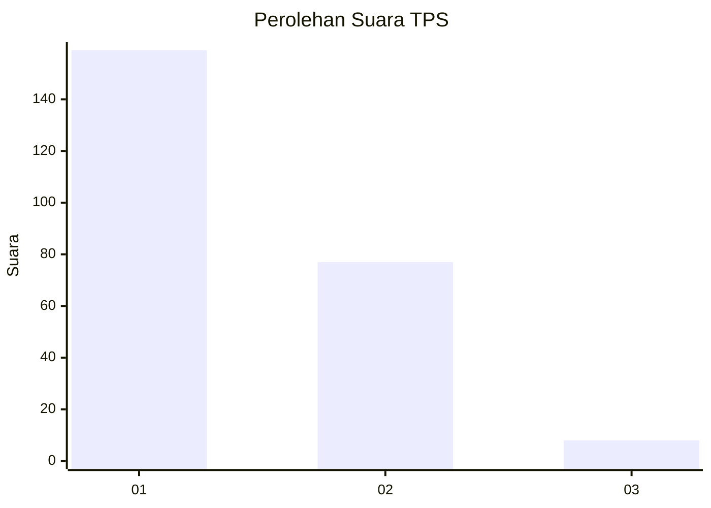
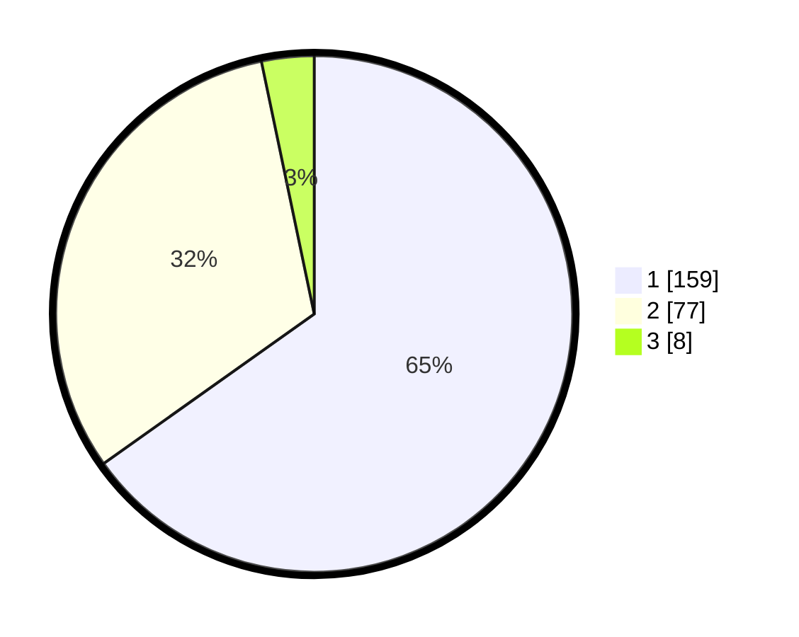

# Hasil

## Grafik

## Tabel

| No. | Nama Paslon    | Suara | Suara (raw) | Persentase |
|:--- |:-------------- | -----:| -----------:| ----------:|
| 1   | ANIES MUHAIMIN | 159   | [159][p-1]  | 65,16      |
| 2   | PRABOWO GIBRAN | 77    | [77][p-2]   | 31,56      |
| 3   | GANJAR MAHFUD  | 8     | [8][p-3]    | 3,28       |

[p-1]: https://github.com/gigit-pemilu/pemilu-2024-11-aceh/blob/main/pilpres/hitung-suara/sub/11-aceh/sub/05-aceh-barat/sub/09-meureubo/sub/2022-paya-peunaga/sub/001-tps/sub/paslon-1.txt
[p-2]: https://github.com/gigit-pemilu/pemilu-2024-11-aceh/blob/main/pilpres/hitung-suara/sub/11-aceh/sub/05-aceh-barat/sub/09-meureubo/sub/2022-paya-peunaga/sub/001-tps/sub/paslon-2.txt
[p-3]: https://github.com/gigit-pemilu/pemilu-2024-11-aceh/blob/main/pilpres/hitung-suara/sub/11-aceh/sub/05-aceh-barat/sub/09-meureubo/sub/2022-paya-peunaga/sub/001-tps/sub/paslon-3.txt

## Foto C Plano

https://sirekap-obj-formc.kpu.go.id/aef4/pemilu/ppwp/11/05/09/20/22/1105092022001-20240215-002628--76ea3f7b-e7f6-4130-9705-c7bd5c64da42.jpg

https://sirekap-obj-formc.kpu.go.id/aef4/pemilu/ppwp/11/05/09/20/22/1105092022001-20240215-003058--e9552a76-16d6-4368-90e1-21d6dd2e5168.jpg

https://sirekap-obj-formc.kpu.go.id/aef4/pemilu/ppwp/11/05/09/20/22/1105092022001-20240215-003304--2c5beccd-bd64-427f-89dc-4e185d34b7e6.jpg

## Metadata

| Key        | Value               |
| ---------- | ------------------- |
| Time Stamp | 2024-02-16 22:01:00 |

