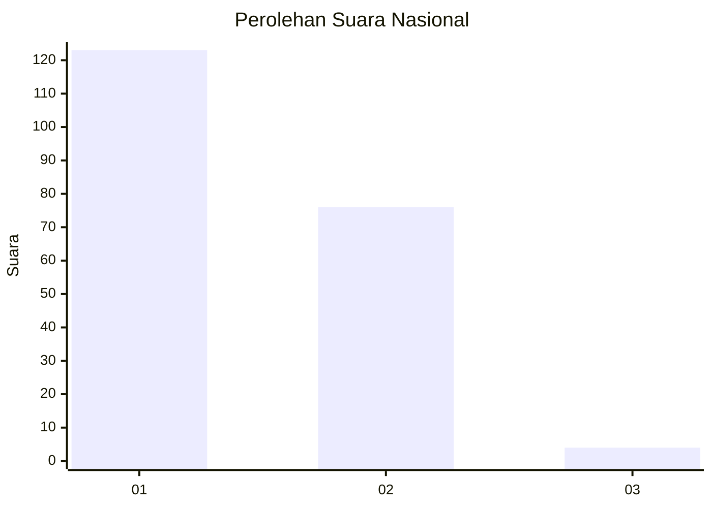
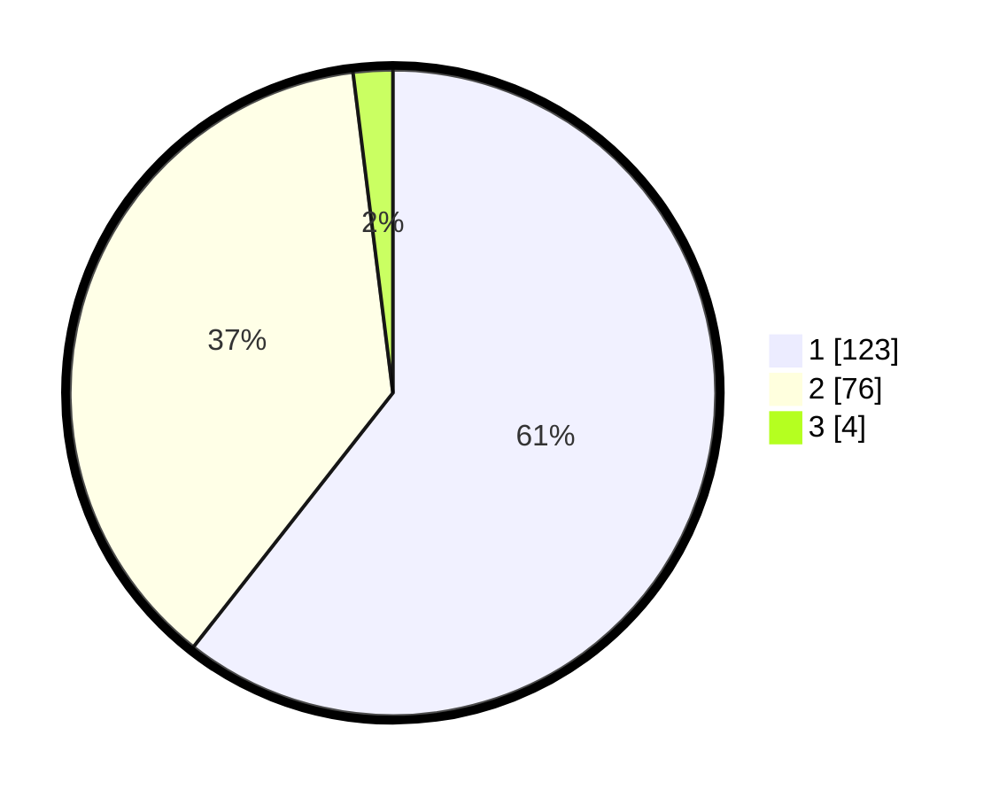

# Hasil

## Grafik

## Tabel

| No. | Nama Paslon    | Suara | Suara (raw) | Persentase |
|:--- |:-------------- | -----:| -----------:| ----------:|
| 1   | ANIES MUHAIMIN | 123   | [123][p-1]  | 60,59      |
| 2   | PRABOWO GIBRAN | 76    | [76][p-2]   | 37,44      |
| 3   | GANJAR MAHFUD  | 4     | [4][p-3]    | 1,97       |

[p-1]: https://github.com/gigit-pemilu/pemilu-2024/blob/main/pilpres/hitung-suara/sub/11-aceh/sub/05-aceh-barat/sub/09-meureubo/sub/2022-paya-peunaga/sub/006-tps/sub/paslon-1.txt
[p-2]: https://github.com/gigit-pemilu/pemilu-2024/blob/main/pilpres/hitung-suara/sub/11-aceh/sub/05-aceh-barat/sub/09-meureubo/sub/2022-paya-peunaga/sub/006-tps/sub/paslon-2.txt
[p-3]: https://github.com/gigit-pemilu/pemilu-2024/blob/main/pilpres/hitung-suara/sub/11-aceh/sub/05-aceh-barat/sub/09-meureubo/sub/2022-paya-peunaga/sub/006-tps/sub/paslon-3.txt

## Foto C Plano

https://sirekap-obj-formc.kpu.go.id/4232/pemilu/ppwp/11/05/09/20/22/1105092022006-20240214-184713--049773bb-63bd-43fc-9e37-4263a3723995.jpg

https://sirekap-obj-formc.kpu.go.id/4232/pemilu/ppwp/11/05/09/20/22/1105092022006-20240214-184907--5b773856-78e9-48a7-999d-dc3258071cfc.jpg

https://sirekap-obj-formc.kpu.go.id/4232/pemilu/ppwp/11/05/09/20/22/1105092022006-20240214-184914--f7d0e019-ec3a-403c-acb0-eb63dc4b9cdd.jpg

## Metadata

| Key        | Value               |
| ---------- | ------------------- |
| Time Stamp | 2024-02-15 19:30:26 |

