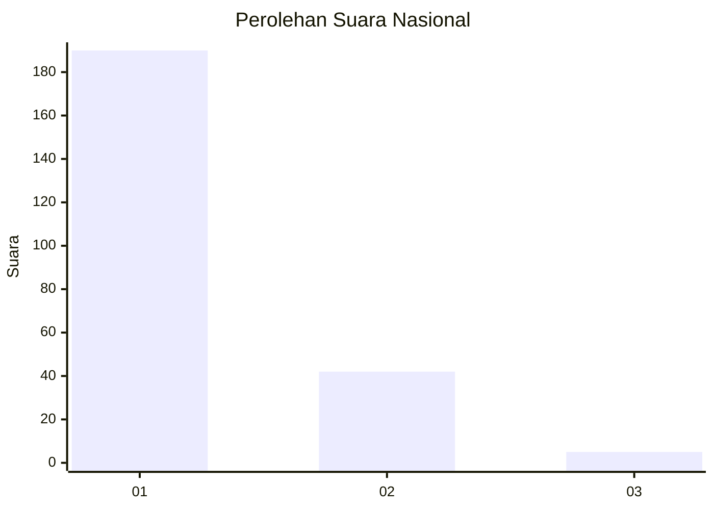
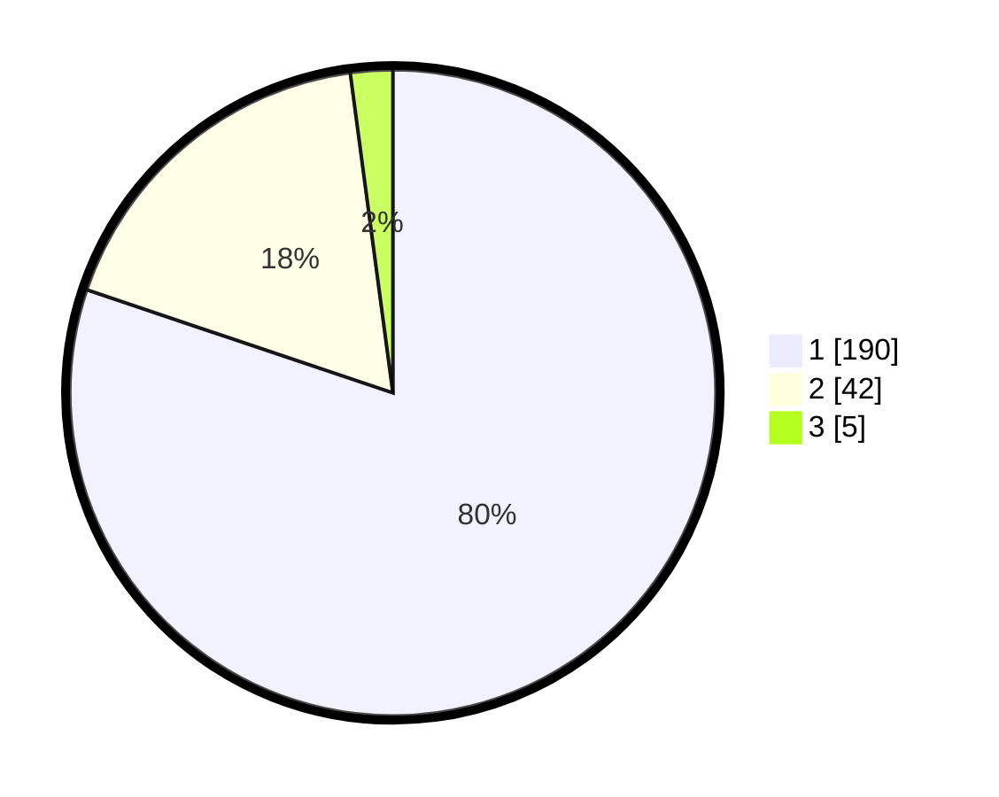

# Hasil

## Grafik

## Tabel

| No. | Nama Paslon    | Suara | Suara (raw) | Persentase |
|:--- |:-------------- | -----:| -----------:| ----------:|
| 1   | ANIES MUHAIMIN | 190   | [190][p-1]  | 80,17      |
| 2   | PRABOWO GIBRAN | 42    | [42][p-2]   | 17,72      |
| 3   | GANJAR MAHFUD  | 5     | [5][p-3]    | 2,11       |

[p-1]: https://github.com/gigit-pemilu/pemilu-2024/blob/main/pilpres/hitung-suara/sub/11-aceh/sub/05-aceh-barat/sub/09-meureubo/sub/2022-paya-peunaga/sub/009-tps/sub/paslon-1.txt
[p-2]: https://github.com/gigit-pemilu/pemilu-2024/blob/main/pilpres/hitung-suara/sub/11-aceh/sub/05-aceh-barat/sub/09-meureubo/sub/2022-paya-peunaga/sub/009-tps/sub/paslon-2.txt
[p-3]: https://github.com/gigit-pemilu/pemilu-2024/blob/main/pilpres/hitung-suara/sub/11-aceh/sub/05-aceh-barat/sub/09-meureubo/sub/2022-paya-peunaga/sub/009-tps/sub/paslon-3.txt

## Foto C Plano

https://sirekap-obj-formc.kpu.go.id/2412/pemilu/ppwp/11/05/09/20/22/1105092022009-20240215-023544--bf02db5f-ee0c-4a78-99ed-824c91bf6a81.jpg

https://sirekap-obj-formc.kpu.go.id/2412/pemilu/ppwp/11/05/09/20/22/1105092022009-20240215-023622--5c0d776f-906e-40c9-9fc2-0d68cd2b7fdb.jpg

https://sirekap-obj-formc.kpu.go.id/2412/pemilu/ppwp/11/05/09/20/22/1105092022009-20240215-023850--c1677f0f-53c7-4965-ab57-e1316a400441.jpg

## Metadata

| Key        | Value               |
| ---------- | ------------------- |
| Time Stamp | 2024-02-16 22:01:00 |

