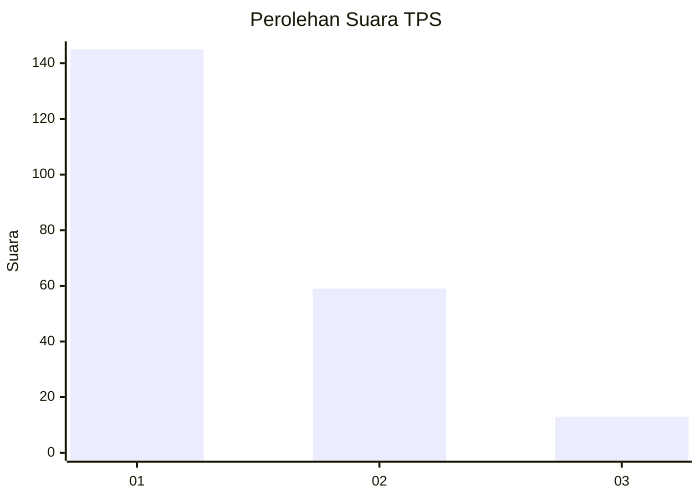
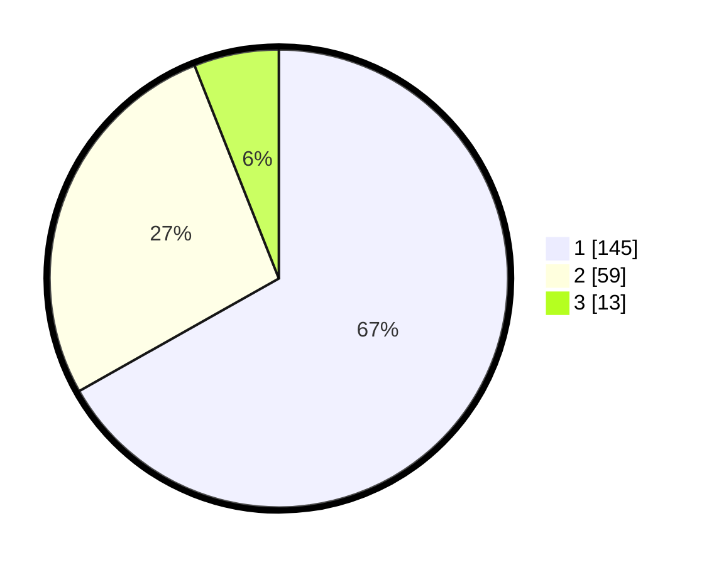

# Hasil

## Grafik

## Tabel

| No. | Nama Paslon    | Suara | Suara (raw) | Persentase |
|:--- |:-------------- | -----:| -----------:| ----------:|
| 1   | ANIES MUHAIMIN | 145   | [145][p-1]  | 66,82      |
| 2   | PRABOWO GIBRAN | 59    | [59][p-2]   | 27,19      |
| 3   | GANJAR MAHFUD  | 13    | [13][p-3]   | 5,99       |

[p-1]: https://github.com/gigit-pemilu/pemilu-2024-11-aceh/blob/main/pilpres/hitung-suara/sub/11-aceh/sub/05-aceh-barat/sub/09-meureubo/sub/2022-paya-peunaga/sub/901-tps/sub/paslon-1.txt
[p-2]: https://github.com/gigit-pemilu/pemilu-2024-11-aceh/blob/main/pilpres/hitung-suara/sub/11-aceh/sub/05-aceh-barat/sub/09-meureubo/sub/2022-paya-peunaga/sub/901-tps/sub/paslon-2.txt
[p-3]: https://github.com/gigit-pemilu/pemilu-2024-11-aceh/blob/main/pilpres/hitung-suara/sub/11-aceh/sub/05-aceh-barat/sub/09-meureubo/sub/2022-paya-peunaga/sub/901-tps/sub/paslon-3.txt

## Foto C Plano

https://sirekap-obj-formc.kpu.go.id/865a/pemilu/ppwp/11/05/09/20/22/1105092022901-20240214-195146--52b96a19-4c80-4e3e-bc96-f7d6095322ec.jpg

https://sirekap-obj-formc.kpu.go.id/865a/pemilu/ppwp/11/05/09/20/22/1105092022901-20240214-195602--6d529575-8c15-4575-a7fa-96b39a3c701a.jpg

https://sirekap-obj-formc.kpu.go.id/865a/pemilu/ppwp/11/05/09/20/22/1105092022901-20240214-195821--26499d6a-6d1a-4c6c-94bb-6f462b0e1ba3.jpg

## Metadata

| Key        | Value               |
| ---------- | ------------------- |
| Time Stamp | 2024-02-16 22:01:00 |

