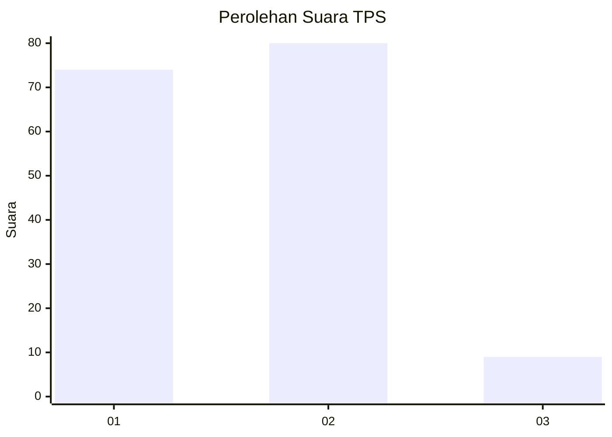
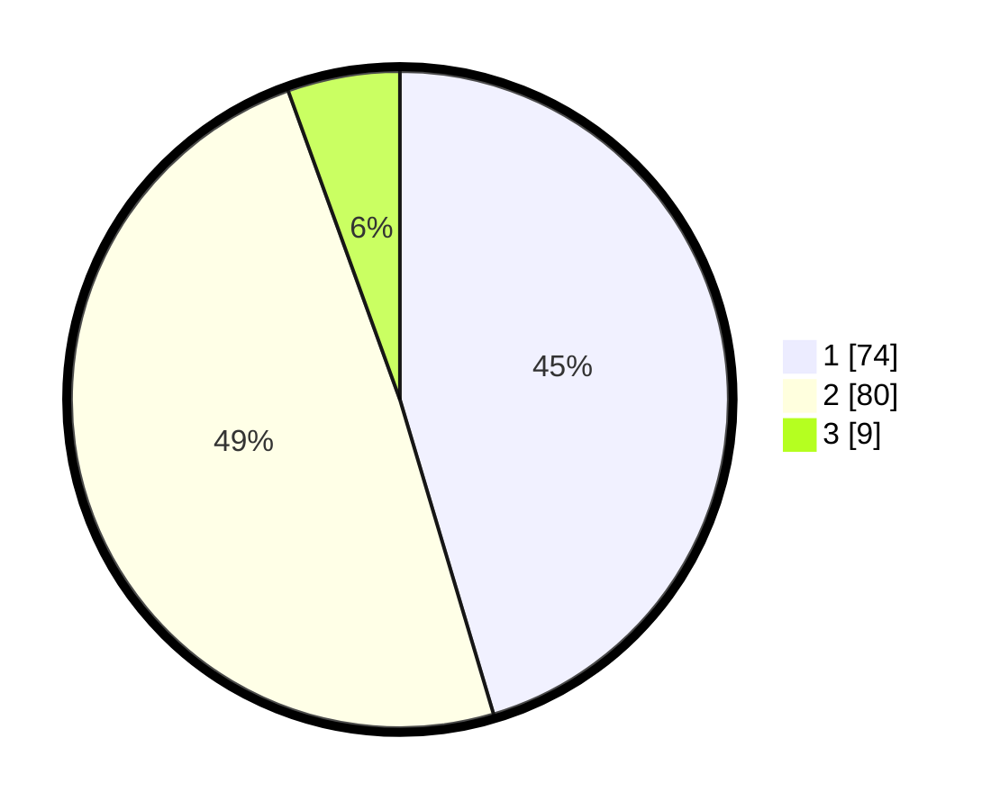

# Hasil

## Grafik

## Tabel

| No. | Nama Paslon    | Suara | Suara (raw) | Persentase |
|:--- |:-------------- | -----:| -----------:| ----------:|
| 1   | ANIES MUHAIMIN | 74    | [74][p-1]   | 45,40      |
| 2   | PRABOWO GIBRAN | 80    | [80][p-2]   | 49,08      |
| 3   | GANJAR MAHFUD  | 9     | [9][p-3]    | 5,52       |

[p-1]: https://github.com/gigit-pemilu/pemilu-2024-11-aceh/blob/main/pilpres/hitung-suara/sub/11-aceh/sub/05-aceh-barat/sub/09-meureubo/sub/2026-bukit-jaya/sub/001-tps/sub/paslon-1.txt
[p-2]: https://github.com/gigit-pemilu/pemilu-2024-11-aceh/blob/main/pilpres/hitung-suara/sub/11-aceh/sub/05-aceh-barat/sub/09-meureubo/sub/2026-bukit-jaya/sub/001-tps/sub/paslon-2.txt
[p-3]: https://github.com/gigit-pemilu/pemilu-2024-11-aceh/blob/main/pilpres/hitung-suara/sub/11-aceh/sub/05-aceh-barat/sub/09-meureubo/sub/2026-bukit-jaya/sub/001-tps/sub/paslon-3.txt

## Foto C Plano

https://sirekap-obj-formc.kpu.go.id/c765/pemilu/ppwp/11/05/09/20/26/1105092026001-20240214-212742--defa3e48-45e6-4245-8315-970eec64915b.jpg

https://sirekap-obj-formc.kpu.go.id/c765/pemilu/ppwp/11/05/09/20/26/1105092026001-20240214-211243--3c78ffdc-735e-4b39-a8ca-c496a16fd893.jpg

https://sirekap-obj-formc.kpu.go.id/c765/pemilu/ppwp/11/05/09/20/26/1105092026001-20240214-213640--3cc25a31-19b3-416e-b97a-bfbf2b00d45b.jpg

## Metadata

| Key        | Value               |
| ---------- | ------------------- |
| Time Stamp | 2024-02-15 23:29:50 |

