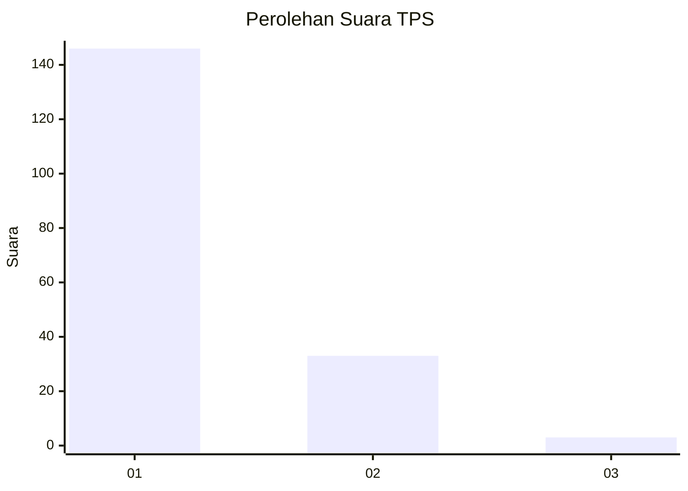
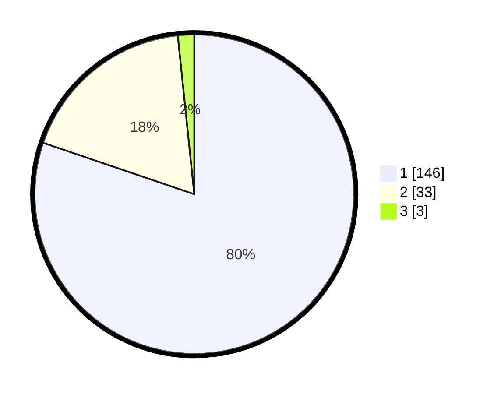

# Hasil

## Grafik

## Tabel

| No. | Nama Paslon    | Suara | Suara (raw) | Persentase |
|:--- |:-------------- | -----:| -----------:| ----------:|
| 1   | ANIES MUHAIMIN | 146   | [146][p-1]  | 80,22      |
| 2   | PRABOWO GIBRAN | 33    | [33][p-2]   | 18,13      |
| 3   | GANJAR MAHFUD  | 3     | [3][p-3]    | 1,65       |

[p-1]: https://github.com/gigit-pemilu/pemilu-2024-11-aceh/blob/main/pilpres/hitung-suara/sub/11-aceh/sub/05-aceh-barat/sub/10-woyla-barat/sub/2001-blang-luah-lm/sub/002-tps/sub/paslon-1.txt
[p-2]: https://github.com/gigit-pemilu/pemilu-2024-11-aceh/blob/main/pilpres/hitung-suara/sub/11-aceh/sub/05-aceh-barat/sub/10-woyla-barat/sub/2001-blang-luah-lm/sub/002-tps/sub/paslon-2.txt
[p-3]: https://github.com/gigit-pemilu/pemilu-2024-11-aceh/blob/main/pilpres/hitung-suara/sub/11-aceh/sub/05-aceh-barat/sub/10-woyla-barat/sub/2001-blang-luah-lm/sub/002-tps/sub/paslon-3.txt

## Foto C Plano

https://sirekap-obj-formc.kpu.go.id/4890/pemilu/ppwp/11/05/10/20/01/1105102001002-20240215-013959--ab2d191a-ac67-45ef-9741-3b2c2a3aa224.jpg

https://sirekap-obj-formc.kpu.go.id/4890/pemilu/ppwp/11/05/10/20/01/1105102001002-20240216-143028--33a1556a-90be-49b8-ba7d-aed345f7657a.jpg

https://sirekap-obj-formc.kpu.go.id/4890/pemilu/ppwp/11/05/10/20/01/1105102001002-20240216-143028--690fde49-82fc-4ab1-aa16-8bf85ab4f8c4.jpg

## Metadata

| Key        | Value               |
| ---------- | ------------------- |
| Time Stamp | 2024-02-16 22:01:00 |

## DATA PEMILIH TETAP

Jumlah pemilih dalam DPT: **196**.
 * L: **106**.
 * P: **90**.

## DATA PENGGUNA HAK PILIH

Jumlah pengguna hak pilih dalam DPT: **186**.
 * L: **99**.
 * P: **87**.

Jumlah pengguna hak pilih dalam DPTb: **0**.
 * L: **0**.
 * P: **0**.

Jumlah pengguna hak pilih dalam DPK: **1**.
 * L: **1**.
 * P: **0**.

Jumlah pengguna hak pilih: **187**.
 * L: **100**.
 * P: **87**.

## JUMLAH SUARA SAH DAN TIDAK SAH

JUMLAH SELURUH SUARA SAH: **182**.

JUMLAH SUARA TIDAK SAH: **5**.

JUMLAH SELURUH SUARA SAH DAN SUARA TIDAK SAH: **187**.

